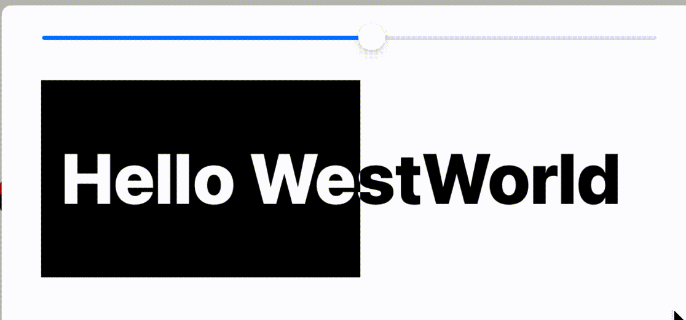
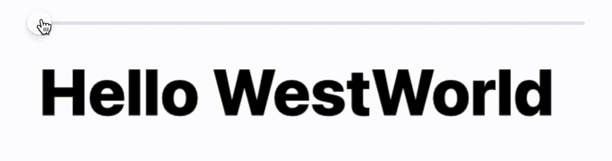
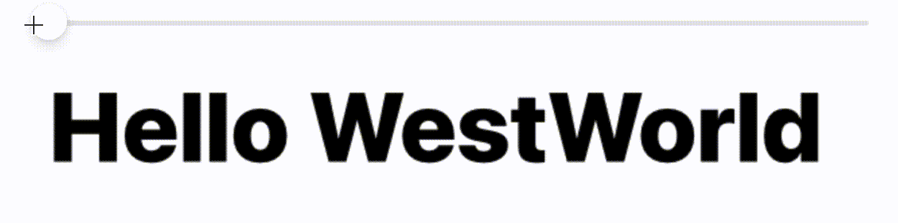
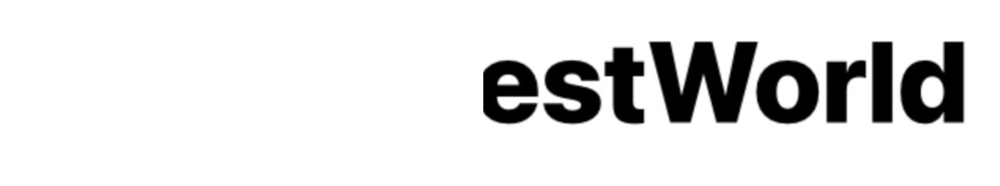
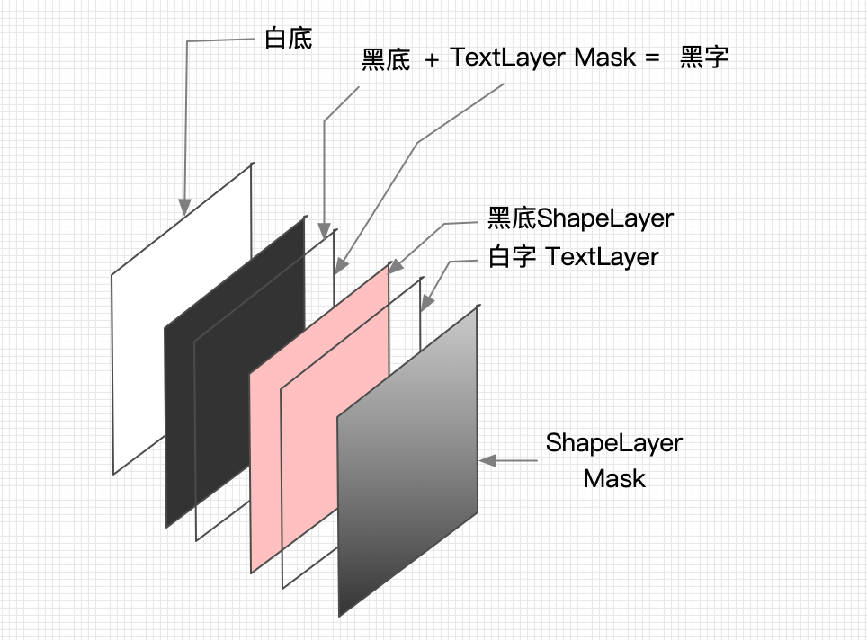

先看效果，白底黑字，随着拖动，逐渐变成黑底白字（注：因为项目关系，效果是带着底色拖动，所以以这种效果来讲解，如果只是改文字颜色，就是只涂抹文字，会稍微简单一些，请触类旁通）



思路：底层（白底黑字），表层（黑底白字），对表层应用蒙板，蒙板的frame由手势控制


本质上是CALayer的mask，但我们先用两个UIView来实现一下，因为它直观且简单：

```objective-c

- (void)viewDidLoad {
    [super viewDidLoad];
  	// create wrapper view 省略
  
    // 底层白底黑字
    self.wrapper.backgroundColor = UIColor.whiteColor;
    UILabel *lbl = [self createLabel];
    lbl.textColor = UIColor.blackColor;
    [self.wrapper addSubview:lbl];

    // 表层黑底
    UIView *cover = [UIView new];
    cover.backgroundColor = UIColor.blackColor;
    cover.frame = self.wrapper.bounds;
    [self.wrapper addSubview:cover];
    // 白字
    UILabel *lbl2 = [self createLabel];
    lbl2.textColor = UIColor.whiteColor;
    [cover addSubview:lbl2];

    // mask的width从0到100%
    self.mask = [UIView new];
    self.mask.frame = CGRectMake(0, 0, 0, self.wrapper.frame.size.height);
    self.mask.backgroundColor = [UIColor blackColor];
    cover.maskView = self.mask;
}

- (UILabel *)createLabel {
  // ...
}

- (IBAction)slidechanged:(UISlider *)sender {
    self.mask.frame =  CGRectMake(0, 0, self.wrapper.frame.size.width * sender.value, self.wrapper.frame.size.height);
}
```

UIView当然本质上用的都是CALayer，那么我用CALayer改写会怎样呢？

结构：UIView黑底+CATextLayer Mask > CAShapeLayer黑底 > CATextLayer白字， 对`shapeLayer`应用mask

```objective-c

- (void)viewDidLoad {
  [super viewDidLoad];
  // create wrapper 省略

  // 底部文字，黑底+文字mask
  self.wrapper.backgroundColor = [UIColor blackColor];
  CATextLayer *bottom  = [self createTextLayer:self.wrapper.frame];
  self.wrapper.layer.mask = bottom;

  // 顶部背景layer+顶部文字layer
  CAShapeLayer *top    = [CAShapeLayer new];
  top.backgroundColor  = [UIColor redColor].CGColor;  // 原本是黑底白字，后面解释为什么改成了红底
  top.frame = self.wrapper.frame;
  CATextLayer *toptext = [self createTextLayer:self.wrapper.bounds];
  toptext.foregroundColor = [UIColor whiteColor].CGColor;
  [top addSublayer:toptext];
  [self.wrapper.layer addSublayer:top];
  
  self.mask = [CAShapeLayer new];
  self.mask.frame = CGRectMake(0.0f, 0.0f, 0.0f, self.wrapper.frame.size.height);
  self.mask.backgroundColor = [UIColor blackColor].CGColor;
  top.mask = self.mask;
}

- (CATextLayer *)createTextLayer:(CGRect)frame {
    CATextLayer *layer = [CATextLayer new];
    layer.frame = frame;
    layer.font = (__bridge CFTypeRef)[UIFont systemFontOfSize:12.0f weight:UIFontWeightHeavy];  // 这里字号是无效的
    layer.fontSize = 73.0f; // 在这里设置字号
    layer.string = @"Hello WestWorld";
    return layer;
}
```

结果却得到这个：



黑底只剩下了黑边，观察到三个现象：

1. 对根layer进行mask，其sublayer都是被mask的
2. 用文字对文字做mask，是会描边的（这一点做了额外几个测试证明了）
3. 动画没有那么跟手（人在前面跑，魂在后面追），都有动量的感觉了，对比UIView的方案看看

先来拣第二个软柿子捏，猜测用`CAShapeLayer`来做cover应该不会有描边，也就是说注释掉以下几行

```objective-c
CATextLayer *toptext = [self createTextLayer:self.wrapper.frame];
toptext.foregroundColor = [UIColor whiteColor].CGColor;
[top addSublayer:toptext];
```

效果如期望的那样，（这次没有描边了，所以就换了个颜色，不然白底白字就看不见了）



这次我们不用根layer做mask，添加一个层：

```objective-c
// 底部文字，黑底+文字mask
CATextLayer *bottom  = [self createTextLayer:self.wrapper.bounds];
// self.wrapper.backgroundColor = [UIColor blackColor];
// self.wrapper.layer.mask = bottom; 
// 对根layer进行mask，会把sublayer全部mask了
// 所以添加一个layer
CAShapeLayer *bottomShape = [CAShapeLayer new];
bottomShape.frame = self.wrapper.bounds;
bottomShape.backgroundColor = [UIColor blackColor].CGColor;
bottomShape.mask = bottom;
[self.wrapper.layer addSublayer:bottomShape];
```


现在如愿以偿，整个结构也只有一个UIView了，相比UView的方案，显然在查看视图结构的时候要简化得多，（动画效果仍然是魂在后面追...），但是，这次仍然是文字对文字做mask，这次却没有描边了：



难道只有根layer上才会描？不继续探索了。

最后，解释一下对直接操作CALayer为什么反应还慢半拍呢？因为CALayer的大部分属性的改变是自带了动画的，在这个例子里得到了充分的证明。

补充一下全部用`CALayer`的结构
