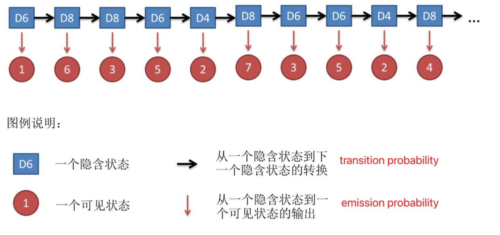
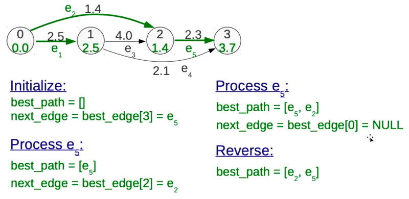
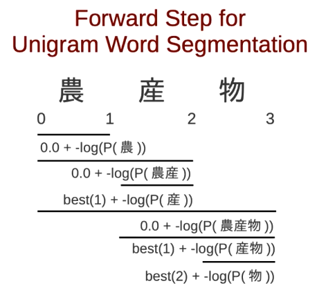
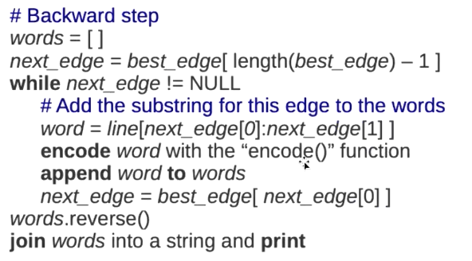

开局一句话，隐马尔可夫，就是在“溯源”，即产生你这个现象的源头在哪。

- 比如你掷出的这个显示为6的骰子，是来自于六面体的还是四面体的，或是来自于普通的还是灌铅了的
- 又比如你一句话里的某一个词，它是处于开始位置还是中间位置，或是它是一个人名还是一个地点或是一个介词

任何一种表现形式，都有一个它的“原因”或“属性”。 现在正式开始，来自我能理解的网络资料，我的课程，以及一些思考

首先几个基础概念：

# 命名实体识别(NER)

**实体**：人物(PER)，地点(LOC)，等
**BIOES**: 开始(Begin)， 中间(Inner)， 结尾(E)，单个(Single)，其它(Other)

比如人名：张北京，就可以被识别为$\Rightarrow$ B-PER, I-PER, E-PER

# Part-of-Speech Tagging（词性标注）

词性标注是为输入文本中的每个词性标注词分配词性标记的过程。标记算法的输入是一系列(标记化的)单词和标记集，输出是一系列标记，每个标记一个。

标记是一项消除歧义的任务;单词是模糊的，有不止一个可能的词性(歧义)，我们的目标是为这种情况找到正确的标签。例如，book可以是动词(book that flight)，也可以是名词(hand me that book)。That可以是一个限定词(Does that flight serve dinner)，也可以是一个补语连词(I thought that your flight was earlier)。后置标记的目标是解决这些分辨率模糊，为上下文选择合适的标记

# Sequence model

Sequence models are central to NLP: they are models where there is some sort of `dependence through time` between your inputs. 

* The classical example of a sequence model is the `Hidden Markov Model` for **part-of-speech tagging**. (词性标注)
* Another example is the `conditional random field`.

HMM模型的典型应用是词性标注


词性标注语料库是统计标注算法的关键训练(和测试)集。三个主要的标注语料库始终用于训练和测试英语词性标注器。

1. 布朗语料库是1961年在美国出版的500篇不同体裁的书面文本的100万单词样本。
2. 《华尔街日报》语料库收录了1989年发表在《华尔街日报》上的100万个单词。
3. 总机语料库由1990-1991年收集的200万字电话对话组成。语料库的创建是通过在文本上运行一个自动的词性标记，然后由人工注释器手工更正每个标记。

# HMM

HMM是一个序列模型(`sequence model`)。序列模型或序列分类器是一个模型，其工作是为序列中的每个单元分配一个标签或类，从而将一个观察序列(观察状态)映射到一个标签序列(隐藏状态)。HMM是一种概率序列模型：给定一个单位序列(单词、字母、语素、句子等等)，它计算可能的标签序列的概率分布，并选择最佳标签序列。

* 3个骰子，6面体，4面体，8面体(D6, D4, D8)
* 每次随机选出一个骰子投掷，得到一个数字
* 共十次，得到10个数字

1. `可见状态链`：10次投掷得到10个数字(1,3,5...)$\Rightarrow$对应你看得的10个单词
2. `隐含状态链`：每一次投掷都有可能拿到三种骰子之一，(D6, D6, D4...) $\Rightarrow$对应为每个单词的词性
3. 转换概率（`transition probability`）：隐含状态之间的概率($\Rightarrow$对应为语法)：
    * 每一次拿到某种骰子之后，下一次拿到三种骰子的概率（[1/3,1/3,1/3],...)
    * 或者说主动决策下一次用哪个骰子的概率[a,b,c...] (相加为1)
4. 可见状态之间没有转换概率
5. 输出概率（`emission probability`）：隐含状态和可见状态之间的概率，比如D4下1的概率为1/4，D6下为1/6 (表现概率，激发概率，多种翻译)



应用HMM模型时候，往往是缺失了一部分信息的，

* 有时候你知道骰子有几种，每种骰子是什么，但是不知道掷出来的骰子序列；
* 有时候你只是看到了很多次掷骰子的结果，剩下的什么都不知道。

如何应用算法去估计这些缺失的信息，就成了一个很重要的问题，这也是HMM模型能做的几件事：

## Decoding

解码的过程就是在给出一串序列和已知HMM模型的情况下，找到最可能的隐性状态序列。

比如结果是：1 6 3 5 2 7 3 5 2 4, 求最可能的骰子序列 

### Viterbi algorithm

1. 掷出1的最大概率是4面体： P1(D4) = P(1|D4) * P(D4) = 1/4 * 1/3
2. 掷出6的最大概率是 P2(D6) = P(6|D6) * P(D6) = 1/6 * 1/3 
3. 连续1，6的概率就成了1的概率 * 2的概率 P2(D6) = P1(D4) * P2(D6) = 1/216
4. 1,6,3 => P3(D4) = P2(D6) * P(3|D4) * P(D4) = $\frac{1}{216} \cdot \frac{1}{3} \cdot \frac{1}{4}$
5. and so on
6. 但这个例子忽略了转移概率，即P(D6|D4), P(D4|D6,D4)，或者说默认了转移概率就是1/3，即每次挑中三个骰子的机率均等。

## Evaluation

根据条件和序列结果求这一序列的概率是多少，比如三种骰子，投出了1，6，3的结果：


* 第1列表示第一次投掷得到1的可能性和为0.18
* 第2列为1 6的的可能性和为0.05
* 第3列为1 6 3的可能性和为0.03

如果远低于或远高于这个概率，必然有做过手脚的骰子。

## 转移概率的矩阵表示

这次假定不同的骰子是用来作弊的，作弊者会根据情况来挑选骰子，这样转移概率就不可能是均等的了：


很幸运，这么复杂的概率转移图，竟然能用矩阵表达：
$A = 
\begin{bmatrix}
0.15 & 0.45 & 0.4 \\
0.25 & 0.35 & 0.4 \\
0.10 & 0.55 & 0.35
\end{bmatrix}
$

既然是3行3列，显然$A_{ij}$就是从i切换到j的概率，比如$A_{12}$ 就应该是这个人把骰子从作弊骰子1切换到2的概率。


相应地，发射概率（即不同骰子摇出的点数的概率）也能表示为矩阵：
$B = 
\begin{bmatrix}
0.16 & 0.16 & 0.16 & 0.16 & 0.16 & 0.16 \\
0.02 & 0.02 & 0.02 & 0.02 & 0.02 & 0.90 \\
0.40 & 0.20 & 0.25 & 0.05 & 0.05 & 0.05 \\
\end{bmatrix}
$

现在有了转移概率和发射概率，我们再来看看前面的掷出1，6，3的骰子的概率：
骰子设为D1 D2 D3, 每一轮的可能性为P1 P2 P3, 则P = P3D1 + P3D2 + P3D3 即第3轮时3种骰子能投出3的概率和

我来推导一下P3D1怎么来的，上面的表格是我从别人的博客里复制的，这里就不做一个一模一样的图了，我们一步步来吧：

* 第一次投掷每个骰子的概率应该是隐含了各为1/3吧？(这个好像叫"`初始隐状态`" $\pi$)
* P1D1 = 0.16 * 0.33, 即1/3概率拿到D1，0.16概率投出1，同理：
    * P1D2 = 0.02 * 0.33
    * P1D3 = 0.40 * 0.33 
* P2D1 = 
    * P1D1 * $A_{00}$ * $B_{05}$ = P1D1 * 0.15 * 0.16 即P1D1前提下，乘上D1换到D1的概率，再乘上D1选出6的概率
    * $+$
    * P1D2 * $A_{10}$ * $B_{05}$ = P1D1 * 0.25 * 0.16 即P1D2前提下，乘上D2换到D1的概率，再乘上D1选出6的概率
    * $+$
    * P1D3 * $A_{20}$ * $B_{05}$ = P1D1 * 0.10 * 0.16 即P1D3前提下，乘上D3换到D1的概率，再乘上D1选出6的概率
    * 以此类推得到P2D2, P2D3 
* P3D2 = （*D1的概率太平均，这次换个D2来演示*） 
    * P2D1 * $A_{01}$ * $B_{12}$ = P2D1 * 0.45 * 0.02 即P2D1前提下，乘上D1换到D2的概率，再乘上D2选出3的概率
    * $+$
    * P2D2 * $A_{11}$ * $B_{12}$ = P2D1 * 0.35 * 0.02 即P2D2前提下，乘上D2换到D2的概率，再乘上D2选出3的概率
    * $+$
    * P2D3 * $A_{21}$ * $B_{12}$ = P2D1 * 0.35 * 0.02 即P2D3前提下，乘上D3换到D2的概率，再乘上D2选出3的概率
    * 以此类推得到P3D1, P3D2
* P = P3D1 + P3D2 + P3D3

$$
\sum_{r\in R}\prod_t^TP(v(t)|w_r(t)) | w_r(t-1))
$$

* v: visible 可见序列
* w: 隐性状态序列
* R: 所有隐状态的可能性

1. t-1隐状态前提下得到t的概率（转移概率）如D2换到D3的概率
2. 上一概率前提下得到v(t)的概率，如D3扔出1的概率
3. 一种隐状态下出序列的结果为累乘
4. 所有隐状态下出该序列的结果为3的累加

简单来说：
1. 可见序列$v(t)$的概率依赖当前$t$下的隐状态（比如是不是作弊了的骰子）$w_r(t)$
    * 得到：$P(v(t)\ \color{red}|\ w_r(t))$
2. 当前隐状态$w_r(t)$又有两个特征:
    1. 由$w_r(t-1)$转换而来的: $P(v(t)|w_r(t))\color{red}{|}w_r(t-1)$
    2. $T$是链式的，概率累乘： $\color{red}{\prod_t^T}P(v(t)|w_r(t)) | w_r(t-1))$
3. 最后一步时的隐状态显然是几种之一，累加起来就是所有可能性：
    * $\color{red}{\sum_{r\in R}}\prod_t^TP(v(t)|w_r(t)) | w_r(t-1))$

# 应用

1. 初始概率

以`BMES`为例（参考NER），把其认为是隐状态，然后认为每个词（里的字）是由隐状态产生的。

即`B`对应的字可能有“`中`”，“`国`”，等等，能作为词语打头的字都可能由隐状态`B`产生，其它状态依次类推。

就像我们三种骰子的初始概率，完全取决于每种骰子占总数的多少一样，HHM应用到语言模型里，初始概率就是先把文字全部用`BMES`表示，然后分别数出个数，与总数做个对比。（此时已经可以判断出`M`和`E`的概率只能是0了。 

2. 转移概率

应该是4个循环吧，每次把当前状态后面跟上四个状态的情况都数出来，就是一个隐状态到其它四个状态的转移概率，四行拼到一起就是一个转移概率的矩阵，类似上面的三种骰子互相切换的矩阵。

也可以用字典，比如 BE BS BB BM等共16个键，两两遍历整个字符串完后，16个count就出来了，group后就能得到概率了。

3. 观测概率（发射概率）

这个就是每一个隐状态下对应不同表面文字的概率了，比如：{s:{"周": 0.3357, "爬":0.00003}...}

要知道，三种概率里面是有很多0的，意思就是在现有的语法体系里面不可能出现的场景，比如第一个字不可能是M和E，B后面不可能跟S，B，而M后面不可能跟B，S，以及S后面不可能跟M，E等，再比如假如哪个字永远不可能是第一个字，那么它的观测概率在S里面就永远是0，等等。

这里要计算的话，因为隐状态是用文字推断出来的，所以这个映射关系还在，那么整理一下两个数组就能把每个隐状态能对应的文字全部映射上了。

 ----

以下是我课程里的笔记，理解了上面的内容，理解下面是没有任何障碍的。

# viterbi in NLP
$\overbrace{
  \enclose{circle}{0} 
  \xrightarrow[农]{2.5}
  \enclose{circle}{1} 
  \xrightarrow[产]{4.0}
  \enclose{circle}{2} 
}^{1.4}
\xrightarrow[物]{2.3}
\enclose{circle}{3}$

$\enclose{circle}{0} 
\xrightarrow[农]{2.5}
\underbrace{
  \enclose{circle}{1} 
  \xrightarrow[产]{4.0}
  \enclose{circle}{2} 
  \xrightarrow[物]{2.3}
  \enclose{circle}{3}
}_{2.1}$

* node: $\enclose{circle}{2}$ ，圆圈，就是位置索引
* edge: 词， 箭头，很好理解：string[0,1] = '农'
* Each edge weight is a `negative log probality`
  * -log(P(农)) = 2.5
  * -log(P(产)) = 4.0
  * -log(P(农产)) = 1.4
  * -log(P(产物)) = 2.1
* Each path is a segmentation for the sentence
* Each path weight is a sentence `unigram` negative log probability
  * -log(P(农产)) + -log(P(物)) = 1.4 + 2.3 = 3.7
  * 农 + 产 + 物 = 2.5 + 4.0 + 2.3 = 8.8
  * 农 + 产物 = 2.5 + 2.1 = 4.6

## two step

1.前向，从左往右，找到**最佳路径**的分数
2.后向，从右往左，创建一条最佳路径

### forward algorithm
pseudo code
```python
best_score[0]=0
for each node in the graph (ascending order)
  best_score[node] = ∞
  for each incoming edge of node
    score=best_score[edgeprev_node]+edge.score
    if score < best_score[node]
      best_score[node]=score
      best_edge[node] =edge
```
example:


* 初始节点打分0，其它节点打分为$\infty$
* 每个节点打分由其(`incoming edge`)(即来源箭头)和来源节点的打分构成
* 如果有多个来源，则计算出该来源的得分，与该节点当前的得分做对比，取得分低的那个
* 把该节点的分值和来源edge存到该节点上（edge就是词）。

1. 简单来说，还是和之前的骰子一样，每一次算出到当前节点的最低分数的路径。
2. 上图中，我们就把e1, e2, e5选出来了，这个过程中，删除了e3, e4这几条路径
3. best_score=(0.0, 2.5, 1.4, 3.7), best_edge = (NULL, e1, e2, e5)
4. 用字典来把Node映射上去：{0:(0.0, NULL), 1:(2.5, e1), 2:(1.4, e2), 3:(3.7, e5)}

### backward algorithm

```python
best_path=[]
next_edge=best_edge[best_edge.length-1]
while next_edge != NULL
  add next_edge to best_path
  next_edge =best_edge[next_edge.prev_node]
reverse best path
```
举例：


* 从图片可知，`path`就是`edge`
* 初始path是空，[]
* 从`forward`的结果字典里找到node 3的best_edge，就是e5 [e5]
* e5的来源的是node 2
* 从字典里找到2的best_edge，是e2 [e5, e2]
* e2的来源是node 0
* 0的best_edge是NULL，结束递归
* reverse: [e2, e5]



这个很好理解
1. 0到农，到农产，到农产物的概率，表示为0.0+ -log(p(农/农产/农产物))
2. 在农的前提下，就有农到产，和农到产物：best(1) + -log(P(产/产物))
3. 在产的前提下，就只有best(2) + -log(P(物))了

应用到NLP： 


这里就是把node, egde具体了一下：

1. 多包了一层for-each，意思是前面的代码是处理一行的
2. node对应是单词结尾(word_end)，其实就是一个index，前面说过了
3. edge对应是单词(word)，前面也说过了，即`string[5,7]`的意思
4. score由uni-gram来计算
5. 计算上，就是找到以基准字当作单词结尾，然后前面的字跟它拼起来的所有可能性，找最低分：
    * 比如abcdefg, 如果当前是e，那么分别比较：abced, bcde, cde, de
6. 接上例，输出结果应该这么解读： 
    * 以b为结尾的单词，最有可能的是xxx, 它的得分是，它的索引是，
    * 以c为结尾的单词，最有可能是bc或是abc，它的得分是，bc/abc的索引是(1,2)，这样



1. 显然这里已经知道edge不知道是一个词，而且是一个词的首尾边界
2. 也知道存到best_edges里面的其实就是词的位置索引
3. 反向的时候，从最后一个索引找到得分最低的词，再从这个单词向前找，一直找到
    * 所以next_edge[0]其实就是当前单词词首，[1]就是词尾
    * 所以把当前单词存进去后，向前搜索就要以next_edge[0]为字典，找对应的best_edge
    * 再从best_edge里面解析出最合适的单词的首尾索引，存到结果数组里
