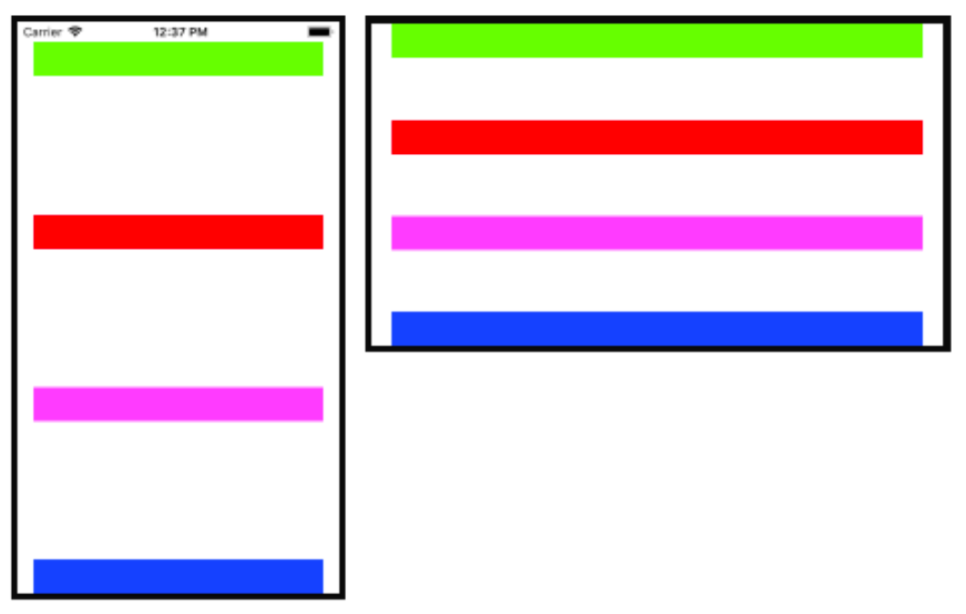

《Programming iOS 14: Dive Deep into Views, View Controllers, and Frameworks》第1章

--------
# View

* A view knows how to draw itself into a rectangular area of the interface.
* A view is also a responder 
* init:
    * `init(frame:)`: init from code
    * `init(coder:)`: init from nib

## Window and Root View

* Window = top view, ultimate superview
    * iPad with iOS 13+ can have multiple window
* only one subview: rootViewController's `main view` -> occupy the entirety of the window

## How an App Launches

* Swift项目自动调用了`UIApplicationMain`方法，唯一方法，初始化了必要资源
* 初始化`UIApplicationMain`（你`UIApplication.shared`的来源），及其degate class(`@UIApplicationMain`)，并持有，贯穿app整个生命周期
* UIApplicationMain calls the app delegate’s `application(_:didFinish- LaunchingWithOptions:)`, giving your code an opportunity run.
* UIApplicationMain creates a `UISceneSession`, a `UIWindowScene`, and an instance that will serve as the window scene’s `delegate`.
    * delegate由*plist.info / Application Scene Manifest / Delegate Class Name* 决定 (`$(PRODUCT_MODULE_NAME).SceneDelegate`)
* 初始化root view
    * UIApplicationMain根据plist判断是否使用了storyboard
        * 初始化UIWindow，并赋给scene delegate's `window` property
        * 初始化initial view controller 并赋给window的`rootViewController`属性
        * UIAplicationMain call window's `makeKeyAndVisible`呈现Interface
    * call scene delegate's `scene(_:willConnectTo:options:)`
        * 这里也是没用storyboard的话，手动去实现上面几步的地方

**Referring to the Windows**

* `view.window`, if it's nil means it can't be visible to the user
* scene delegate's `window` property
* `UIApplication.shared.windows.first!`

> Do not expect that the window you know about is the app’s only window. The runtime can create `additional mysterious windows`, such as the `UITextEffectsWindow` and the `UIRemoteKeyboardWindow`.

## Subview and Superview

**曾经**，一个view拥有它对应的一个矩形区域，不属于它的subview的其它view在这个矩形内是看不见的，因为重绘矩形的时候是不会考虑到其它view的。同样，也不能draw到矩形区域外去。

OS X10.5起，苹果更新了关于View的架构，iOS也跟着改变了，subview能出现在superview之外（所以反而需要`clipping`了），一个view也能overlap到另一个view上而无需成为其subview（后来居上）。

结果就是，你现在看到几个互相重叠的我色块，你再也分辨不出view之间的层次关系了。（`isDescendant(of:) `可以检查层次关系）

没有清空subview的方法，所以：`myView.subviews.forEach {$0.removeFromSuperview()}`

## Color

* background color不设置表示这个view是透明的
* 如果再没有进行任何子view的绘制，那么这个view就看不见了
* 这种view可以作为容器来使用

iOS 13起，引入黑暗模式后，硬编码的颜色就迎来了很大的问题。

* 纠结的解决方法：
```swift
 v.backgroundColor = UIColor { tc in
        switch tc.userInterfaceStyle {
        case .dark:
            return UIColor(red: 0.3, green: 0.4, blue: 0.4, alpha: 1)
        default:
            return UIColor(red: 0, green: 0.1, blue: 0.1, alpha: 1)
        }
}
```

其中, tc是`trait collection`，一系列特征的集合。
* 而iOS 13起多了很多`.system`开头的color，可以自适应
* *asset catalog*中可以自定义颜色，并设置不同模式下的颜色

## Visibility and Opacity

隐藏一个view:
* `isHidden`: view还在，但不会接受触摸事件
    * `alpha = 0`也会使得`isHidden == true`
* `isOpaque`: 它不影响可见性，但影响**drawing system**
    * `opaque == true`的view不具有透明度，将拥有最高的渲染效率
* `frame = CGRect.zero`的view也是不可见的

## Frame, Bounds and Center

* 就是视图在父视图（坐标系）中的位置和大小。
* `sizeTofit`方法来适应内容的大小。
* `bound`原点设为(10, 10)意思是坐标系往左上角移了(10,10)的像素，即原来的(10,10)现在到了原点。
    * `bounds.insetBy(dx:dy)`是保持中心不变（即同时改变了原点和宽高）
* `center`表示的是视图在父级中的位置，所以改变自己的bounds并不改变它的center
    * 本质上`frame`是center+宽度的便捷方法
    * 如果v2是v1的子视图，`v2.center = v1.center` 通常不能生效，因为它们的坐标系不同（各自的父级）

## Transform and Transform3D

* Transform改变View的绘制，但不改变它的bounds和center.
* value is a `CGAffineTransform`，其实就是一个变换矩阵
* CGPoint, CGSize, and CGRect all have an `applying(_:)` method 用来计算应用Transform后的坐标
* 3D版的就是多了一个垂直于屏幕的Z轴

## Window Coordinates and Screen Coordinates

* The device screen has `no frame`, but it has bounds. 
* The window has `no superview`, but its frame is set automatically to match the screen’s bounds. 
    * continues to fill the screen

iOS 7及之前，屏幕的坐标系是不变的，如果有旋转，则是对root view进行了一次rotation的transfrom。
但在iOS 8不再用transform而是制定了两套坐标系，通过`UICoordinateSpace`协议表示
    * UIScreen's `coordinateSpace`: 会旋转的bounds
    * UIScreen's `fixedCoordinateSpace`: 不变

读取视图v在设备的固定坐标系下的位置：
```swift
let screen = UIScreen.main.fixedCoordinateSpace
let r = v.superview!.convert(v.frame, to: screen)
```

## Trait Collections

将view的一系列环境特征通过view hierarchy层级下传，通过服从`UITraitEnvironment`协议（提供`traitCollection`属性和`traitCollectionDidChange`方法）

**traitCollection**
* *displayScale*: screen's resolution
* *userInterfaceIdiom*: general device type, iPhone, or ipad
* *interfaceStyle*: is in light/dark mode
* *userInterfaceLevel*: .base / .elevated -> affects dynamic background colors

> If you implement traitCollectionDidChange(_: ), `always call super in the first line`. Forgetting to do this is a common beginner mistake.

自定义trait collection只能用下面这种“组合”的方式
```swift
let tcdisp = UITraitCollection(displayScale: UIScreen.main.scale)
let tcphone = UITraitCollection(userInterfaceIdiom: .phone)
let tc1 = UITraitCollection(traitsFrom: [tcdisp, tcphone])  // 取交集
```

自动颜色的底层逻辑：
```swift
 let yellow = UIColor.systemYellow
let light = UITraitCollection(userInterfaceStyle: .light)
let dark = UITraitCollection(userInterfaceStyle: .dark)
let yellowLight = yellow.resolvedColor(with: light)
// 1 0.8 0 1
let yellowDark = yellow.resolvedColor(with: dark)
// 1 0.839216 0.0392157 1
```

### Size Classes

把屏幕针对宽高和比例做几个分类：
* .regular(h, v) -> iPad
* .compact(h) + .regular(v) -> 竖屏iPhone
* .regular(h) + .compact(v) -> 横屏大iPhone
* .compact(h, v) -> 横屏小iPhone（5S以前的）

所以, size class:
* 并不能从`traitCollectionDidChange`获得，因为iPad永远是`.regular`
* 只关心横竖向突然间.regular和.compact的切换

**Overriding Trait Collections**

You cannot `insert` a trait collection directly into the inheritance hierarchy simply by setting a view’s trait collection;

For the user interface style, there is a simpler facility available both for a UIViewController and for a UIView: the `overrideUserInterfaceStyle` property. 
    * default `.unspecified`，意味着interface style会往下传
    * 一旦设为.dark或.light, 就拦截了`userInterfaceStyle`的继承

## Layout

* Manual layout: `layoutSubviews`里手动摆放每个视图，可定制最强
* Autoresizing: 子视图根据`autoresizingMask`来调整
* Autolayout: 依赖对“约束”的描述来布局，背后仍然是`layoutSubviews`
    * 需要禁止autoresizing

### Autoresizing

Autoresizing is a matter of conceptually assigning a subview “**springs and struts**.” A spring can expand and contract; a strut can’t. Springs and struts can be assigned internally or externally, horizontally or vertically. 

可变的就叫Spring(有弹性)，不变的就叫Strut（不知道怎么翻译）。

* 一个居中的子视图，本身也会随着父视图而改变大小:
    * 意味着它与父视图的四个边距是不变的 -> 4个外部决定的struts
    * 宽高则是可变的 -> 2个内部决定的spring
* 而如果子视图不随环境改变大小：
    * 意思着宽高是固定的 -> 2个内部决定的struts
    * 而四个边距通通可变 -> 4个外部决定的spring
* 一个右下角摆放的OK button
    * 显然，按钮大小不改变 -> 2个内部struts
    * 与右边和底部距离不变 -> 2个外部struts
    * 与顶部和左边距离可变 -> 2个外部spring
* 一个顶部占满的text field
    * 高度不变 -> 1个vertical struts（内部）
    * 宽度可变 -> 1个horizontal spring(内部)
    * 顶，左，右三边距离不变 -> 3个外部struts
    * 底部距离可变 -> 1个外部spring

所谓的“内部”，是因为教材里用的是internally，就例子来看，其实就是说衡量的对象只是自己，而“距离”明显需要有一个参照物，那就叫externally了。

通过`autoresizingMask`来描述上述例子中的规则，通过bitmask来进行组合，默认为全空（但是等同于`flexibleRightMargin`)，即普通的流式布局，靠左上对齐，右边距和底边距是动态的。

```swift
 let v1 = UIView(frame:CGRect(100, 111, 132, 194))
v1.backgroundColor = UIColor(red: 1, green: 0.4, blue: 1, alpha: 1)
let v2 = UIView(frame:CGRect(0, 0, 132, 10))
v2.backgroundColor = UIColor(red: 0.5, green: 1, blue: 0, alpha: 1)
let v1b = v1.bounds
let v3 = UIView(frame:CGRect(v1b.width-20, v1b.height-20, 20, 20))
v3.backgroundColor = UIColor(red: 1, green: 0, blue: 0, alpha: 1)
self.view.addSubview(v1)
v1.addSubview(v2)
v1.addSubview(v3)
```

演示了上例中的"text fiels"和“ok button"，一个置顶，一个靠中下。并且都设置了绝对大小的宽高，那么当你改变v1的frame的时候，比如变宽变高，v2,v3会发生什么呢？

因为你没有设置autoresizingMask，那么就会默认保持左上的边距，这样v2不再铺满顶部，v3也不再紧贴右下角，想要它们跟着v1变化：
```swift
v2.autoresizingMask = .flexibleWidth  // 宽度可变
v3.autoresizingMask = [.flexibleTopMargin, .flexibleLeftMargin] // 左，顶可变（这样就能尽情往右下贴了）
```

> AutoResizing在`layoutSubviews`被调用之前发生。

### Autolayout and Constraints

autolayout的子view可以不用autolayout，但是父view必须是autolayout，层层向上到`main view` of it's view controller, which *receives autolayout-related events*

autolayout描述不同view的属性之间的位置关系，这些view不必是兄弟，也不非得是父子，只需要保证拥有一个共同的祖先。

谁持有这些约束？
* 如果是约束自身的宽度（绝对值） -> 属于自身
* 如果是约束了它对superview的顶部的距离 -> 属于superview
* 如果约束了几个sibling view的顶部对齐 -> 属于这些view的superview

事实上，iOS不需要你关心这个，`.activate`让你只管描述约束和关系，然后把它加到正确的view上。

约束基本上是可读的，除了`priority`, `constant`, 和 `isActive`，其它情况你只能移除并重建了。（还有一个跟约束无关的`identifier`， debug有用）

> autolayout发生在`layoutSubviews`，所以如果你提前设置了frame，图像将会发生跳动。如果你是在layoutSubviews里面设置的就不会。当然你最好线用约束。

如果你的约束涉及到了别的之前并没用使用autolayout的view， The autolayout engine takes care of this for you: 
* it `reads` the view’s *frame* 
* and *autoresizingMask* settings and `translates` them into implicit constraints

比如：
```swift
let lab1 = UILabel(frame:CGRect(270,20,42,22))
lab1.autoresizingMask = [.flexibleLeftMargin, .flexibleBottomMargin]
lab1.text = "Hello"
self.view.addSubview(lab1)
```

一个右上的label，如果你的另一个view相对*lab1*来设置autolayout的约束，那么lab1将会自动产生如下四个约束：
```
1. <NSAutoresizingMaskLayoutConstraint H:[UILabel:'Hello']-(63)-|>
2. <NSAutoresizingMaskLayoutConstraint UILabel:'Hello'.minY == 20>
3. <NSAutoresizingMaskLayoutConstraint UILabel:'Hello'.width == 42>
4. <NSAutoresizingMaskLayoutConstraint UILabel:'Hello'.height == 22>
```

而且约束的具体数值以当前运行设备来定的，比如上例是iPhone8，屏幕宽度是375，那么：
* origin(270, 28) 能得到minY = 20 -> 约束2
* size(42, 22)能得到height = 22, width = 42 -> 约束3，4
* 结合屏幕宽度，origin, size， 得到右边距离：(375 - 270 - 42 = 63) -> 约束1

但是如果后面还有别的约束的话，很容易千万冲突，毕竟都自动生成的，用户写代码的时候并不会在意当时自动生成的约束在其它场景是否也会有别的约束自动生成

`translatesAutoresizingMaskIntoConstraints`干的就是这个，所以一般情况下是把它关掉的。

语法：
```swift
v1.addConstraint(
    NSLayoutConstraint(item: v2,
        attribute: .leading,
        relatedBy: .equal,
        toItem: v1,
        attribute: .leading,
        multiplier: 1, constant: 0)
)


// compact notation
NSLayoutConstraint.activate([
        lab2.topAnchor.constraint(
            equalTo: lab1.bottomAnchor, constant: 20),
        lab2.trailingAnchor.constraint(
            equalTo: self.view.trailingAnchor, constant: -20)
])
```

### VFL (Visual format notation)

`"V:|-10-[v2(20)]"`这代表v2的顶部距离superview 10个point,高度是20。如果描述的是水平方向的，则是**H**，但H是默认的，可以省略。同样，H对应的括号里的数值会被理解为width.

v2是view的名字，通常你需要准备一个字典，这样就可以在`VFL`中用简单的文字对应任何view了

```swift

let d = ["v2":v2,"v3":v3]
NSLayoutConstraint.activate([
    NSLayoutConstraint.constraints(withVisualFormat:
        "H:|[v2]|", metrics: nil, views: d),
    NSLayoutConstraint.constraints(withVisualFormat:
        "V:|[v2(10)]", metrics: nil, views: d),
    NSLayoutConstraint.constraints(withVisualFormat:
        "H:[v3(20)]|", metrics: nil, views: d),
    NSLayoutConstraint.constraints(withVisualFormat:
        "V:[v3(20)]|", metrics: nil, views: d)
].flatMap {$0})
```
注意这里的flatMap，因为`constraints(withVisualFormat:)` 返的是一个数组，而期望是一个值，所以用map把$0取了出来。

`"[v1(>=20@400,<=30)]"`，@后面接的是优先级

### new features

iOS 10引入的`anchorWithOffset(to:)`，是什么意思？

它也是创建的一个anchor，也就是说可以应用`constrain(equalto:)`之类的方法，而它本身是一个dimension，所以dimension当然是可以用来比较的。

比如，我有一个view(v1)，摆在屏幕上面某位置，现在要摆一个view(v2)，希望它出现在v1和屏幕底部（或v1的superview，设为v0）的中间（即垂直居中），显然，如果要用dimension描述出来的话，那就是：
* v1底部到v2中间的距离
* 等于
* v2中部到屏幕底部v0底部的距离
```swift
NSLayoutConstraint.activate([
    v1.bottomAnchor.anchorWithOffset(to: v2.centerYAnchor)
        .constraint(equalTo: 
    v2.centerYAnchor.anchorWithOffset(to: view.bottomAnchor))
])
```
刻意写成了三行，与我上文的三段文字描述对应

iOS 11引入了运行时决定的spacing：
```
constraint(equalToSystemSpacingAfter:multiplier:)
constraint(greaterThanOrEqualToSystemSpacingAfter:multiplier:)
constraint(lessThanOrEqualToSystemSpacingAfter:multiplier:)
constraint(equalToSystemSpacingBelow:multiplier:)
constraint(greaterThanOrEqualToSystemSpacingBelow:multiplier:)
constraint(lessThanOrEqualToSystemSpacingBelow:multiplier:)
```

### Margins and Guides

* UIEdgeInsets是对布局的补充，增加“第二条边”
* Layout guides -> 没看明白
* safe area可以表示为inset，也可以表示为guides
    * `additionalSafeAreaInsets`还能增加safe area

```swift
let c = v1.topAnchor.constraint(equalTo: v.safeAreaLayoutGuide.topAnchor)
```
subview might be positioned with respect to its superview’s `margins`, especially through an autolayout constraint. By **default**, a view has a margin of 8 on all four edges.
这更像是superview的padding，而iOS并没有padding的概念（因为它并不是CSS的盒子模型）
```swift
let c = v.leadingAnchor.constraint(equalTo:
        self.view.layoutMarginsGuide.leadingAnchor)
let arr = NSLayoutConstraint.constraints(withVisualFormat:
        "H:|-[v]", metrics: nil, views: ["v":v])
```
* `layoutMarginsGuide`是只读的，但UIView提供了`layoutMargins`属性（一个UIEdgeInsets）
    * from iOS11: `directionalLayoutMargins`(其实就是用了trail, leading等)
* VFL中用短横线来代表对齐的是margin
* margin会往下传，用`preservesSuperviewLayoutMargins`控制
* margin与safearea不冲突，会自动相加，用`insetsLayoutMarginsFromSafeArea`关闭
* viewController有`systemMinimumLayoutMargins`可以增加main view的margin(减小的话会静默失败，即无效)
    * 而`viewRespectsSystemMinimumLayoutMargins`设为false，就能突破这个限制：（上下为0，左右为16，大屏设备左右为20）

**Custom layout guides**

书中的例子是垂直平均分配几个view，然后发现是把layout guide当成一个view来做的
* 每个view（除去最后一个） add一个guide
* ABABABA排列，A是view,B是guide
* A的底部=B的顶部（除去最后一个A）
* A的顶部=B的底部（除去第一个A）
* 令B的高度相等

就把4个A给垂直平均分配了，理解的难点就是guide也当作一个view来用，而语法上又是加到view的属性里的。同时，只要设置guide的高度相等，就会自动占用4个View之外的所有空间平均分配。


这么做只是为了演示layout guide，但是虽然理解了，也不知道能用它来干嘛？当成一个隐形的view去做布局？

**Constraint alignment**

通过设置view的`alignmentRectInsets`，可以改变constrains计算的起点。对我来说，又是一种padding?

同样的还有自定义baseline的` forFirstBaselineLayout and forLastBaselineLayout.`

### Intrinsic Content Size

button, label, image等会根据内容和预设有一个instrinsic content size，而且可以用来**隐式地**产生约束（`NSContentSizeLayoutConstraint`）

* `contentHuggingPriority(for:)` 某方向上阻止扩大到比intrinsic size更大的优先级，默认250
* `contentCompressionResistancePriority(for:)`，阻止缩小的优先级，默认750
* `invalidateIntrinsicContentSize`就像invalidate a view，会触发重新计算size

`"H:[lab1(>=100)]-(>=20)-[lab2(>=100)]"` 这两个label，在屏幕变小时，谁最先缩到100？
```swift
 let p = lab2.contentCompressionResistancePriority(for: .horizontal)
lab1.setContentCompressionResistancePriority(p+1, for: .horizontal)
```
这里把lab1阻止缩小的优先级调得更高，那么就是lab2会先缩小

### Self-Sizing Views

前面讲的都是superview对subview的影响，这一节反过来，subview的大小影响superview。

假定一个没有设置宽高的view，包含了一个button，我们知道button是有其intrinsic size的（固定的高，宽度由按钮文字决定），
* 所以这个view也就有了宽高。
* 但这个宽高拥有低优先级，不会与显式设定的宽高相冲突。
* 运行时调用`systemLayoutSizeFitting(_:)`可以让系统优优先级地去按这个size去layout。这个操作是昂贵和低效的。

### Stack Views

UIStackView仍然是自动布局体系里的，它的作用是（为其`arrangedSubviews`）生成一系列约束，可以理解为语法糖。

* `arrangedSubviews`是**subViews**的一个子集
* stackView也可以添加额外的subView
* *setCustomSpacing(_:after:)*设置额外的space
* 不要再对arrangedSubviews手动添加约束，基本会与你看不见的计算出来的约束冲突
    * 但stackview本身是可以用autolayout来布局的

此时再来看看前面的竖向排列元素，并且间隔相等的例子的写法：
```swift
  // give the stack view arranged subviews
let sv = UIStackView(arrangedSubviews: views)
// configure the stack view
sv.axis = .vertical
sv.alignment = .fill
sv.distribution = .equalSpacing
// constrain the stack view
sv.translatesAutoresizingMaskIntoConstraints = false
self.view.addSubview(sv)
let marg = self.view.layoutMarginsGuide
let safe = self.view.safeAreaLayoutGuide
NSLayoutConstraint.activate([
    sv.topAnchor.constraint(equalTo:safe.topAnchor),
    sv.leadingAnchor.constraint(equalTo:marg.leadingAnchor),
    sv.trailingAnchor.constraint(equalTo:marg.trailingAnchor),
    sv.bottomAnchor.constraint(equalTo:self.view.bottomAnchor),
])
```

顺便注意以下里对layoutMargin和safearea的引用，都是通过layout guide的。

> debug会发现stack view其实帮你做了你之前做的事：`generating UILayoutGuide objects and using them as spacers`

stack view还有一个特性就是能自适应`arrangedSubviews`的变化。如果你把它理解为一个计算引擎，可能就好理解了。

### Internationalization

使用.leading, .trailing等是为了适应不同语言的左右顺序，引入到布局里却会出现问题，并不是从右到左的语言的横向布局就也要相应反转。UIView.semanticContentAttribute可以人为控制，
* 默认值是.unspecified， 
* .playback or .spatial将会不应用翻转。
* .forceLeftToRight or .forceRightToLeft则是手动指定一个方向

UIView`.effectiveUserInterfaceLayoutDirection`能report出这个trait

> You can test your app’s right-to-left behavior easily by changing the scheme’s Run option Application Language to “Right to Left Pseudolanguage.”

### Debug autolayout

```
(lldb) e -l objc -- [[UIApplication sharedApplication] windows][0]
(UIWindow *) $1 = ...
(lldb) e -l objc -O -- [$1 _autolayoutTrace]
```

To get a full list of the constraints responsible for positioning a particular view within its superview, log the results of calling the UIView instance method `constraintsAffectingLayout(for:)`. 

## Configuring Layout in Nib

这一部分内容建议打开Xcode对着原文操作，多为界面操作

### Conditional Interface Design

wC, HR等用来表示宽高在正常和压缩空间里的不同组合。

思路：先架构通用的视图和约束，然后用两种方法之一来描述不同size class下的特殊布局：
* in the Attributes or Size inspector
* design that difference in the canvas:

## Xcode View Features

### Designable Views and Inspectable Properties

有关Xcode的预览这一节可以看看，以及`@IBDesignable`方法能在xib里面呈现（教程里是在`willMove(toSuperview)`方法里调用）

## Layout Events

**updateConstraints**
* （向上冒泡）`propagated up` the hierarchy, starting at the deepest subview
* called at launch time，然后几乎不会调用，除非手动
* 也从不直接调用，而是通过
    * `updateConstraintsIfNeeded`方法
    * 或是`setNeedsUpdateConstraints`

**traitCollectionDidChange(_:)**
* (向下传播)`propagated down` the hierarchy of UITraitEnvironments.

**layoutSubviews**
* The layoutSubviews message is the moment when `layout actually takes place`.
* （向下传播） `propagated down` the hierarchy, starting at the top (typically the root view) and working down to the deepest subview.
* If you’re not using autolayout, layoutSubviews does **nothing** by default
* layoutSubviews is your opportunity to perform manual layout **after** autoresizing has taken place. 
* If you are using autolayout, you **must** call super or the app will crash (with a helpful error message).
* 从不直接调用：
    * `layoutIfNeeded`
    * `setNeedsLayout`

> When you’re using autolayout, `what happens in layoutSubviews`? 
>
>1. The runtime, having examined and resolved all the constraints affecting this view’s subviews, 
>2. and having worked out values for their center and bounds, 
>3. now simply assigns `center` and `bounds` values to them. 
>
>In other words, layoutSubviews performs **manual layout**!

所以如果你需要在auto layout之后微调，`layoutSubviews`是法定的入口：
1. call `super`, causing all the subviews to adopt their new frames
2. examine those frames, 如果不满意，则对`frame`进行微调（或者`bounds`和`center`）

这也是autolayout engine自己的步骤，要注意的是你必须要和autolayout engine来协作，并且**不要**调用`setNeedsUpdateConstraints`(时机已过)
