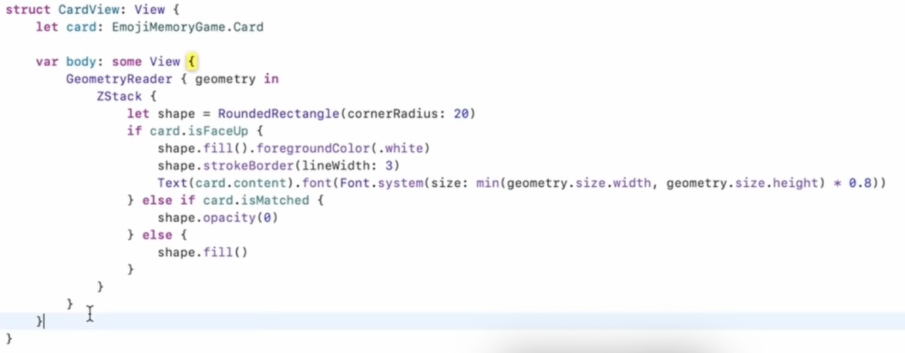

本文涉及内容：`ViewModifier, Property Observers, Layout`

----

# ViewModifier

`.aspectRatio(2/3)` is likely something like `.modifier(AspectModifier(2/3))` AspectModifier can be `anything` that conforms to the `ViewModifier` protocol ...

它只有一个body方法：
```swift
protocol ViewModifier {
    associatedtype Content // this is a protocol’s version of a“don’t care” 
    func body(content: Content) -> some View {
        return some View that represents a modification of content }
}
```

* 对一个view调用`.modifier`就是把这个view传成了上述body方法的content
* 而从`.modifer`变成`.cardify`，不过是用了`extension`：
```swift
extension View {
    func cardify(isFaceUp: Bool) -> some View {
        return self.modifier(Cardify(isFaceUp: isFaceUp))
    }
}
```

# Property Observers

* 语法长得像`computed var`, 但完全不是一回事 （get, set之于willSet, didSet）
* willSet, didSet，对应newValue, oldValue

## @State

your view is **Read Only**, 

为什么？
> 因为view的生命周期足够短，基本上是不断地生成和销毁，根本不需要”被改变“

* 所以永远用`let`
* 所以是`stateles`的

这样的结构很简单，任何view的变化其实就是重绘。

仍然有些时候需要状态：
- 编辑表单
- 模态窗口或通知窗口等临时窗口
- 动画需要追踪动画进度

声明：
```swift
@State private var somethingTemporary: SomeType // this can be of any type
```
* private 表示别人访问不到
* @State的的变化会在**必要时**引起重绘 （相当于一个`@ObservedObject`）
* view会不断销毁和重建 -> 指针会永远指向新的内存地址
* 而state是在堆上分配的空间
* 所以销毁和重建view并不会丢失state
* 后文`property wrapper`详述

# Layout

1. `Container`提供空间
2. `Views`确定自身的大小
3. `Container`提供`View`的位置
4. `Container`确定自身大小（等同于#2)

## HStack and VStack

横/纵向排列元素(View)，并提供“尽可能小”的空间，根据元素性质，有三种场景：
1. `inflexble` view: `Image`，fixed size
2. slightly more flexible view: `Text`，适应文字的合适大小
3. very flexible view: `RoundedRectangle`: 占满空间 -> 基本上`Shape`都会有多少空间占多少

* 一旦元素确定了size，多余的空间就会给下一个元素，最后`very flexible view`平均分配剩下的空间
* 所有元素大小确定，容器大小也就确定了，如果有`very flexible`的，那么容易本身也是`very flexible`的

remark：
* `Spacer(minLength: CGFloat)` 空格, draw nothing, 占尽可能多的空间
* `Divider()` 画条分隔线，占尽可能小的空间
* `.layoutPriority(100)` 用优先级来表示分配空间的顺序，默认值为0。后分配者如果没有空间了会用省略号表示
* `HStack(alignment: .leading)`用来控制元素的对齐

> List, Form, OutlineGroup 其实就是 `really smart VStacks`，即本质上就是一个纵向排列的布局。

## LazyHStack and LazyVStack

* *Lazy*的意思是如果元素对应的位置没有出现在屏幕上，就不会构建View.
* they also size themselves to fit their views
* 前两条加一起，得出这个容器不会尽可能多的占用空间，即使含有very flexible的view -> 尽可能小的空间
* 显然，它最多出现在`ScrollView`里（只有在有限窗口里滚动，才有可见不可见的差别）

## Scrollview

* 给多少空间占多少空间

## LazyHGrid and LazyVGrid

* 一个方向view数量固定，另一个方向动态增减（scroll）的H/V stack，以竖向的`LazyVGrid`为例：
* 确定每行元素个数，多少行由元素总数决定
* 或者确定元素大小，在行方向铺满后，再往下一行铺
* HGrid方向则是先纵向铺满，再水平铺

## ZStack

* sizes itself to fit its children
* can be very flexible (if one children is)

两个modifier其实也是用的ZStack:
* `.background`，插入一个view在底层，stack起来: `Text("hello").background(Rectangle().foregroundColor(.red))`
* `.overlay`，覆盖到表层的zstack: `Circle().overlay(Text("hello"), alignment:.center)`

More：
* 一个view是可以选择任意size的，哪怕比给它的空间更大(产生裁剪)
* `.aspectRatio(2/3, contentMode: .fit)`如果是在HStack里，
    * 则是把元素横向排列后得到宽度，根据宽度计算出高度，得到元素大小
    * `.fit`表示完整显示图片（就长边），短边部分补成黑色，`.fill`应该是就短边，长边部分就裁剪了

```swift
HStack {
    ForEach(cards) { card in
        CardView(card).aspectRatio(2/3, contentMode: .fit)
    }
}
    .foregroundColor(.orange)
    .padding(10)
```
1. 在能够分配的空间里，四边各减10 -> padding(10)
2. 减10后的空间里，根据aspectRation确定一个size
3. 这个size应用给CardView
4. 组合成HStack的size

总大小就是HStack的size四边各加10

而View们如何知道能占多少空间？-> `GeometryReader`

## GeometryReader

```swift
var body: View {
    GeometryReader { geometry in
        ...
    }
}
```
参数`geometry`是一个`GeometryProxy`:

```swift
struct GeometryProxy {
    var size: CGSize
    var safeAreaInsets： EdgeInsets
    func frame(in: CoordinateSpace) -> CGRect
}
```
* `size`表示被提供了多少的空间（by its container)
* 并且不包含safe area（如刘海）
* 如果需要绘制到safe area里去: `ZStack{...}.edgesIgnoringSafeArea([.top])`



图中演示的是设置卡片字体的大小，希望尽可能地填充卡片，`geometry.size`能给出运行时数据，而无需硬编码。
