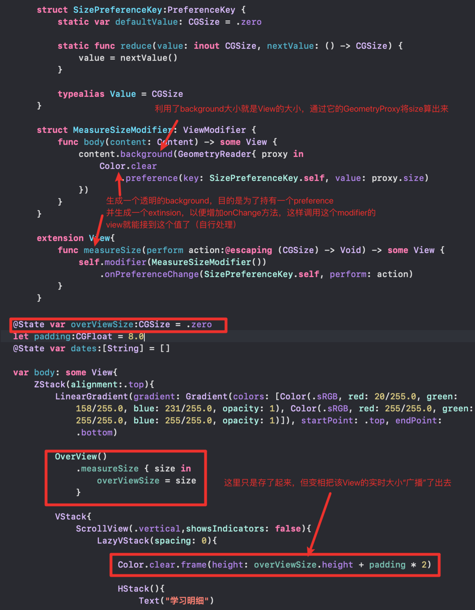

[cs193p_2021_笔记_1](https://www.jianshu.com/p/998b0ef4a2cd)
[cs193p_2021_笔记_2](https://www.jianshu.com/p/af0ad1bead34)
[cs193p_2021_笔记_3_Animation_Transition](https://www.jianshu.com/p/d103f8d12052)
[cs193p_2021_笔记_4_Color_Image_Gesture](https://www.jianshu.com/p/41e7309c7f55)
[cs193p_2021_笔记_5_Property Wrapper](https://www.jianshu.com/p/e3c2ee1628c6)
[cs193p_2021_笔记_6_Persistence](https://www.jianshu.com/p/a315274a4fd2)
[cs193p_2021_笔记_7_Document Architecture](https://www.jianshu.com/p/f4ae879eef9c)

所有笔记已导出成一篇pdf文档，已上传百度：
链接: https://pan.baidu.com/s/1hgnzfxbE9l4zlcYBDsa-1g 提取码: 7w1f

---

本文内容：与UIKit的集成，以及学习过程中的一些tips，skills，与章节无章的notes

---

# MVVM


* viewmodel要起到gete keeper的作用，它就要把model给private起来
    * 或者private (set), 这样保护了写，但是能读
    * 或者用一个计算属性把需要的model 暴露出去
* 一个viewmodel通常要conform `ObservableObject`
    * 就隐含了一个`var objectWillChange: ObservableObjectPublisher`
    * model要改动前：`objectWillChange.send()`
    * 或者，把model改为`@Publisher var model`，会自动广播
* 订阅者（通常就是View）就要把这个viewmodel打个可订阅的标识：
    * `@ObservedObject var viewModel: MyViewModel`
    * 只能是`var`，因为很明显是会变的
    * View监听到是会自动invalicate view的，就会重绘

# UIKit Integration

UIKit并不是纯View的世界，大多数时候是跟ViewController一起出现的，还严重依赖`Delegate`这种机制进行跨View的事件传递（回调）。

## Representbles

`UIViewRepresentable`，`UIViewContorllerRepresentable`都是SwiftUI的View了，包含几个组件：

1. `makeUIView{Controller}(context: Context) -> view/controller`
2. `updateUIView{Controller}(view/controller, context: Context) ->`
3. `makeCoordiinator() -> Coordinator` // handle delegate
    * 调用该方法后, `context.coordinator`就有值了
4. a `Context` containn the coordinator, swiftui's env, animation transaction
5. `dismantleUIView{Controller}(view/controller, coordinator: Coordinator)` // clean up when disappears

# Tips & Skills

学习过程随笔记下来的一些技巧和知识点:

## basic

* [0...6]是0到6，[0..<6]是0到5
* var s = struct_a; s["a"] = 3, 不会改变struct_a, 因为struct永远是复制
* `arr.firstIndex(where: { item in item.id == myID})`，因为where需要的函数传递的是本身（类似map, filter)，所以可以简化为：
    * `arr.firstIndex(where: { $0.id == myID})`
* `typealias Card = MemoryGame<String>.Card` 别名
* `var a_int_array = [Int]()` 一种初始化方式
* extension中的属性可以直接用，（当然也可以用`self.`）
* `arr.filter { isGood($0)}` 因为参数就是自己，还可以继续简化： `arr.filter(isGood)``
    * 同理：`[1...100].reduce(0, +)`，因为默认参数是两个，所以会自动填到+号两边，展开就是`{ $0 + $1 }`
* `Collection` protocol is for *immutable* collections
    * mutalbe Collection protocol is `RangeReplaceableCollection`
    * 所以要写一个扩展，在改变集合的元素，先选对正确的protocol
* 用`try`还是`try?`调用一个声明了`throw`的函数，取决于你是要忽略它还是处理它
    * `try`就是不处理，结果就是包含了这段代码的函数也要标上`throw`
    * `try?`就是忽略掉，承认`nil`
* `String(describing: obj)`: 对象的字符串表示，或字符串描述
* `#function` 程序名
* `@ScaleMetric var fontSize: CGFloat = 40.0` 固定大小的字体，用`@ScaleMetric`也能按比例缩放
* 剪贴板：`UIPasteboard.general.image?.jpegData(...)`
* safe area: `UIAplication.shared.windows.first?.safeAreaInsets`
* `views.map{ UIHostingController(rootView: $0)}` 把一组View转为ViewController
* `timer = Timer.publish(erery: 3, on: .current, in: .common).autoconnect()`
    * view`.onReceive(timer, perform: {}) `
* `Texxt(Image(systemName: "video.circle")) + Text("视频")`: 两个知识点
    * Text view重载了`+`操作符，省去了用`HStack`
    * Image也可以作为Text的内容
* `Circle + trim + stroke + rotation` 可以组合出一段任意角度的弧形
* 一个`PreferenceKey`用来广播属性变化的例子：


    * see more [https://swiftwithmajid.com/2020/01/15/the-magic-of-view-preferences-in-swiftui/](https://swiftwithmajid.com/2020/01/15/the-magic-of-view-preferences-in-swiftui/)
看一个简化的实例：

可以看到，其实化简化可读性更强，用for循环，再在里面做逻辑，会把直白的初衷绕进去：
* 返回唯一一个面朝上的卡片
* 设置选定索引的卡片面朝上

* 同样， `Button`的声明是：`(_ title: StringProtocol, action: () -> Void)`, 
    * 简化后也更加直观了：`Button("text"){ actions }`

* 给class/struct添加和使用默认的`description`有点绕，等于原生并不支持，还理解成了`String`的方法
```swift
struct abc: CustomStringConvertible {
    var a:Int
    var b:Int
    func de() -> String{
        // #function, file, filePaht, fileID, line, column
        "\(String(describing: self))\n\(#function)\n\(#filePath)"

        // String(describing: obj)
        // 理解为用obj对象的description属性来构造字符串
        // 而一般人的设计思路会是：给obj对象增加一个description属性，这个属性是个string
        // 并且这个对象要服务 CustomStringConvertible 协议
    }
    var description: String {
        "{\"a\":\(a), \"b\":\(b)}"
    }
}

abc(a: 77, b: 88).de() // 输出： {"a": 77, "b": 88} \n de() \n myfile_path
```

## view

* `var body : some View {...}` 意思是你自己不需要实现View，但你要返回some实现了View的（别的）对象
    * 它是一个computed var，所以跟的{}就是一个function
    * 所以{}里隐含了一个return
* `Text("hello").padding()`返回的不再是Text
* `ZStack(alignment: .center, content: {...})`
    * 简化为：`ZStack(alignment: .center) {...}`，提取了方法体
    * 如果`alignment`为空： `ZStack {...}`
    * 所以它里面也可以有局部变量
* 多个函数参数也可以简化：
    * `Button(action: {...}, label: {...})`
    * `Button {...} label: {...}`省掉了第一个参数名，省掉了逗号
* `Button.contextMenu{ some View}` 上下文菜单，内容就是some View
* `Menu{ some View} label: { Label }` 呈现为一个button，点击后会自动呈现some View组成的菜单
    * 也就是说它自己帮你封装了UI和行为（点击弹出菜单），不需要写什么`onTap`事件
* `myView.sheet(isPresented: $flag) { some View}` 通过`$flag`就能根据`myView`的位置在合适的位置打开sheet，内容由@viewBuilder的closure提供
* `popover`也同理，还有一种popover时把对象传进去的用法：
    * `popover`与`sheet`的区别是`popover`在计算自身大小的时候是“尽可能小”，所以在包的对象里对好自己size一下
* alert有点不同：`.alert(item: $flag) { alertToShow in return Alert}`， 就是要返回一个`Alert`对象
* `myView.popover(item: $obj) {obj in ...}` 这一类传item做flag的用法也有广泛的使用场景
* 弹出的页面查看自己的状态，用`presentationMode`环境变量
    * `presentationMode.wrappedValue.isPresented`
* `NavigationView`里的`NavigationLink`也是一样封装了UI和行为（点击跳转）
*  toolbaritem的placement除了leading, trailing等直观表示，还有一些语义对应的(类似alert中有红色的销毁按钮），如`destructiveAction, cancellationAction, confirmationAction`等，甚至`automaic`
* 工具条放到底部：ToolbarItemGroup(placement: .bottmbar){}`
* `.StackNavigationViewStyle`, 让大屏幕iPhone横屏时不去尝试左右分屏，直接铺满
* `UIDevice.current.userInterfaceIdiom == .pad`
* 环境变量：`horizontalSizeClass`, `verticalSizeClass`等，根据是否compact来判断布局，而不是写死的大小，以实现跨机型适配


## layout

* `lazyVGrid(columns: [GridItem(.fixed(200)), GridItem(.flexable()), GridItem())])` 
    * 其实就是一个flex的排版
    * 横向利用所有空间，竖向尽可能小
    * 竖排，没定义，看效果是top
    * 横排，由每一个GridItem来定义
    * `Lazy`的意思是只有出现在屏幕上时，才会渲染`body`
    * 如果横向元素也自由排列呢？比如横屏15个，竖屏6个
        * `lazyVGrid(columns: GridItem(.adaptive(minimum: 80)))` 只要一个item, 然后指定一个最小宽度即可
    * 同理应该有lazyHGrid

## static

* .largeTitle, .white, 其实就是静态变量: `Font.largeTitle`, `Color.white`，所以不要觉得代码里用`static let xxx = xxx`很low
    * 静态方法同理，只要不需要是实例变量的，都可以staic起来，跳出初始化流程


## XCode

* 设置 > Behaviors > Generates output 可以设置模拟器有output时的行为，比如拉出控制台看输出
```swift
    // 设置预览的设备
    .previewDevice(PreviewDevice(rawValue: "iPhone 12"))
    .previewDisplayName("iPhone 12")
```
* preview里面你做两个`.preferredColorScheme(.dark/.light)`就可以同时预览两种颜色模式下的效果了 
* 其实以上在右侧面板设置会更简单，一样会在Preview里生成相应（跟手写一模一样）的代码


...
