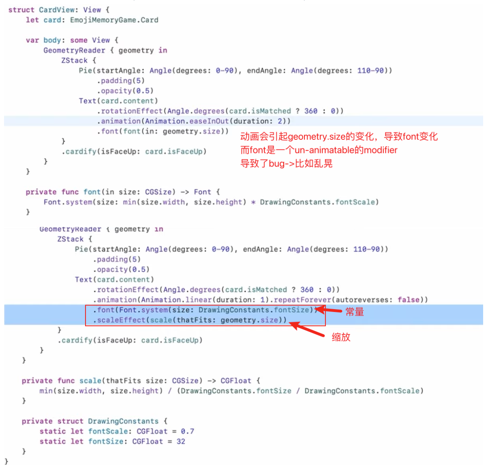
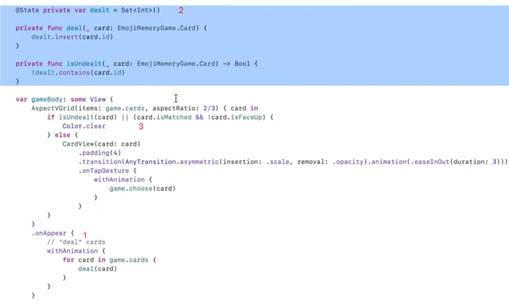
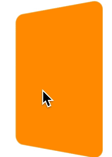

[cs193p_2021_笔记_1](https://www.jianshu.com/p/998b0ef4a2cd)
[cs193p_2021_笔记_2](https://www.jianshu.com/p/af0ad1bead34)
cs193p_2021_笔记_3_Animation_Transition
[cs193p_2021_笔记_4_Color_Image_Gesture](https://www.jianshu.com/p/41e7309c7f55)
[cs193p_2021_笔记_5_Property Wrapper](https://www.jianshu.com/p/e3c2ee1628c6)
[cs193p_2021_笔记_6_Persistence](https://www.jianshu.com/p/a315274a4fd2)
[cs193p_2021_笔记_7_Document Architecture](https://www.jianshu.com/p/f4ae879eef9c)
[cs193p_2021_笔记_8](https://www.jianshu.com/p/2136bdc2c6f6)

-----

# Animation

* One way to do animation is by animating a Shape.
* The other way to do animation is to animate Views via their `ViewModifiers`.
* Only `changes` can be animated
    * ViewModifier arguments (not all, i.e. fonts)
    * Shapes
    * the *existance* of a View in the UI
        * 比如if-else和ForEach
* You can only animate changes to Views in *containers that are already on screen* (`CTAAOS`).

两个golden rule:
1. 要有view modifier的属性变化
2. 要在屏幕上
才会触发动画（其实就是上面的最后两条）

* 课程的动画例子里，用了if-else来生成view，这样导致了新生成的view不会触发动画
* 比如点开两张牌，新点开的那张牌由于之前牌的内容并没有出现在屏幕上，导致动画没有触发
* 所以把view的结构由if-else的生成和销毁机制，变成了透明度切换机制
    * 即正面和反面都在屏幕上，只不过透明度相反，以在视觉上要么是正面要么是反面
    * 本以为透明度为0就会销毁视图(UIKit？)，看样子并不是这样的，大胆用opacity就好了

## 隐式调用

```swift
Text(“👻 ”)
    .opacity(scary ? 1 : 0)                             // 普通modifier, 即如果没有动画，也需要的状态（即代码也不会删）
    .rotationEffect(Angle.degrees(upsideDown ? 180 : 0))    // 动画modifier，即定制的动画效果，不需要动画的时候，就不需要这一行
    .animation(Animation.easeInOut)                         // 触发
```
- 上述所有`ViewModifier`都会被动画
    * `scary, upsideDown`等值改变时也会触发动画
- 隐式调用会冒泡（所以不要对一个container view做`.animation`，还有定位的问题)
- animation的参数就是一个struct： duration, delay, repeat, curve...

对于不能动画的modifier，看一下这个实例（上为修改前，下为修改后）


1. 把font设为常量，把缩放变成一个geometric effect
2. 同时也说明`.animation()`不止作用于它前面的

## 显式调用

```swift
withAnimation(.linear(duration: 2)) {
    // do something that will cause ViewModifier/Shape arguments to 
change somewhere }
```
- It will appear in closures like `.onTapGesture`.
- 显式动画不会覆盖掉隐式动画
- 很少有处理用户手势而不包`.withAnimation`的

# Transition

- 转场，主要用于view的出现和消失
- 一对`ViewModifier`，一个`before`, 一个`after`

```swift
ZStack {
    if isFaceUp {
        RoundedRectangle() // default .transition is .opacity 
        Text(“👻 ”).transition(.scale)
    } else {
        RoundedRectangle(cornerRadius: 10).transition(.identity)
    }
}
```

Unlike .animation(), .transition() does not get redistributed to a container’s content Views. So putting .transition() on the ZStack above only works if the entire ZStack came/went. 

(Group and ForEach do distribute .transition() to their content Views, however.)

意思是`.transition`并不会向下传递，如果对`ZStack`做转场，只会把整个容器进行转场而不是里面的view（见实例二）

- 转场只是一个声明，并没有触发动画（其实就是设置了`ViewModifier`）
- 所以转场没有隐式调用
- 只对CTAAOS有用

`.onAppear`或`.onDisappear`时，container必然是在屏幕上的，所以这是一个写`.transition`的好地方（记得要`withAnimation`)

built-in transitions:

- AnyTransition.opacity: 通过`.opacity` modifier来实现淡入淡出
- AnyTransition.scale: 通过`.frame` modifier来实现缩放
- AnyTransition.offset(CGSize): 通过`.offset`来实现移动
- AnyTransition.modifier(active:identity:): 你提供两个`ViewModifier`

通过`AnyTransition.animation`(Animation`)来定制动画细节：

```swift
.transition(.opacity.animation(.linear(duration: 20))) 
```

# 动画机制

其实就是给出一系列的数据点，系统会根据这些数据点把时间切分，你给的数据点越多，切的时间块也就越多，而且系统会根据你的线性函数来决定是平均还是怎样去切分这些时间块：
- the animation system divides the animation duration up into little pieces.
- The animation system then tells the Shape/ViewModifier the current piece it should show. 
- And the Shape/ViewModifier makes sure that its code always reflects that.

系统通知变量当前的值，UI根据这个值实时绘制当前的View，不断销毁重建，就是动画的过程。

系统是用一个变量来通知这个进度的：`Animatable` protocol的唯一成员变量：`animatableData`:

```swift
var animatableData: Type
```

* Type只需要满足`VectorArithmetic`协议，其实就是一个可以被细分的值，基本上是Float, Double, CGFloat，以及`AnimatablePair`(其实就是两个`VectorArithmetic`)
* 想要支持动画的`Shape`, `ViewModifier`，只需要实现`Animatable`协议即可（即提供一个`animatableData`属性）

Because it’s communicating both ways, this animatableData is a `read-write` var.
* The `setting` of this var is the animation system telling the Shape/VM which piece to draw.
* The `getting` of this var is the animation system getting the `start/end` points of an animation.

**实例一**


* view modifier里面有一个变量`rotation`（ZStack, content, rotation3DEffect)
* 那么外层在`withAnimation{}`的时候，我们是期望rotation的值能动起来的
    * 内置的viewmodifier当然会自己动，如`opacity`等
* 那么我们首先就要让`Cardify` conform to `Animatable`（例子中的AnimatableModifer = Animatable + ViewModifer)
* 然后我们就要实现`animatableData`, 因为系统事实上就是不断去更新这个data值
* 教材里把它进行了封装（当然你也可以直接用它），这只是思维方式上的区别
* `animatedData`会随时间变化，自然会不断invalidate view，然后rebuild view，动画就产生了。

**实例二**

课程里有这么个需求：卡片由`LazyVGrid`提供布局，且卡片出现和消失的时候都要有动画。

出现和消失？那当然就是`Transition`的事了:
```swift
Card()
  .transition(AnyTransition.asymmetric(insertion: .scale, 
                                         removal: .opacity)))
```
运行时发现消失的时候有动画，出现的动画却没有。原因是`transition`只会在*出现和消失*时触发，而我们的卡片是包在grid容器里的，所以grid出现在屏幕上的时候，就带着卡片一起出现了，transition并不会向下传递（前文也已经说过了，这里刚好印证）。

1. 所以解决方法当然可以“延迟”呈现这些卡片
2. 课程里用了另一种方法，机制当然也是延迟，但不是那么地直白：



* 就是利用了`.onAppear`来阻断容器和卡片的连续生成，而改用容器呈现后，再逐个“添加”的方式，让每一张卡片都有一个单独出现的机会
* 同时也必须利用`@State`, 让每添加一张卡片都会invalidate view一次
* 也能看出，animate能animate的就是属性和transition

> 当然，课程最后改成了“发牌”的机制，手动添加卡片，彻底阻断了卡片和容器一起出现的场景。

这就带我们来到了实例三，同一个view在不同容器间的动画，怎么计算各自尺度下同一个view的位置：`matchedGeometryEffect`

**实例三**


* 想要有牌一张张发出去的效果，自然会想到添加延时
* 实现成了同时做动画，只不过越到后面的牌，延时越长（动作越慢），而不是我们想象的先后触发

为了让不同的牌发出去时有立体效果，还以index为依据设置了`zIndex`，最终效果：


