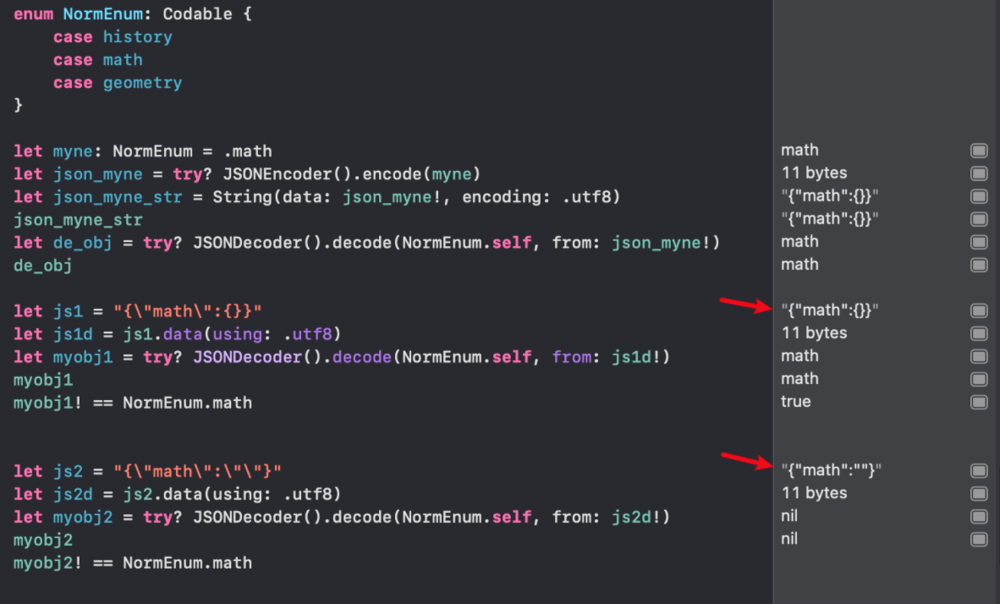

[cs193p_2021_笔记_1](https://www.jianshu.com/p/998b0ef4a2cd)
[cs193p_2021_笔记_2](https://www.jianshu.com/p/af0ad1bead34)
[cs193p_2021_笔记_3_Animation_Transition](https://www.jianshu.com/p/d103f8d12052)
[cs193p_2021_笔记_4_Color_Image_Gesture](https://www.jianshu.com/p/41e7309c7f55)
[cs193p_2021_笔记_5_Property Wrapper](https://www.jianshu.com/p/e3c2ee1628c6)
cs193p_2021_笔记_6_Persistence
[cs193p_2021_笔记_7_Document Architecture](https://www.jianshu.com/p/f4ae879eef9c)
[cs193p_2021_笔记_8](https://www.jianshu.com/p/2136bdc2c6f6)

--

# Persistence

持久化数据的方式有
* File system（FileManager）
* Sqlite/CoreData
* iCloud: 根据上面两种格式存储
* CloutKit: a database in the cloud (network)
* UserDefaults
* Codable/JSON
* UIDocument (UIKit feature)(与Files App集成)
* 3rd-party

## UserDefaults

* 只能存储`Property List`
* `Property List`支持String, Int, Bool, floating point, Date, Data, Array or Dictionary
    * 任何其它类型需要转成`Property List`
    * `Codable` converts structs into `Data` objects (and `Data` is a `Property List`).

```swift
let defaults = UserDefaults.standard
defaults.set(object, forKey: “SomeKey”) // object must be a Property List
defaults.setDouble(37.5, forKey: “MyDouble”)

// retrive

let i: Int = defaults.integer(forKey: “MyInteger”)
let b: Data = defaults.data(forKey: “MyData”)
let u: URL = defaults.url(forKey: “MyURL”)
let strings: [String] = defaults.stringArray(forKey: “MyString”) 
// etc.
// Retrieving Arrays of anything but String is more complicated ...
let a = defaults.array(forKey: “MyArray”) // will return Array<Any>
// 最好用Codable的data(forKey:)替代
```

## Core Data

SwiftUI进行的集成:
* 创建的对象是`ObservableObjects`
* 一个property wrapper `@FetchRequest`
* 管理对象(context)是`NSManagedObjectContext`
* context通过`@Environment`传入

demo:
```swift
@Environnment(\.managedObjectContext) var context
let flight = Flight(context: context)
flight.aircraft = “B737” // etc.

let ksjc = Airport(context: context)
ksjc.icao = “KSJC” // etc.

flight.origin = ksjc // this would add flight to ksjc.flightsFrom too try? context.save()

let request = NSFetchRequest<Flight>(entityName: “Flight”) request.predicate =
NSPredicate(format: “arrival < %@ and origin = %@“, Date(), ksjc) 
request.sortDescriptors = [NSSortDescriptor(key: “ident”, ascending: true)] 

let flights = try? context.fetch(request) // past KSJC flights sorted by ident
// flights is nil if fetch failed, [] if no such flights, otherwise [Flight]
```

以上是core data部分，还是浓浓的OC的痕迹，看看Swift UI的版本。

首先，上述的`Flights, Airports`都是ViewModel。它自然拥有它的`Property Wrapper`:

```swift
@FetchRequest(entity:sortDescriptors:predicate:) var flights: FetchedResults<Flight>
@FetchRequest(fetchRequest:) var airports: FetchedResults<Airport>

// flights and airports will continuously update as the database changes. 
ForEach(flights) { flight in
    // UI for a flight built using flight 
}

// bi-binding
_flights = FetchRequest(...)
```

## Cloud Kit

上个demo吧
```swift
let db = CKContainer.default.public/shared/privateCloudDatabase 
// Record理解为Table
let tweet = CKRecord(“Tweet”)
// 索引理解为Field
tweet[“text”] = “140 characters of pure joy”
let tweeter = CKRecord(“TwitterUser”)
tweet[“tweeter”] = CKReference(record: tweeter, action: .deleteSelf)
db.save(tweet) { (savedRecord: CKRecord?, error: NSError?) -> Void in
    if error == nil {
    // hooray!
    } else if error?.errorCode == CKErrorCode. NotAuthenticated.rawValue {
        // tell user he or she has to be logged in to iCloud for this to work!
    } else {
        // report other errors (there are 29 different CKErrorCodes!) 
    }
}

// Query
// 类似core data, 构造predict, request(就是query)即可

let predicate = NSPredicate(format: “text contains %@“, searchString)
let query = CKQuery(recordType: “Tweet”, predicate: predicate)
db.perform(query) { (records: [CKRecord]?, error: NSError?) in
    if error == nil {
        // records will be an array of matching CKRecords
    } else if error?.errorCode == CKErrorCode.NotAuthenticated.rawValue {
        // tell user he or she has to be logged in to iCloud for this to work!
    } else {
        // report other errors (there are 29 different CKErrorCodes!) 
    }
}
```

One of the coolest features of Cloud Kit is its ability to `send push notifications` on changes. All you do is register an `NSPredicate` and whenever the database changes to match it,

## File System

Sandbox包含：
* Application directory — Your executable, .jpgs, etc.; not writeable.
* Documents directory — Permanent storage created by and always visible to the user. 
* Application Support directory — Permanent storage not seen directly by the user. 
* Caches directory — Store temporary files here (this is not backed up).
* Other directories (see documentation) 
* ...

```swift
let url: URL = FileManager.default.url(
    for directory: FileManager.SearchPathDirectory.documentDirectory, // for example 
    in domainMask: .userDomainMask // always .userDomainMask on iOS
    appropriateFor: nil, // only meaningful for “replace” file operations
    create: true // whether to create the system directory if it doesn’t already exist
 )
```

Examples of SearchPathDirectory values :
```swift
.documentDirectory, 
.applicationSupportDirectory, 
.cachesDirectory, 
etc.
```

再列些常用api：
```swift
// URL

func appendingPathComponent(String) -> URL
func appendingPathExtension(String) -> URL // e.g. “jpg”
var isFileURL: Bool // is this a file URL (whether file exists or not) or something else? 
func resourceValues(for keys: [URLResourceKey]) throws -> [URLResourceKey:Any]? 
// Example keys: .creationDateKey, .isDirectoryKey, .fileSizeKey

// Data

// retrive binary data
// option almost always []
init(contentsOf: URL, options: Data.ReadingOptions) throws 
// write
// The options can be things like .atomic (write to tmp file, then swap) or .withoutOverwriting.
func write(to url: URL, options: Data.WritingOptions) throws -> Bool

// FileManager
fileExists(atPath: String) -> Bool
// Can also create and enumerate directories; move, copy, delete files; etc.
```

## Codable

* 保留一个对象所有的var（变量）的机制
* 如果一个Struct它的成员变是Codable的，那么Swift会帮你把这个Struct实现Codable，比如没有associated data的Enum。
* 帮你实现不代表不要显式声明
* 基础类型基本上都实现了Codable

```swift
let object: MyType = ...
// encode
let jsonData: Data? = try? JSONEncoder().encode(object)

// write file
try jsonData.write(to: url)

// deocde as string
let jsonString = String(data: jsonData!, encoding: .utf8)

// decode as object
let myObject: MyType = try? JSONDecoder().decode(MyType.self, from: jsonData!)
// 从字符串到对象没有一步到位的办法，只能先string->Data
let data = jsstring.data(using: .utf8) // 再把data传到上术方法里
```

encode, decode是会throw的，注意try_catch相应的Error，比如`.keyNotFound, .dataCorrupted...`

### CodingKeys

json与对象相互进行转化有一个通用的需求，就是键的映射，这更常用在外部API与本地类的映射中，比如userId，别人叫guestId，等等，Swift中，用一个叫`CodingKeys`的枚举来实现这个映射：

```swift
private enum CodingKeys: String, CodingKey {
    case uid = "user_id"
    case someDate = "some_date"
    case pname = "panme" // 表示在JSON中也叫这个名字 
    case sku // 如果名字一样的话，可以这么简写 
    // 但是不写的话，序列化的时候就不会序列这个字段了
    // 解码时会有 KeyNotFound 类的错误
}

// 结合起来，用在init中
init(from decoder: Decoder) throws {
    // container是切入点，要弄清楚
    // 如果没有手写键的映射表，那么keydBy就是自己
    let container = try decoder.container(keyedBy: CodingKeys.self)
    someDate = try container.decode(Date.self, forKey: .someDate) 
    // 从json中加载.someDate对应的键的值，尝试解码成Date
    // other vars (每种case必须全部都有)
}
```

### Enum

序列化枚举有点复杂：
1. 简单枚举应该怎么序列化？ 其实是序列化成case对应的名字和表示空JSON的`{}`组成的键值对，比如`{"math":{}}`
2. 有关联数据的枚举呢？ 那就得自己提供`encoder`:
    * `case url: try container.encode(url, forKey: .url)` 即对相应的枚举值进行相应的encode
3. 并且自行decode，但是与struct（为每一个key填值）不同，因为枚举变量只是一个值，所以是依次尝试，解码成功就认定是那一个枚举值
```swift
if let url = try? container.decode(URL.self, forKey: .url) {
    self = .url(url)
} else if ... // 别的尝试

// 此句的作用是根据.url对应的键名，取出值，反射成URL对象，如果成功，那么这个枚举值是.url无疑
// 而且关联数据就是反射的结果
// 如果失败，继续换一个键名，将对应的值转成对应的类型，依次类推
```
4. 那么如何手动decode一个原始的枚举呢？
    * 我们知道上述实践是为了反射出关联数据，并且根据能够成功反射关联数据来判断枚举类型
    * 原始枚举需要encode哪个值呢？-> 目前我只能做一个空`struct`来实现序列化成`{}`的目的 -> 为了跟默认形态保持一致
        * 事实上你是可以encode成任意值的（比如100，"hello"，因为我们只关心有没有这个键，有的话，就是这个枚举类型，只是`{}`拥有可读性
        * 你encode成什么值，decode的时候对对应的键尝试去反射回这个值就行了


最后，思考题：
> 上面说了，原生枚举序列化成： `{"math":{}}`，也说了，如果，键对应的值对原生枚举序列化是没意义的，可以是任何值，那么对于`{"math":100}`，能否顺序序列化回其枚举形态`.math`呢？

答案：
1. 值为100报错了
2. 于是我改为""或"other“等字符串或空字符串，解码的结果是`nil`

也就是说，默认的decode只认`{}`



而前面我们知道了，如果是自己手写，它可以是任何值，它的意义仅仅是个标识，并不会取它的值。验证：
```swift
enum NormEnum: Codable {
    case history, math, geometry
    
    private enum keyMap: String, CodingKey{
        case history  = "HIST"
        case math     = "MATH"
        case geometry = "GEOM"
    }

    func encode(to encoder: Encoder) throws {
        var container = try encoder.container(keyedBy: keyMap.self)
        switch self{
        case .history: try container.encode("", forKey: .history)
        case .math: try container.encode("", forKey: .math)
        case .geometry: try container.encode("", forKey: .geometry)
        }
    }
    
    init(from decoder: Decoder) throws {
        let container = try decoder.container(keyedBy: keyMap.self)
        if let s = try? container.decode(String.self, forKey: .history) {
            self = .history
        } else if let s = try? container.decode(String.self, forKey: .math) {
            self = .math
        } else {
            self = .geometry
        }
    }
}
```
上面的代码中，我将三个字段全部用空字符串编码，并且给了三个不同的键名，现在，我真入任意值，比如`"HAHA"`，解码看看：
```swift
let js2 = "{\"MATH\":\"HAHA\"}"
let js2d = js2.data(using: .utf8)
let myobj2 = try? JSONDecoder().decode(NormEnum.self, from: js2d!)
```
结果成功认出myobj2是一个`.math`。原理当然是我的代码里在尝试转成一个字符串，而没有限定是什么字符串。
