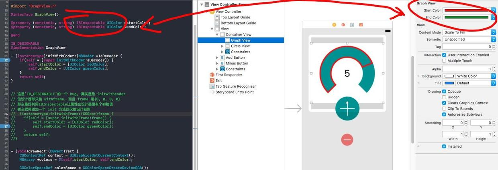

首先, 了解一下 [IBInspectable / IBDesignable](http://nshipster.com/ibinspectable-ibdesignable/)
这是让 Xcode能在设计时就体现你代码对 UI 进行的修改, 以及在设计器里能动态增加你对视图添加的属性的控件的特性(是的, 只是 xcode 的特性, 并不是语言特征)

然后, 用这个的人多半碰到了这类问题:

>error: IB Designables: Failed to update auto layout status: Interface Builder Cocoa Touch Tool raised a "NSInternalInconsistencyException" exception: Could not load NIB in bundle: 'NSBundle

网上可能有一大堆讨论相关问题的贴子, 解决方法不尽其数, 可能都不适用你, 所以我的这篇也可能不适用你, 最好还是善用搜索, 我谨提供一种思路.

网上有让你修改工程配置的, 寻找崩溃日志的, 解决我这个问题的, 是在Storyboard 界面里选中出问题的 View(你一定要至少知道是给哪个 view 添加上 `IB_DESIGNABLE`才导致的问题, 可以通过逐个移除这个声明以测试), 再在菜单里选择: `Editor - Debug Selected Views`
这个时候就会模拟`IB_DESIGNABLE`进行 debug, 再加上全局异常断点, 代码就会在崩溃处命中了.

我的问题是我用了两个属性, 然后在 view 的 `drawWithRect:`方法中, 这两个属性都为空, 而我的属性是在`initWithCoder:`中初始化的. 所以我再添加`initWithFrame:`, 在其中解决, 顺利解决.

这说明三个问题:
1. `IB_DESIGNABLE`目前的实现还有 bug, 真实启动是跑`initWithCoder:`的, 它在设计器里绘图的时候却走了`initWithFrame:`, 你可能不得不为了对付这个 bug 而添加一次同样的代码
2. `initWithFrame:`的时候 frame 是{0, 0, 0, 0}可别忘了, 有时候这个也是崩溃原因
3. 如果我把`drawWithRect:`中要用到的属性提前初始化一样可以避免这样的问题, 怎样做? 配合`IBInspectable`, 然后在设计器中给属性设初始值

