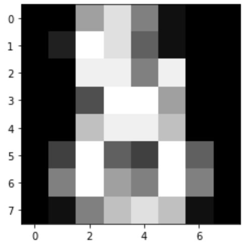
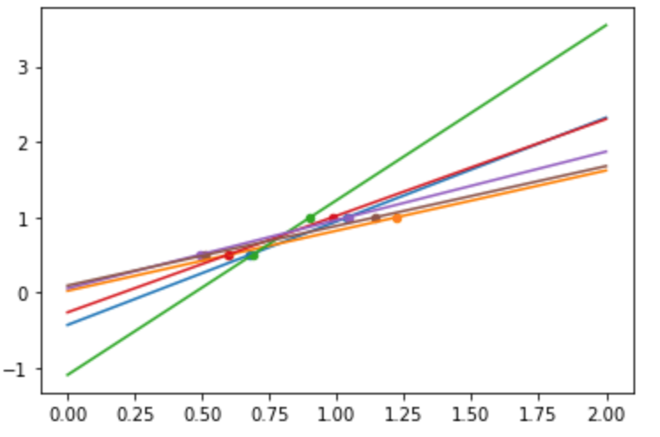
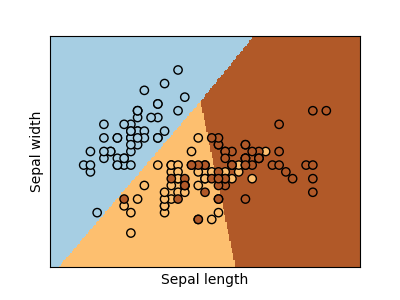

当初翻scikit learn文档的时候，越翻越多，干脆把它的教程拿出来看了看，只有前面的部分，主要想看看scikit learn角度整理的知识体系，果然，一开始就是从监督和非监督讲起：

## Machine learning

In general, a learning problem considers a set of n samples of data and then tries to predict properties of unknown data. 

Learning problems fall into a few categories:

* [supervised learning](https://scikit-learn.org/stable/supervised_learning.html#supervised-learning), in which the data comes with additional attributes that we want to predict. This problem can be either:
    + **classification**: samples belong to two or more classes and we want to learn from already labeled data how to predict the class of unlabeled data. 
    + **regression**: if the desired output consists of one or more continuous variables, then the task is called regression. 
* [unsupervised learning](https://scikit-learn.org/stable/unsupervised_learning.html#unsupervised-learning), in which the training data consists of a set of input vectors x without any corresponding target values.
    + **clustering**: The goal in such problems may be to discover groups of similar examples within the data
    + **density estimation**: to determine the *distribution* of data within the input space
    + **down dimensional**: project the data from a high-dimensional space down to two or three dimensions for the purpose of visualization.


## dataset

[see more](https://scikit-learn.org/stable/datasets/loading_other_datasets.html#external-datasets) dataset load method

### data, targets

A `dataset` is a dictionary-like object that holds all the data and some metadata about the data. This data is stored in the `.data` member, which is a n_samples, n_features array. In the case of supervised problem, one or more response variables are stored in the `.target` member.

## estimator

In scikit-learn, an `estimator` for classification is a Python object that **implements** the methods `fit(X, y)` and `predict(T)`,  an estimator is any object that learns from data

An example of an estimator is the class `sklearn.svm.SVC`, which implements `support vector classification`.

- estimator.param1 表示传入的参数
- estimator.param1_   表示estimated param

```python
from sklearn import datasets
iris   = datasets.load_iris()
digits = datasets.load_digits()

# digits.data.shape,  (1797, 64)
# digits.images.shape, (1797, 8, 8)

import matplotlib.pyplot as plt
plt.imshow(digits.images[-1], cmap='gray')

from sklearn import svm
# first, we treat the estimator as a black box, and set params manually
# or we can use `grid search` and `cross validation` to determine the best params
clf = svm.SVC(gamma=0.001, C=100.)

# train(or learn) from all (except last one) digits
# validate with the last digit
clf.fit(digits.data[:-1], digits.target[:-1])
clf.predict(digits.data[-1:])
```
```
array([8])
```

```python
# better practise
from sklearn.model_selection import train_test_split

# flatten the images
n_samples = len(digits.images)
data = digits.images.reshape((n_samples, -1))

# Create a classifier: a support vector classifier
clf = svm.SVC(gamma=0.001)

# Split data into 50% train and 50% test subsets
X_train, X_test, y_train, y_test = train_test_split(
    data, digits.target, test_size=0.5, shuffle=False)

# Learn the digits on the train subset
clf.fit(X_train, y_train)

# Predict the value of the digit on the test subset
predicted = clf.predict(X_test)
```

## classification_report

[classification_report](https://scikit-learn.org/stable/modules/generated/sklearn.metrics.classification_report.html#sklearn.metrics.classification_report) builds a text report showing the main classification metrics.

## confusion matrix

[plot_confusion_matrix](https://scikit-learn.org/stable/modules/model_evaluation.html#confusion-matrix) can e used to visually represent a confusion matrix:

$
\begin{array}{c|c}
& Positive & Negative \\
\hline
True & TP & TN \\
\hline
False & FP & FN
\end{array}
$

混淆矩阵还有另一种写法，即横纵轴都以positive，和negative表示，而不是如上的一个是指标，一个是判断（正确，错误）。这些都不重要，自己看清楚不要臆测就好了。
如果：
$
\begin{array}{c|c}
& Positive & Negative \\
\hline
True &3 & 4 \\
\hline
Fa lse &1 & 2
\end{array}
$

解读：
- 预测Positive共4例，成功3，失败1
- 预测Negative共6例，成功4，失败2
所以反推正样本3+2=5，负样1+4=5，共10例

大原则，我们看到的时候已经是结果，所以只能从结果反推真实情况，比如正确的`正`和错误的`负`，加起来就是样本的`正`，等等

- 准确率：7/10 （TP+TN/total) 根据上文的文字描述，其实就是判断成功的次数
- 精确率：3/4 (TP/TP+FP) 即**只关注一个指标**(等于是竖向统计），比如正例，或负例，然后观察它错了多少。
    - 本例中，只预测了4个正，就错了一个
- 召回率：3/5 (TP/TP+FN) 仍然只关注一个指标，比如正例，但是召回率关心你把所有的“正例“找出来多少
    - 也就是说，如果你把所有的样本判断为正例，召回率可达100%

```python
from sklearn import metrics
print(f"Classification report for classifier {clf}:\n"
      f"{metrics.classification_report(y_test, predicted)}\n")
```
```
Classification report for classifier SVC(gamma=0.001):
              precision    recall  f1-score   support

           0       1.00      0.99      0.99        88
           1       0.99      0.97      0.98        91
           2       0.99      0.99      0.99        86
           3       0.98      0.87      0.92        91
           4       0.99      0.96      0.97        92
           5       0.95      0.97      0.96        91
           6       0.99      0.99      0.99        91
           7       0.96      0.99      0.97        89
           8       0.94      1.00      0.97        88
           9       0.93      0.98      0.95        92

    accuracy                           0.97       899
   macro avg       0.97      0.97      0.97       899
weighted avg       0.97      0.97      0.97       899
```
```python
disp = metrics.plot_confusion_matrix(clf, X_test, y_test)
disp.figure_.suptitle("Confusion Matrix")
print(f"Confusion matrix:\n{disp.confusion_matrix}")

plt.show()
```


## Conventions

### Type Casting

Unless otherwise specified, input will be cast to float64:
```python
>>> import numpy as np
>>> from sklearn import random_projection

>>> rng = np.random.RandomState(0)
>>> X = rng.rand(10, 2000)
>>> X = np.array(X, dtype='float32')
>>> X.dtype
dtype('float32')

>>> transformer = random_projection.GaussianRandomProjection()
>>> X_new = transformer.fit_transform(X)
>>> X_new.dtype
dtype('float64') 
```

the example above, the `float32` X is casst to `float64` by `fit_transform(X)`

```python
from sklearn import datasets
from sklearn.svm import SVC
iris = datasets.load_iris()
clf = SVC()
clf.fit(iris.data, iris.target)

print(list(clf.predict(iris.data[:3])))

# fit string
clf.fit(iris.data, iris.target_names[iris.target])

print(list(clf.predict(iris.data[:3])))
# ['setosa', 'setosa', 'setosa']
```
```
[0, 0, 0]
['setosa', 'setosa', 'setosa']
```
### Refitting and updating parameters

Hyper-parameters of an estimator can be updated after it has been **constructed** via the `set_params()`. then you call `fit()`, the learned will be overwrite.

```python
import numpy as np
from sklearn.datasets import load_iris
from sklearn.svm import SVC
X, y = load_iris(return_X_y=True)    # 注意换了种load方式

clf = SVC()
clf.set_params(kernel='linear').fit(X, y)
print('linear', clf.predict(X[:5]))

clf.set_params(kernel='rbf').fit(X, y)
print('rbf', clf.predict(X[:5]))
```
```
linear [0 0 0 0 0]
rbf [0 0 0 0 0]
```

## Multiclass vs. multilabel fitting

When using multiclass classifiers, the learning and prediction task that is performed is **dependent on** the format of the target data fit upon:
```python
from sklearn.svm import SVC
from sklearn.multiclass import OneVsRestClassifier
from sklearn.preprocessing import LabelBinarizer

X = [[1, 2], [2, 4], [4, 5], [3, 2], [3, 1]]
y = [0, 0, 1, 1, 2]

# 注意一行的写法
classif = OneVsRestClassifier(estimator=SVC(random_state=0)) 
print('1d:', classif.fit(X, y).predict(X))

# one-hot
y = LabelBinarizer().fit_transform(y)
print('y:', y)
print('one-hot:', classif.fit(X, y).predict(X))  # 可以看到，已经开始不准确了b
```
```
1d: [0 0 1 1 2]
y: [[1 0 0]
 [1 0 0]
 [0 1 0]
 [0 1 0]
 [0 0 1]]
one-hot: [[1 0 0]
 [1 0 0]
 [0 1 0]
 [0 0 0]
 [0 0 0]]
```

### multiple label
```python
from sklearn.preprocessing import MultiLabelBinarizer
y = [[0, 1], [0, 2], [1, 3], [0, 2, 3], [2, 4]]  # 一个instance被赋予多个label，（甚至第4个有3个label)
y = MultiLabelBinarizer().fit_transform(y)
classif.fit(X, y).predict(X)
```
```
array([[1, 1, 0, 0, 0],
       [1, 0, 1, 0, 0],
       [0, 1, 0, 1, 0],
       [1, 0, 1, 0, 0],
       [1, 0, 1, 0, 0]])
```

## KNN (k nearest neighbors classification)
KNN是一种用身边最近的n个数据点哪个类别最多来推断自己类别的的方法，所以本质上还是有标签的（周边数据点都是打标的）

> 我还写过一种无监督的**聚类**方法，叫`k-means`，就因为都有个`k`，一度都让我混淆了起来。其实没有关系，`k-means`是随机选k个点当作中心点，找出与它们最近的点来聚类，然后再每个点取中心，这么迭代N次之后，聚类好的数据也会越来越远。这里只是作个旁记。
```
import numpy as np
from sklearn import datasets
iris_X, iris_y = datasets.load_iris(return_X_y=True)
# Split iris data in train and test data
# A random permutation, to split the data randomly
np.random.seed(0)
indices = np.random.permutation(len(iris_X))
iris_X_train = iris_X[indices[:-10]]
iris_y_train = iris_y[indices[:-10]]
iris_X_test = iris_X[indices[-10:]]
iris_y_test = iris_y[indices[-10:]]
# Create and fit a nearest-neighbor classifier
from sklearn.neighbors import KNeighborsClassifier
knn = KNeighborsClassifier()
knn.fit(iris_X_train, iris_y_train)
print(knn.predict(iris_X_test))
print(iris_y_test)
```
```
[1 2 1 0 0 0 2 1 2 0]
[1 1 1 0 0 0 2 1 2 0]
```
### The curse of dimensionality

nearest neighbor算法，维数越高，需要的数据越多，才能保证在一点的附近有足够多的neighbor。所以一般来说当特征很多时KNN的效果会下降。当然也有例外，某次做一个20个特征的KNN时候，结果居然比随机森林还要好_(:з」∠)_场面一度十分尴尬… [参考](https://www.zhihu.com/question/27836140/answer/145952018)

## Shrinkage

If there are **few** data points per dimension, noise in the observations induces **high variance**:

# train with very few data
```python
from sklearn import linear_model

X = np.c_[ .5, 1].T
y = [.5, 1]
test = np.c_[ 0, 2].T
regr = linear_model.LinearRegression()

import matplotlib.pyplot as plt 

np.random.seed(0)
for _ in range(6): 
    this_X = .1 * np.random.normal(size=(2, 1)) + X
    regr.fit(this_X, y)
    plt.plot(test, regr.predict(test)) 
    plt.scatter(this_X, y, s=20)
```


## Ridge regression:

A solution in high-dimensional statistical learning is to shrink the regression coefficients to zero: any two randomly chosen set of observations are likely to be uncorrelated. This is called Ridge regression.

This is an example of `bias/variance` tradeoff: 

the **larger** the ridge `alpha` parameter, 
- the **higher** the `bias`
- the **lower** the `variance`.

lasso 回归和岭回归（ridge regression）其实就是在标准线性回归的基础上分别加入 L1 和 L2 正则化（regularization）。相比直接把一些特征的系数置零，只是把它们的“贡献”变小，即乘一下较低的权重（惩罚，imposing a penalty on the size of the coefficients）。

Lasso 更多用于估计稀疏样本的系数。

以下关于几个加了正则的demo和调优是整理笔记整理岔了，不是官方教程里的，但是也是我的学习笔记，正好演示一些demo和cross validation的用法就不删了。

- L1-norm (Lasso)
- L2-norm (Ridge)
- (Elastic Net) (l1+l2)
Lasso:  
$$J(\theta) = \frac{1}{2}\sum_{i}^{m}(y^{(i)} - \theta^Tx^{(i)})^2 + 
            \color{red} {\lambda \sum_{j}^{n}|\theta_j|}$$

Ridge:  
$$J(\theta) = \frac{1}{2}\sum_{i}^{m}(y^{(i)} - \theta^Tx^{(i)})^2 +
            \color{blue} {\lambda \sum_{j}^{n}\theta_j^2}$$

ElasticNet:  
$$J(\theta) = \frac{1}{2}\sum_{i}^{m}(y^{(i)} - \theta^Tx^{(i)})^2 + 
            \lambda(\rho 
            \color{red}{\sum_{j}^{n}|\theta_j|} + 
            (1-\rho)\color{blue}{ \sum_{j}^{n}\theta_j^2})$$

#### 岭回归demo

```python
from sklearn.linear_model import Ridge
from sklearn.datasets import load_boston
from sklearn.model_selection import train_test_split

boston = load_boston()   # 还记得上一节课 load_iris() 吗？
X = boston.data
y = boston.target

X_train, X_test, y_train, y_test = train_test_split(X, y, test_size=0.2, random_state=3)

model = Ridge(alpha=0.01, normalize=True)   # 用岭回归构建模型
model.fit(X_train, y_train)                 # 拟合
train_score = model.score(X_train, y_train) # 模型对训练样本得准确性
test_score = model.score(X_test, y_test)    # 模型对测试集的准确性

print(boston.data[:5], boston.target[:5])
print()
print(f"train_score: {train_score}, test_score: {test_score}")
```
```
[[6.3200e-03 1.8000e+01 2.3100e+00 0.0000e+00 5.3800e-01 6.5750e+00
  6.5200e+01 4.0900e+00 1.0000e+00 2.9600e+02 1.5300e+01 3.9690e+02
  4.9800e+00]
 [2.7310e-02 0.0000e+00 7.0700e+00 0.0000e+00 4.6900e-01 6.4210e+00
  7.8900e+01 4.9671e+00 2.0000e+00 2.4200e+02 1.7800e+01 3.9690e+02
  9.1400e+00]
 [2.7290e-02 0.0000e+00 7.0700e+00 0.0000e+00 4.6900e-01 7.1850e+00
  6.1100e+01 4.9671e+00 2.0000e+00 2.4200e+02 1.7800e+01 3.9283e+02
  4.0300e+00]
 [3.2370e-02 0.0000e+00 2.1800e+00 0.0000e+00 4.5800e-01 6.9980e+00
  4.5800e+01 6.0622e+00 3.0000e+00 2.2200e+02 1.8700e+01 3.9463e+02
  2.9400e+00]
 [6.9050e-02 0.0000e+00 2.1800e+00 0.0000e+00 4.5800e-01 7.1470e+00
  5.4200e+01 6.0622e+00 3.0000e+00 2.2200e+02 1.8700e+01 3.9690e+02
  5.3300e+00]] [24.  21.6 34.7 33.4 36.2]

train_score: 0.723706995939315, test_score: 0.7926416423787221
```
#### 岭回归调优

* Ridge regression is a penalized linear regression model for predicting a numerical value
* and it can be very effective when applied to classification
* the important parameter to tune is the regularization strength (`alpha`) in (0.1, 1.0) step = 0.1
```python
from sklearn.linear_model import RidgeCV
from sklearn.datasets import load_boston
from sklearn.model_selection import train_test_split

boston = load_boston()
X = boston.data
y = boston.target
X_train, X_test, y_train, y_test = train_test_split(X, y, test_size=0.2, random_state=3)

# 用redge cross validation建模而不是Ridge
model = RidgeCV(alphas=[1.0, 0.5, 0.1, 0.05, 0.01, 0.005, 0.001, 0.0005, 0.0001], normalize=True)
model.fit(X_train, y_train)
print(model.alpha_)
```
```
0.01
```
#### lass demo和调优
```python
from sklearn.linear_model import Lasso

lasso_reg = Lasso(alpha=0.1)
lasso_reg.fit(X, y)
print("lasso score", lasso_reg.score(X_test, y_test))

# 调优
lscv = LassoCV(alphas=(1.0, 0.1, 0.01, 0.001, 0.005, 0.0025, 0.001, 0.00025), normalize=True)
lscv.fit(X, y)
print('Lasso optimal alpha: %.3f' % lscv.alpha_)
```
```
lasso score 0.7956864030940746
Lasso optimal alpha: 0.010
```
#### 弹性网络

大多情况下应该避免使用纯线性回归，如果特征数比较少，更倾向于`Lasso回归`或者`弹性网络`，因为它们会将无用的特征权重降为0，一般来说`弹性网络`优于`Lasso回归`

```python
from sklearn.linear_model import ElasticNet

e_net = ElasticNet(alpha=0.1, l1_ratio=0.5)
e_net.fit(X, y)
print("e_net score:", e_net.score(X_test, y_test))

# 调优
encv = ElasticNetCV(alphas=(0.1, 0.01, 0.005, 0.0025, 0.001), 
                    l1_ratio=(0.1, 0.25, 0.5, 0.75, 0.8), 
                    normalize=True)
encv.fit(X, y)
print('ElasticNet optimal alpha: %.3f and L1 ratio: %.4f' % (encv.alpha_, encv.l1_ratio_))
```
```
e_net score: 0.7926169728251697
ElasticNet optimal alpha: 0.001 and L1 ratio: 0.5000
```
回到教程，对前例（数据过少引起的过拟合），加入了惩罚项后：
```python
regr = linear_model.Ridge(alpha=.1)
np.random.seed(0)
for _ in range(6): 
    this_X = .1 * np.random.normal(size=(2, 1)) + X
    regr.fit(this_X, y)
    plt.plot(test, regr.predict(test)) 
    plt.scatter(this_X, y, s=20) 
    
# 观察图像的不同，其实可以理解为样本过少时的”过拟合“，引入忽略的指标后虽然对训练集的准确率大打折扣，但确实降低了方差
```


#### Diabetes dataset
换个数据源，`estimator`并不需要更换，如果需要换超参，前文也已经讲过了：
```python
diabetes_X, diabetes_y = datasets.load_diabetes(return_X_y=True)
diabetes_X_train = diabetes_X[:-20]
diabetes_X_test  = diabetes_X[-20:]
diabetes_y_train = diabetes_y[:-20]
diabetes_y_test  = diabetes_y[-20:]

# observe the alpha and the score:

alphas = np.logspace(-4, -1, 6)  # log10(-4)到log10(-1)共6个数做alpha
print(alphas)
print([f'{regr.set_params(alpha=alpha).fit(diabetes_X_train, diabetes_y_train).score(diabetes_X_test, diabetes_y_test) * 100:.2f}%'
       for alpha in alphas])
```
```
[0.0001     0.00039811 0.00158489 0.00630957 0.02511886 0.1       ]
['58.51%', '58.52%', '58.55%', '58.56%', '58.31%', '57.06%']
```
## Lasso regression

Lasso = least absolute shrinkage and selection operator

相比Ridge, Lasso会真的把一些feature系数置0 (**sparse method**)，适用奥卡姆剃刀原理(**Occam’s razor**: prefer simpler models)
```python
regr = linear_model.Lasso()
scores = [regr.set_params(alpha=alpha)
              .fit(diabetes_X_train, diabetes_y_train)
              .score(diabetes_X_test, diabetes_y_test)
          for alpha in alphas]
best_alpha = alphas[scores.index(max(scores))]
regr.alpha = best_alpha   # 不链式调用的话不需要用set_params
regr.fit(diabetes_X_train, diabetes_y_train)
print(regr.coef_)
```
```
[   0.         -212.43764548  517.19478111  313.77959962 -160.8303982
   -0.         -187.19554705   69.38229038  508.66011217   71.84239008]
```

### Different algorithms for the same problem

Different algorithms can be used to solve the same mathematical problem. For instance the `Lasso` object in scikit-learn solves the lasso regression problem using a `coordinate descent` method, that is efficient on **large datasets**. However, scikit-learn also provides the `LassoLars` object using the `LARS` algorithm, which is very efficient for problems in which the weight vector estimated is very **sparse** (i.e. problems with **very few** observations).

## Classification

### Logistic Regerssion



```python
log = linear_model.LogisticRegression(C=1e5)
log.fit(iris_X_train, iris_y_train)
```
```
LogisticRegression(C=100000.0)
```
- The `C` parameter controls the **amount of regularization** in the LogisticRegression object: 
    * a large value for `C` results in **less regularization**. 
- `penalty="l2"` gives **Shrinkage** (i.e. non-sparse coefficients), 
- `penalty="l1"` gives **Sparsity**.

**DEMO**: 比较`KNN`和`LogisticRegression`
```python
from sklearn import datasets, neighbors, linear_model

X_digits, y_digits = datasets.load_digits(return_X_y=True)
X_digits = X_digits / X_digits.max()

n_samples = len(X_digits)

X_train = X_digits[:int(.9 * n_samples)]
y_train = y_digits[:int(.9 * n_samples)]
X_test = X_digits[int(.9 * n_samples):]
y_test = y_digits[int(.9 * n_samples):]

knn = neighbors.KNeighborsClassifier()
logistic = linear_model.LogisticRegression(max_iter=300)

print('KNN score: %f' % knn.fit(X_train, y_train).score(X_test, y_test))
print('LogisticRegression score: %f'
      % logistic.fit(X_train, y_train).score(X_test, y_test))
```
```
KNN score: 0.961111
LogisticRegression score: 0.933333
```

## Support vector machines (SVMs)

支持向量机(support vector machines,SVM)是一种二分类模型，它的基本模型是定义在特征空间上的间隔最大的线性分类器。除此之外，SVM算法还包括核函数，核函数可以使它成为非线性分类器。

`Support Vector Machines` belong to the **discriminant model family**: 

they try to find a combination of samples to **build a plane** maximizing the margin between the two classes. `Regularization` is set by the `C` parameter: 
* a **small** value for C means the margin is calculated using **many or all** of the observations around the separating line (more regularization); 
* a **large** value for C means the margin is calculated on observations **close to** the separating line (less regularization).

SVMs can be used：
* in regression –`SVR` (Support Vector Regression)–, 
* or in classification –`SVC` (Support Vector Classification).

SVM模型有两个非常重要的参数C与gamma。其中:
- C是惩罚系数，即对误差的宽容度。c越高，说明越不能容忍出现误差,容易过拟合。C越小，容易欠拟合。C过大或过小，泛化能力变差
- gamma是选择RBF函数作为kernel后，该函数自带的一个参数。隐含地决定了数据映射到新的特征空间后的分布，gamma越大，支持向量越少，gamma值越小，支持向量越多。支持向量的个数影响训练与预测的速度。

### Using kernels
Classes are not always **linearly separable** in feature space. The solution is to `build a decision function` that is not linear but may be **polynomial** instead. 

This is done using the `kernel` trick that can be seen as creating a decision energy by positioning kernels on observations:

#### Linear kernal

```python
svc = svm.SVC(kernel='linear')
```


#### Polynomial kernel

```python
svc = svm.SVC(kernel='poly', degree=3)
```

#### RBF kernel (Radial Basis Function)

```python
svc = svm.SVC(kernel='rfb')
```

**DEMO**: Plot different SVM classifiers in the iris dataset

* LinearSVC minimizes the squared hinge loss while SVC minimizes the regular hinge loss.
* LinearSVC uses the One-vs-All (also known as One-vs-Rest) multiclass reduction while SVC uses the One-vs-One multiclass reduction.

```python
# 代码片段，定义4个estimator
C = 1.0  # SVM regularization parameter
models = (svm.SVC(kernel='linear', C=C),
          svm.LinearSVC(C=C, max_iter=10000),
          svm.SVC(kernel='rbf', gamma=0.7, C=C),
          svm.SVC(kernel='poly', degree=3, gamma='auto', C=C))
models = (clf.fit(X, y) for clf in models)
```


## cross validation

https://scikit-learn.org/stable/modules/cross_validation.html#cross-validation

**RAW DEMO**: KFold cross-validation:

```python
import numpy as np
from sklearn import datasets, svm

X_digits, y_digits = datasets.load_digits(return_X_y=True)
svc = svm.SVC(C=1, kernel='linear')

score = svc.fit(X_digits[:-100], y_digits[:-100]).score(X_digits[-100:], y_digits[-100:])
print(score)

X_folds = np.array_split(X_digits, 3)  # 分成了3个fold
y_folds = np.array_split(y_digits, 3)
scores = list()
for k in range(3):
    # We use 'list' to copy, in order to 'pop' later on
    X_train = list(X_folds)
    X_test = X_train.pop(k) # 取出最后一个fold # 不对，python居然可以Pop任意一个索引
    X_train = np.concatenate(X_train) # 把剩下的fold拼回去
    y_train = list(y_folds)
    y_test = y_train.pop(k)
    y_train = np.concatenate(y_train)
    scores.append(svc.fit(X_train, y_train).score(X_test, y_test))
scores
```
```
0.98
[0.9348914858096828, 0.9565943238731218, 0.9398998330550918]
```
Scikit-learn肯定是提供了官方支持的：
```python
from sklearn.model_selection import KFold, cross_val_score

# step 1: 用KFold和fold数做一个KFold对象，然后用这个KFold对象去循环（其实就是一个generator)
# step 2: 每次循环自己手动计算score
k_fold = KFold(n_splits=3)
scores = [svc.fit(X_digits[train], y_digits[train]).score(X_digits[test], y_digits[test]) \
         for train, test in k_fold.split(X_digits)]
scores
```
[0.9348914858096828, 0.9565943238731218, 0.9398998330550918]
```
可见官方api分折和我们手动split，每次从后向前取一折做测试集结果是一致的
当然，打印cross_validation的结果也是有封装的：
```python
# 把KFolder对象传入即可
scores = cross_val_score(svc, X_digits, y_digits, cv=k_fold)
print(scores)

# 定制scoring method:
scores = cross_val_score(svc, X_digits, y_digits, cv=k_fold, scoring='precision_macro')
print(scores)
```
```
[0.93489149 0.95659432 0.93989983]
[0.93969761 0.95911415 0.94041254]
```
##### Cross-validation generators:

[see more](https://scikit-learn.org/stable/tutorial/statistical_inference/model_selection.html) cross-validation generators:

$
\begin{array}{l|l|l}
KFold & StratifiedKFold & GroupKFold \\
\hline
ShuffleSplit & StratifiedShuffleSplit & GroupShuffleSplit \\
\hline
LeaveOneGroupOut & LeavePGroupOut & LeaveOneOut \\
\hline
LeavePOut & PredefinedSplit
\end{array}
$
#### Datatransformation with held out data

```python
>>> from sklearn import preprocessing
>>> X_train, X_test, y_train, y_test = train_test_split(
...     X, y, test_size=0.4, random_state=0)
>>> scaler = preprocessing.StandardScaler().fit(X_train)
>>> X_train_transformed = scaler.transform(X_train)
>>> clf = svm.SVC(C=1).fit(X_train_transformed, y_train)
>>> X_test_transformed = scaler.transform(X_test)
>>> clf.score(X_test_transformed, y_test)
0.9333...

>>> from sklearn.pipeline import make_pipeline
>>> clf = make_pipeline(preprocessing.StandardScaler(), svm.SVC(C=1))
>>> cross_val_score(clf, X, y, cv=cv)
array([0.977..., 0.933..., 0.955..., 0.933..., 0.977...])
```
#### cross_validate v.s. cross_val_score

The cross_validate function differs from cross_val_score in two ways:

- It allows specifying multiple metrics for evaluation.
- It returns a dict containing fit-times, score-times (and optionally training scores as well as fitted estimators) in addition to the test score.

```python

>>> from sklearn.model_selection import cross_validate
>>> from sklearn.metrics import recall_score
>>> scoring = ['precision_macro', 'recall_macro']
>>> clf = svm.SVC(kernel='linear', C=1, random_state=0)
>>> scores = cross_validate(clf, X, y, scoring=scoring)  # 以字典返回validate几个指标
>>> sorted(scores.keys())
['fit_time', 'score_time', 'test_precision_macro', 'test_recall_macro']
>>> scores['test_recall_macro']
array([0.96..., 1.  ..., 0.96..., 0.96..., 1.        ])

```

## grid search

https://scikit-learn.org/stable/modules/grid_search.html#grid-search

对不同参数进行组合遍历，目的是为了`maximize the cross-validation score`

```python
from sklearn.model_selection import GridSearchCV, cross_val_score
Cs = np.logspace(-6, -1, 10)
clf = GridSearchCV(estimator=svc, param_grid=dict(C=Cs), n_jobs=-1)
clf.fit(X_digits[:1000], y_digits[:1000])
print('best score:', clf.best_score_)
print('best estimator.c:', clf.best_estimator_.C)
# Prediction performance on test set is not as good as on train set
score = clf.score(X_digits[1000:], y_digits[1000:])
print('score:', score)
```
```
best score: 0.95
best estimator.c: 0.0021544346900318843
score: 0.946047678795483
```
与此同时，每个estimator也有自己的CV版本（跟之前串课的笔记呼应上了）
```python
from sklearn import linear_model, datasets
lasso = linear_model.LassoCV()
X_diabetes, y_diabetes = datasets.load_diabetes(return_X_y=True)
lasso.fit(X_diabetes, y_diabetes)
# The estimator chose automatically its lambda:
lasso.alpha_
```
```
0.003753767152692203
```
## Unsupervised learning: seeking representations of the data

### Clustreing: grouping observations together

### K-means clustreing

随机选k个质心计算所有的点的距离，然后再取每个群里的均值做质心，如此往复。结果的随机性很强（前面剧透了，把k-means和knn搞混过）
```python
from sklearn import cluster, datasets
X_iris, y_iris = datasets.load_iris(return_X_y=True)
k_means = cluster.KMeans(n_clusters=3)
k_means.fit(X_iris)
print(k_means.labels_[::10])
print(y_iris[::10])
```
```
[0 0 0 0 0 1 1 1 1 1 2 2 2 2 2]
[0 0 0 0 0 1 1 1 1 1 2 2 2 2 2]
```
```python
k_means.cluster_centers_
```
```
array([[5.006     , 3.428     , 1.462     , 0.246     ],
       [5.9016129 , 2.7483871 , 4.39354839, 1.43387097],
       [6.85      , 3.07368421, 5.74210526, 2.07105263]])
```
### 未完结

https://scikit-learn.org/stable/tutorial/statistical_inference/unsupervised_learning.html
