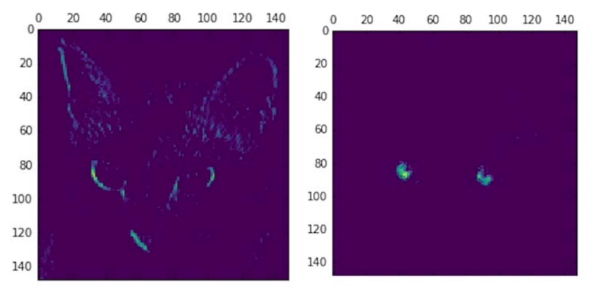
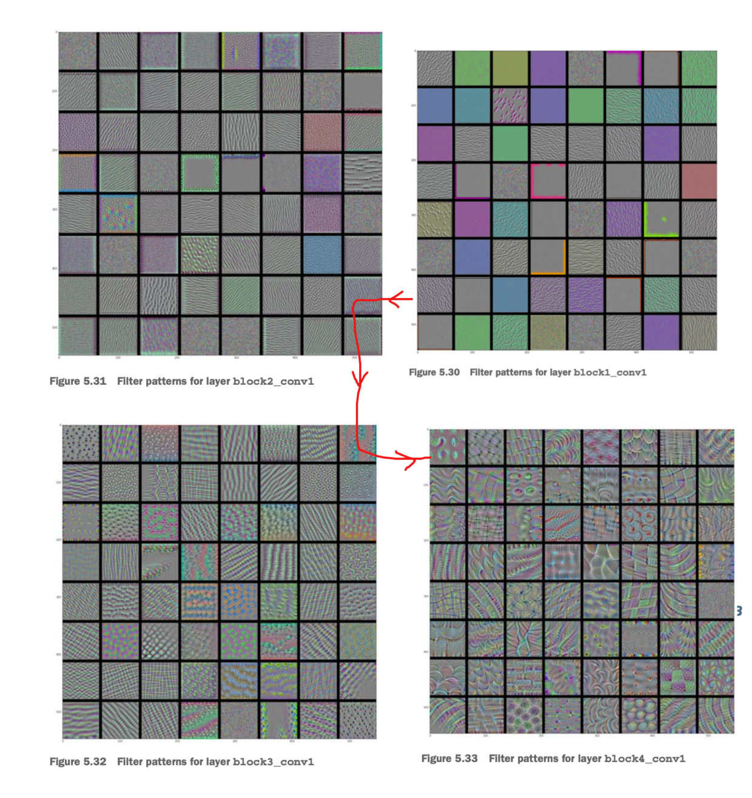
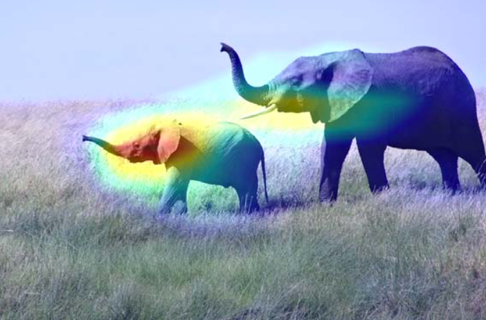

本来是打算趁这个时间好好看看花书的，前几章看下来确实觉得获益匪浅，但看下去就发现跟不上了，特别是抱着急功近利的心态的话，目前也沉不下去真的一节节吃透地往下看。这类书终归不是入门教材，是需要你有过一定的积累后再回过头来看的。

于是想到了《Deep Learning with Python》，忘记这本书怎么来的了，但是在别的地方看到了有人推荐，说是Keras的作者写的非常好的一本入门书，翻了前面几十页后发现居然跟进去了，不该讲的地方没讲比如数学细节，而且思路也极其统一，从头贯穿到尾（比如representations, latent space,  hypothesis space），我觉得很受用。

三百多页全英文，居然也没查几个单词就这么看完了，以前看文档最多十来页，也算一个突破了，可见其实还是一个耐心的问题。

看完后书上做了很多笔记，于是顺着笔记读了第二遍，顺便就把笔记给电子化了。不是教程，不是导读。

# Fundamentals of deep learning

**核心思想**：
learng useful `representations` of input data
>what’s a `representation`? 
>
>At its core, it’s a different way to look at data—to represent or encode data. 

简单回顾深度学习之于人工智能的历史，每本书都会写，但每本书里都有作者自己的侧重：
* Artificial intelligence
* Machine learning
    * Machine learning is tightly related to `mathematical statistics`, but it differs from statistics in several important ways. 
        * machine learning tends to deal with large, complex datasets (such as a dataset of millions of images, each consisting of tens of thousands of pixels) 
        * classical statistical analysis such as Bayesian analysis would be impractical(不切实际的). 
        * It’s a hands-on discipline in which ideas are proven empirically more often than theoretically.（工程/实践大于理论）
    * 是一种meaningfully transform data
        * Machine-learning models are all about finding appropriate representations for their input data—transformations of the data that make it more amenable to the task at hand, such as a classification task.
        * 寻找更有代表性的representation, 通过:(coordinate change, linear projections, tranlsations, nonlinear operations)
        * 只会在`hypothesis space`里寻找
        * 以某种反馈为信号作为优化指导
* Deep learning
    * Machine Learing的子集，一种新的learning representation的新方法
    * 虽然叫神经网络(`neural network`)，但它既非neural，也不是network，更合理的名字：
        * `layered representations learning` and `hierarchical representations learning`.
    * 相对少的层数的实现叫`shallow learning`

## Before deep learning

* Probabilistic modeling
    *  the earliest forms of machine learning, 
    * still widely used to this day. 
        * One of the best-known algorithms in this category
 is the `Naive Bayes algorithm`(朴素贝叶斯)
    * 条件概率，把规则理解为“条件”，判断概率，比如垃圾邮件。
        * A closely related model is the logistic regression
* Early neural networks
    * in the mid-1980s, multiple people independently rediscovered the Backpropagation algorithm
    * The `first` successful practical application of neural nets came in 1989 from Bell Labs -> **LeNet**
* Kernel methods
    *  Kernel methods are `a group of classification algorithms`(核方法是一组分类算法)
        * the best known of which is the `support vector machine` (**SVM**).
        * SVMs aim at solving classification problems **by** finding good *decision boundaries* between two sets of points belonging to two different categories.
            1. 先把数据映射到高维，decision boundary表示为`hyperplane`
            2. 最大化每个类别里离hyperplane最近的点到hyperplane的距离:`maximizing the margin`
        * The technique of mapping data to a high-dimensional representation 非常消耗计算资源，实际使用的是核函数(`kernel function`):
            * 不把每个点转换到高维，而只是计算每两个点在高维中的距离
            * 核函数是手工设计的，不是学习的
        * SVM在分类问题上是经典方案，但难以扩展到大型数据集上
        * 对于perceptual problems(感知类的问题)如图像分类效果也不好
            * 它是一个`shallow method`
            * 需要事先手动提取有用特征(`feature enginerring`)-> difficult and  brittle（脆弱的）
* Decision trees, random forests, and gradient boosting machines
    * Random Forest
        * you could say that they’re almost always the *second-best* algorithm for any shallow machine-learning task. 
    * gradient boosting machines (1st):
        * a way to improve any machine-learning model by iteratively training new models that specialize in `addressing the weak points of the previous models`.

## What makes deep learning different

it completely automates what *used to be* **the most crucial step** in a machine-learning workflow: `feature engineering`. 有人认为这叫穷举，思路上有点像，至少得到特征的过程不是靠观察和分析。

**feature engineering**
> manually engineer good layers of representations for their data

# Getting started with neural networks

## Anatomy of a neural network

* `Layers`, which are combined into a `network` (or model)
    * layers: 常见的比如卷积层，池化层，全连接层等
    * models: layers构成的网络，或多个layers构成的模块（用模块组成网络）
        * Two-branch networks
        * Multihead networks
        * Inception blocks, residual blocks etc.
    * The topology of a network defines a hypothesis space
    * 本书反复强调的就是这个`hypothesis space`，一定要理解这个思维：
        * By choosing a network topology, you `constrain` your space of possibilities (hypothesis space) to a specific series of tensor operations, mapping input data to output data.（network的选择约束了tensor变换的步骤）
        * 所以如果选择了不好的network，可能导致你在错误的`hyposhesis space`里搜索，以致于效果不好。
* The `input data` and corresponding `targets`
* The `loss` function (objective function), which defines the `feedback signal` used for learning
    * The quantity that will be minimized during training. 
    * It represents a measure of success for the task at hand.
    * 多头网络有多个loss function，但基于`gradient-descent`的网络只允许有一个标量的loss，因此需要把它合并起来（相加，平均...）
* The `optimizer`, which determines how learning proceeds
    * Determines how the network will be updated based on the loss function. 
    * It implements a specific variant of stochastic gradient descent (SGD).

### Classifying movie reviews: a binary classification example

**一个二元分类的例子**

情感分析/情绪判断，数据源是IMDB的影评数据.

**理解hidden的维度** 

how much freedom you’re allowing the network to have when learning internal representations. 即学习表示（别的地方通常叫提取特征）的自由度。

目前提出了架构网络的时候的两个问题：

1. 多少个隐层
2. 隐层需要多少个神经元（即维度）

后面的章节会介绍一些原则。

**激活函数**

李宏毅的课程里，从用整流函数来逼近非线性方程的方式来引入激活函数，也就是说在李宏毅的课程里，激活函数是**因**，推出来的公式是**果**，当然一般的教材都不是这个角度，都是有了线性方程，再去告诉你，这样还不够，需要一个`activation`。

本书也一样，告诉你，如果只有`wX+b`，那么只有线性变换，这样会导致对`hypothesis space`的极大的限制，为了扩展它的空间，就引入了非线性的后续处理。总之，都是在自己的逻辑体系内的。本书的逻辑体系就是`hypothesis space`，你想要有解，就是在这个空间里。

**网络结构**

```python
from keras import models
from keras import layers
model = models.Sequential()
model.add(layers.Dense(16, activation='relu', input_shape=(10000,)))
model.add(layers.Dense(16, activation='relu'))
model.add(layers.Dense(1, activation='sigmoid'))
```

**entropy**

`Crossentropy` is a quantity from the field of Information Theory（信息论） that measures the distance between probability distributions。

in this case, between the ground-truth distribution and your predictions.

**keras风格的训练**

其实就是模仿了`scikit learn`的风格。对快速实验非常友好，缺点就是封装过于严重，不利于调试，但这其实不是问题，谁也不会只用keras。

```python
# 演示用类名和字符串分别做参数的方式
model.compile(optimizer='rmsprop',
            loss='binary_crossentropy',
            metrics=['accuracy'])

from keras import optimizers
model.compile(optimizer=optimizers.RMSprop(lr=0.001),
            loss='binary_crossentropy',
            metrics=['accuracy'])

from keras import losses
from keras import metrics
model.compile(optimizer=optimizers.RMSprop(lr=0.001),
            loss=losses.binary_crossentropy,
            metrics=[metrics.binary_accuracy])

model.compile(optimizer='rmsprop',
              loss='binary_crossentropy',
              metrics=['acc'])

# train
history = model.fit(partial_x_train,
                    partial_y_train,
                    epochs=20,
                    batch_size=512,
                    validation_data=(x_val, y_val))
```

后续优化，就是对比train和validate阶段的loss和accuracy，找到overfit的节点（比如是第N轮），然后重新训练到第N轮（或者直接用第N轮生成的模型，如果有），用这个模型来预测没有人工标注的数据。

核心就是要**训练到明显的overfit**为止。这是第一个例子的内容，所以是告诉你怎么用这个简单的网络来进行预测，而不是立即着眼怎么去解决overfit.

**第一个小结**

1. 数据需要预处理成tensor, 了解几种tensor化，或vector化的方式
2. 堆叠全连接网络(Dense)，以及activation，就能解决很多分类问题
3. 二元分类的问题通常在Dense后接一个sigmoid函数
4. 引入二元交叉熵(BCE)作为二元分类问题的loss
5. 用了rmsprop优化器，暂时没有过多介绍。这些优化器都是为了解决能不能找到局部极值而进行的努力，具体可看上一篇李宏毅的笔记
6. 使用overfit之前的那一个模型来做预测

### Classifying newswires: a multiclass classification example

这次用路透社的新闻来做多分类的例子，给每篇新闻标记类别。

**预处理，一些要点**:

1. 不会采用所有的词汇，所以预处理时，根据词频，只选了前1000个词
2. 用索引来实现文字-数字的对应
3. 用one-hot来实现数字-向量的对应
4. 理解什么是序列（其实就是一句话）
5. 所以句子有长有短，为了矩阵的批量计算（即多个句子同时处理），需要“对齐”（补0和截断）
6. 理解稠密矩阵(word-embedding)与稀疏矩阵(one-hot)的区别（这里没有讲，用的是one-hot)

**网络和训练**

1. 网络结构不变，每层的神经元为(64, 64, 46)
2. 前面增加了神经元，16个特征对语言来说应该是不够的）
3. 最后一层由1变成了46，因为二元的输出只需要一个数字，而多元输出是用one-hot表示的向量，最有可能的类别在这个向量里拥有最大的值。
4。 损失函数为`categorial_crossentropy`，这在别的教材里应该就是普通的CE.

**新知识**

1. 介绍了一种不用one-hot而直接用数字表示真值的方法，但是没有改变网络结构（即最后一层仍然输出46维，而不是因为你用了一个标量而只输出一维。
    * 看来它仅仅就是一个**语法糖**（loss函数选择`sparse_categorial_crossentropy`就行了）
2. 尝试把第2层由64改为4，变成`bottleneck`，演示你有46维的数据要输出的话，前面的层数或少会造成信息压缩过于严重以致于丢失特征。

### Predicting house prices: a regression example

这里用了预测房价的Boston Hosing Price数据集。

与吴恩达的课程一样，也恰好是在这个例子里引入了对input的normalize，理由也仅仅是简单的把量纲拉平。现在我们应该还知道Normalize还能让数据在进入激活函数前，把值限定在激活函数的梯度敏感区。

此外，一个知识点就是你对训练集进行Normalize用的均值和标准差，是直接用在测试集上的，而不是各计算各的，可以理解为保持训练集的“分布”。
> 这也是`scikit learn`里`fit_tranform`和直接用`transform`的原因。

1. 对scalar进行预测是不需要进行激活（即无需把输出压缩到和为1的概率空间）
2. loss也直观很多，就是predict与target的差（取平方，除2，除批量等都是辅助），预测与直值的差才是核心。

# Fundamentals of machine learning

* Supervised learning
    * binary classification
    * multiclass classificaiton
    * scalar regression
    * vector regression（比如bounding-box)
    * Sequence generation (摘要，翻译...)
    * Syntax tree prediction
    * Object detection (一般bounding-box的坐标仍然是回归出来的)
    * Image segmentation
* Unsupervised learing
    * 是数据分析的基础，在监督学习前也常常需要用无监督学习来更好地“理解”数据集
    * 主要有降维(`Dimensionality reduction`)和聚类(`clustering`)
* Self-supervised learning
    * 其实还是监督学习，因为它仍需要与某个target做比较
    * 往往半监督（自监督）学习仍然有小量有标签数据集，在此基础上训练的不完善的model用来对无标签的数据进行打标，循环中对无标签数据打标的可靠度就越来越高，这样总体数据集的可靠度也越来越高了。有点像生成对抗网络里生成器和辨别器一同在训练过程中完善。
    * `autoencoders`
* Reinforcement learning
    * an `agent` receives information about its `environment` and learns to choose `actions` that will maximize some `reward`. 
    * 可以用训练狗来理解
    * 工业界的应用除了游戏就是机器人了

## Data preprocessing
* vectorization
* normalization (small, homogenous)
* handling missing values
    1. 除非0有特别的含义，不然一般可以对缺失值补0
    2. 你不能保证测试集没有缺失值，如果训练集没看到过缺失值，那么将不会学到忽略缺失值
        * *复制*一些训练数据并且随机drop掉一些特征
* feature extraction
    * making a problem easier by expressing it in a simpler way. It usually requires understanding the problem **in depth**.
    * **Before** deep learning, feature engineering used to be `critical`, because classical **shallow algorithms** didn’t have `hypothesis spaces` rich enough to learn useful features by themselves. (又见假设空间)
    * 但是好的特征仍然能让你在处理问题上更优雅、更省资源，也能减小对数据集规模的依赖。

## Overfitting and underfitting

* Machine learning is the tension between `optimization` and `generalization`.
* optimization要求你在训练过的数据集上能达到最好的效果
* generalization则希望你在没见过的数据上有好的效果
* 如果训练集上loss小，测试集上也小，说明还有优化(optimize)的余地 -> `underfitting`看loss
    * just keep training
* 如果验证集上generalization stop improving(泛化不再进步，一般看衡量指标，比如准确率) -> `overfitting`

解决overfitting的思路：

* **the best solution** is get more trainging data
* **the simple way** is to reduce the size of the model
    * 模型容量(`capacity`)足够大，就足够容易*记住*input和target的映射，没推理什么事了
* add constraints -> weight `regularization`
* add dropout
    
## Regularization

**Occam’s razor**

> given *two explanations* for something, the explanation most likely to be correct is the **simplest one**—the one that makes **fewer assumptions**. 

即为传说中*如无必要，勿增实体*的`奥卡姆剃刀原理`，这是在艺术创作领域的翻译，我们这里还是直译的好，即能解释一件事的各种理解中，越简单的，假设条件越少的，往往是最正确的，引申到机器学习，就是如何定义一个`simple model`

A simple model in this context is:

* a model where the distribution of parameter values has `less entropy` 
* or a model with fewer parameters

实操就是，就是迫使选择那些值比较小的weights，which makes the distribution of weight values more regular. This is called weight `regularization`。这个解释是我目前看到的最`regularization`这个名字最好的解释，“正则化”三个字都认识，根本没人知道这三个字是什么意思，翻译了跟没番一样，而使分布更“常规化，正规化”，好像更有解释性。

别的教材里还会告诉你这里是对大的权重的**惩罚**（设计损失函数加上自身权重后，权重越大，loss也就越大，这就是对大权重的惩罚）

* L1 regularization—The cost added is proportional to the absolute value of the weight coefficients (the L1 norm of the weights).
* L2 regularization—The cost added is proportional to the square of the value of the weight coefficients (the L2 norm of the weights). 

L2 regularization is also called `weight decay `in the context of neural networks. Don’t let the different name confuse you: weight decay is mathematically **the same as** L2 regularization.

> 只需要在训练时添加正则化

## Dropout

randomly dropping out (setting to zero) a number of output features of the layer during training.

dropout的作者Geoff Hinton解释dropout的灵感来源于银行办事出纳的不停更换和移动的防欺诈机制，可能认为一次欺诈的成功实施需要员工的配合，所以就尽量降低这种配合的可能性。于是他为了防止神经元也能聚在一起”密谋”，尝试随机去掉一些神经元。以及对输出添加噪声，让模型更难记住某些patten。

## The universal workflow of machine learning

1. Defining the problem and assembling a dataset
    * What will your input data be? 
    * What are you trying to predict?
    * What type of problem are you facing?
    * You hypothesize that your outputs can be predicted given your inputs.
    * You hypothesize that your available data is sufficiently informative to learn the relationship between inputs and outputs.
    * Just because you’ve assembled exam- ples of inputs X and targets Y doesn’t mean X contains enough information to predict Y.
2. Choosing a measure of success
    * accuracy? Precision and recall? Customer-retention rate?
    * balanced-classification problems,
        * accuracy and area under the `receiver operating characteristic curve` (ROC AUC) 
    * class-imbalanced problems
        * precision and recall. 
    * ranking problems or multilabel classification
        * mean average precision
    * ...
3. Deciding on an evaluation protocol
    * Maintaining a hold-out validation set—The way to go when you have plenty of data
    * Doing `K-fold` cross-validation—The right choice when you have too few samples for hold-out validation to be reliable
    * Doing `iterated K-fold` validation—For performing highly accurate model evaluation when *little data* is available
4. Preparing your data
    * tensor化，向量化，归一化等
    * may do some feature engineering
5. Developing a model that does better than a baseline
    * baseline:
        * 基本上是用纯随机(比如手写数字识别，随机猜测为10%)，和纯相关性推理（比如用前几天的温度预测今天的温度，因为温度变化是连续的），不用任何机器学习做出baseline
    * model:
        * Last-layer activation
            * sigmoid, relu系列， 等等
        * Loss function
            * 直接的预测值真值的差，如MSE
            * 度量代理，如crossentropy是ROC AUC的proxy metric
    * Optimization configuration
        * What optimizer will you use? What will its learning rate be? In most cases, it’s safe to go with rmsprop and its default learning rate.
    * Scaling up: developing a model that overfits
        * 通过增加layers, 增加capacity，增加training epoch来加速overfitting，从而再通过减模型和加约束等优化
    * Regularizing your model and tuning your hyperparameters
        * Add dropout.
        * Try different architectures: add or remove layers. 
        * Add L1 and/or L2 regularization.
        * Try different hyperparameters (such as the number of units per layer or the learning rate of the optimizer) to find the optimal configuration.
        * Optionally, iterate on feature engineering: add new features, or remove features that don’t seem to be informative.

Problem type | Last-layer activation | Loss function
-------------|-----------------------|--------------
Binary classification | sigmoid | binary_crossentropy
Multiclass, single-label classification | softmax |categorical_crossentropy
Multiclass, multilabel classification | sigmoid | binary_crossentropy
Regression to arbitrary values | None | mse
Regression to values between 0 and 1 | sigmoi | mse or binary_crossentropy

# Deep learning for computer vision

## Convolution Network

The convolution operation extracts patches from its input feature map and applies the same transformation to all of these patches, producing an output feature map. 

* convolution layers learn local patterns(局部特征)
    * The patterns they learn are translation invariant.（局部特征可在图片别的地方重复）
    * 有的教材里会说每个滑窗一个特征，然后引入**参数共享**才讲到一个特征其实可以用在所有滑窗
* They can learn spatial hierarchies of patterns(低级特征堆叠成高级特征)
* depth axis no longer stand for specific colors as in RGB input; rather, they stand for filters(表示图片时，3个通道有原始含义，卷积开始后通道只表示filter了)
* `valid` and `same` convolution（加不加padding让filter在最后一个像素时也能计算）
* `stride`，滑窗步长
* `max-pooling` or `average-pooling`
    * usually 2x2 windows by stride 2 -> 下采样(downsample)
    * 更大的感受野
    * 更小的输出
    * 不是唯一的下采样方式（比如在卷积中使用stride也可以）
    * 一般用max而不是average(寻找最强的表现)
* 小数据集
    * data augmenetation(旋转平衡缩放shear翻转等)
        * 不能产生当前数据集不存在的信息
        * 所以仍需要dropout
    * pretrained network(适用通用物体)
        * feature extraction
        * fine-tuneing

### Using a pretrained convnet

A pretrained network is a saved network that was previously trained **on a large dataset** typically on a large-scale image-classification task.

### Feature extraction

Feature extraction consists of using the representations learned by a previous network to extract interesting features from new samples. These features are then run through a *new classifier*, which is trained from scratch. 

1. 即只使用别的大型模型提取的representations（特征），来构建自己的分类器。
2. 原本模型的分类器不但是为特定任务写的，而且基本上丧失了位置和空间信息，只保留了对该任务上的presence probability.
3. 最初的层一般只能提取到线，边缘，颜色等低级特征，再往后会聚合出一些纹理，更高的层就可能会叠加出一些眼，耳等抽象的特征，所以你的识别对象与pretrained数据源差别很大的时候，就需要考虑把最尾巴的几层layer也舍弃掉。（e.g. VGG16最后一层提取了512个feature map）
4. 两种用法：
    * 跑一次预训练模型你选中的部分，把参数存起来（$\leftarrow$错），把输出当作dataset作为自己构建的分类器的input。
        * 快，省资源，但是需要把数据集固定住，等于没法做data augmentation
        * 跑预训练模型时不需要计算梯度(freeze)
        * 其实应用预训练模型就等于别人的预处理数据集，而真实的模型只有一个小分类器
    * 合并到自定义的网络中当成普通网络训练
        * 慢，但是能做数据增广了
        * 需手动设置来自预训练模型的梯度不需要计算梯度

> 注：这里为什么单独跑预训练模型不能数据增广呢？

> 教材用的是keras, 它处理数据的方式是做一个generaotr，只要你给定数据增广的规则（参数），哪怕只有一张图，它也是可以无穷无尽地给你生成下一张的。所以每一次训练都能有新的数据喂到网络里。这是出于内存考虑，不需要真的把数据全部加载到内存里。

> 而如果你是一个固定的数据集，比如几万条，那么你把所有的数据跑一遍把这个结果当成数据集（全放在内存里），那也不是不可以在这一步用数据增广。

### Fine-tuning

Fine-tuning consists of unfreezing a few of the top layers of a frozen model base used for feature extraction, and jointly training both the newly added part of the model (in this case, the fully connected classifier) and these top layers. This is called fine-tuning because it slightly adjusts the more abstract representations of the model being reused, in order to make them more relevant for the problem at hand.

前面的feature extraction方式，会把预训练的模型你选中的layers给freeze掉，即不计算梯度。这里之所以叫fine-tuning，意思就是会把最后几层(top-layers)给`unfreezing`掉，这样的好处是保留低级特征，重新训练高级特征，还保留了原来大型模型的结构，不需要自行构建。


> 但是： it’s only possible to fine-tune the top layers of the convolutional base once the classifier on `top has already been trained`. 预训练模型没有frezze住的话loss将会很大，所以变成了先train一个大体差不多的classifier，再联合起来train一遍高级特征和classifier:

1. Add your custom network on top of an already-trained base network.
2. Freeze the base network.
3. Train the part you added. (第一次train)
4. Unfreeze some layers in the base network.
5. Jointly train both these layers and the part you added.（第二次train）

但千万别把所有层都unfrezze来训练了
1. 低级特征都为边缘和颜色，无需重新训练
2. 小数据量训练大型模型，model capacity相当大，非常容易过拟合

### Visualizing what convents learn

并不是所有的深度学习都是黑盒子，至少对图像的卷积网络不是 -> `representations of visual concepts`, 下面介绍**三种**视觉化和可解释性的representations的方法。

#### Visualizing intermediate activations

就是把每个中间层(基本上是"卷积+池化+激活“)可视化出来，This gives a view into how an input is `decomposed` into the different filters learned by the network. 

```python
from keras import models
layer_outputs = [layer.output for layer in model.layers[:8]] activation_model = models.Model(inputs=model.input, outputs=layer_outputs)

activations = activation_model.predict(img_tensor)

import matplotlib.pyplot as plt
plt.matshow(first_layer_activation[0, :, :, 4], cmap='viridis')

# 注意使用的是matshow而不是show

```



以上代码是利用了keras的Model特性，将所有layers的输出**摊平**（就是做了一个多头的模型），然后再顺便取了第4和第7个feature map画出来，可以看到，图一感兴趣的是`对角线`，图二提取的是`蓝色的亮点`。

结构化这些输出，可以确信初始layer确实提取的是简单特征，越往后越高级（抽象）。

A deep neural network effectively acts as an `information distillation`(信息蒸馏) pipeline, with raw data going in (in this case, RGB pictures) and being repeatedly transformed so that irrelevant information is filtered out (for example, the specific visual appearance of the image), and useful information is `magnified and refined` (for example, the class of the image).

> 关键词：有用的信息被不断**放大和强化**

书里举了个有趣的例子，要你画一辆自行车。你画出来的并不是一辆充满细节的单车，而往往是你抽象出来的单车，你会用基本的线条勾勒出你对单车特征的理解，比如龙头，轮子等关键部件，以及相对位置。画家为什么能画得又真实又好看？那就是他们真的仔细观察了单车，他们绘画的时候用的并不是特征，而是一切细节，然而对于没有受过训练的普通人来说，往往只能用简单几笔勾勒出脑海中的单车的样子（其实并不是样子，而是特征的组合）

#### Visualizing convnet filters

通过强化filter对输出的反应并绘制出来，这是从数学方法上直接观察filter，看什么最能“刺激”一个filter，用”梯度上升“最能体现这种思路：

把output当成loss，用梯度上升（每次修改input_image）训练出来的output就是这个filter的极端情况，可以认为这个filter其实是在提取什么（responsive to）：


```python
from keras.applications import VGG16
from keras import backend as K
model = VGG16(weights='imagenet', include_top=False)
layer_name = 'block3_conv1'
filter_index = 0
layer_output = model.get_layer(layer_name).output
loss = K.mean(layer_output[:, :, :, filter_index])  # output就是loss

grads = K.gradients(loss, model.input)[0] # 对input求微分
grads /= (K.sqrt(K.mean(K.square(grads))) + 1e-5)

iterate = K.function([model.input], [loss, grads])
import numpy as np
# 理解静态图的用法
loss_value, grads_value = iterate([np.zeros((1, 150, 150, 3))])

input_img_data = np.random.random((1, 150, 150, 3)) * 20 + 128.
step = 1.
for i in range(40):
    loss_value, grads_value = iterate([input_img_data])
    input_img_data += grads_value * step  # 梯度上升

```
按上述代码的思路结构化输出并绘图：



从线条到纹理到物件（眼睛，毛皮，叶子）

> each layer in a convnet learns a collection of filters such that their inputs can be expressed as a `combination of the filters`.

> This is similar to how the Fourier transform decomposes signals onto a bank of cosine functions. 

用傅里叶变换来类比卷积网络每一层就是把input表示成一系列特征的组合。

#### Visualizing heatmaps of class activation

which parts of a given image led a convnet to its final classification decision. 即图像有哪一部分对最终的决策起了作用。

* `class activation map` (CAM) visualization,
* `Grad-CAM`: Visual Explanations from Deep Networks via Gradient-based Localization.”

>  you’re weighting a spatial map of “how intensely the input image activates different channels” by “how important each channel is with regard to the class,” resulting in a spatial map of “how intensely the input image activates the class.

解读上面这句话：

不同channels（特征）对图像的激活的强度  
\+  
每个特征对(鉴定为）该类别的重要程度  
\=  
该“类别”对图像的激活的强度


一张两只亚洲象的例图，使用VGG16来做分类，得到92.5%的置信度的亚洲象的判断，为了visualize哪个部分才是“最像亚洲象”的，使用`Grad-CAM`处理：

```python
from keras.applications.vgg16 import VGG16
model = VGG16(weights='imagenet')
african_e66lephant_output = model.output[:, 386]  # 亚洲象在IMGNET的类别是386
last_conv_layer = model.get_layer('block5_conv3') # top conv layer

grads = K.gradients(african_elephant_output, last_conv_layer.output)[0] 
pooled_grads = K.mean(grads, axis=(0, 1, 2))
iterate = K.function([model.input],
                     [pooled_grads, last_conv_layer.output[0]])
pooled_grads_value, conv_layer_output_value = iterate([x])
for i in range(512):
    conv_layer_output_value[:, :, i] *= pooled_grads_value[i]
heatmap = np.mean(conv_layer_output_value, axis=-1)
```


叠加到原图上去（用cv2融合两张图片，即相同维度的数组以不同权重逐像素相加）：



# Deep learning for text and sequences

空间上的序列，时间上的序列组成的数据，比如文本，视频，天气数据等，一般用`recurrent neural network`(RNN)和`1D convnets`

> 其实很多名词，包括convnets，我并没有在别的地方看到过，好像就是作者自己发明的，但这些不重要，知道它描述的是什么就可以了，不一定要公认术语。

通用场景：

* [分类: 文本分类] Document classification and timeseries classification, such as identifying the topic of an article or the author of a book
* [分类: 文本比较] Timeseries comparisons, such as estimating how closely related two documents or two stock tickers are
* [分类: 生成] Sequence-to-sequence learning, such as decoding an English sentence into French
* [分类: 情感分析]Sentiment analysis, such as classifying the sentiment of tweets or movie reviews as positive or negative
* [回归: 预测]Timeseries forecasting, such as predicting the future weather at a certain location, given recent weather data

我画蛇添足地加了是分类问题还是回归问题.

>  none of these deeplearning models truly understand text in a human sense

Deep learning for natural-language processing is `pattern recognition` applied to words, sentences, and paragraphs, in much **the same** way that computer vision is pattern recognition applied to pixels.

## tokenizer

图像用像素上的颜色来数字化，那文字也把什么数字化呢？
* 拆分为词，把每个词转化成向量
* 拆分为字（或字符），把每个字符转化为向量
* 把字（词）与前n个字（词）组合成单元，转化为向量，（类似滑窗），N-Grams

all of above are `tokens`, and breaking text into such tokens is called `tokenization`. These vectors, packed into sequence tensors, are fed into deep neural networks. 

`N-grams`这种生成的token是无序的，就像一个袋子装了一堆词：`bag-of-words`: a set of tokens rather than a list of sequence.

所以句子结构信息丢失了，更适合用于浅层网络。作为一种rigid, brittle（僵硬的，脆弱的）特征工程方式，深度学习采用多层网络来提取特征。

## vectorizer

token -> vector:

* one-hot encoding
* token/word embedding (word2vec)

### one-hot

1. 以token总数量（一般就是字典容量）为维度
2. 一般无序，所以生成的时候只需要按出现顺序编索引就好了
3. 有时候也往往伴随丢弃不常用词，以减小维度
4. 也可以在字符维度编码（维度更低）
5. 一个小技巧，如果索引数字过大，可以把单词hash到固定维度(未跟进)

特点/问题：

- sparse
- high-dimensional, 比如几千几万
- no spatial relationship
- hardcoded

### word embeddings

- Dense
- Lower-dimensional，比如128，256...
- Spatial relationships (语义接近的向量空间上也接近)
- Learned from data

to obtain word embeddings:

1. 当成训练参数之一(以Embedding层的身份)，跟着训练任务一起训练
2. pretrained word embeddings
    * Word2Vec(2013, google)
        + CBOW
        + Skip-Gram
    * GloVe(2014, Stanford))
    * 前提是语言环境差不多，不同学科/专业/行业里的词的关系是完全不同的
        * GloVe从wikipedia和很多通用语料库里训练，可以尝试在许多非专业场景里使用。

keras加载训练词向量的方式：
```python
model.layers[0].set_weights([embedding_matrix])
model.layers[0].trainable = False
```

pytorch：
```python
# TEXT, LABEL为torchtext的Field对象
from torchtext.vocab import Vectors
vectors=Vectors(name='./sgns.sogou.word') #使用预训练的词向量，维度为300Dimension
TEXT.build_vocab(train, vectors=vectors) #构建词典
LABEL.build_vocab(train)

vocab_size = len(TEXT.vocab)
vocab_vectors = TEXT.vocab.vectors.numpy() #准备好预训练词向量

self.embedding = nn.Embedding(num_embeddings=vocab_size， embedding_dim=embedding_size)

# 上面是为了回顾，真正用来做对比的是下面这两句
self.embedding.weight.data.copy_(torch.from_numpy(vocab_vectors))
self.embedding.weight.requires_grad = False
```

> 预训练词向量也可以继续训练，以得到task-specific embedding

## Recurrent neural networks(RNN)

sequence, time series类的数据，天然会受到前后数据的影响，RNN通过将当前token计算的时候引入上一个token的计算结果（反向的话就能获得下一个token的结果）以获取上下文的信息。


前面碰到的网络，数据消费完就往前走（按我这种说法，后面还有很多“等着二次消费的”模块，比如inception, resdual等等），叫做`feedforward network`。显然，RNN中，一个token产生输出后并不是直接丢给下一层，而是还复制了一份丢给了同层的下一个token. 这样，当前token的`output`成了下一个token的`state`。

* 因为一个output其实含有“前面“所有的信息，一般只需要最后一个output
* 如果是堆叠多层网络，则需要返回**所有**output

序列过长梯度就消失了，所谓的**遗忘** （推导见另一篇笔记，）  -> `LSTM`, `GRU`

### Long Short-Term Memory(LSTM)

1. 想象有一根传送带穿过sequence
2. 同一组input和state会进行三次相同的线性变换，有没有联想到`transformer`用同一个输出去生成`q, k, v`？

```python

output_t = activation(dot(state_t, Uo) + dot(input_t, Wo) + dot(C_t, Vo) + bo)
i_t = activation(dot(state_t, Ui) + dot(input_t, Wi) + bi) 
f_t = activation(dot(state_t, Uf) + dot(input_t, Wf) + bf) 
k_t = activation(dot(state_t, Uk) + dot(input_t, Wk) + bk)

c_t+1 = i_t * k_t + c_t * f_t  # 仍然有q，k，v的意思（i,k互乘，加上f， 生成新c）
```

> 不要去考虑哪个是**遗忘门**，**记忆门**，还是**输出门**，最终是由weights决定的，而不是设计。

Just keep in mind what the LSTM cell is meant to do: 
> allow past information to be `reinjected` at a later time, thus fighting the vanishing-gradient problem.

关键词：reinject

### dropout

不管是keras还是pytorch，都帮你隐藏了dropout的坑。 你能看到应用这些框架的时候，是需要你把dropout传进去的，而不是手动接一个dropoutlayer，原因是需要在序列每一个节点上应用同样的dropout mask才能起作用，不然就会起到反作用。

keras封装得要复杂一点：
```python
model.add(layers.GRU(32,
                    dropout=0.2,
                    recurrent_dropout=0.2,
                    input_shape=(None, float_data.shape[-1])))
```

### stacking recurrent layers

前面说过，设计好的模型的一个判断依据是至少让模型能跑到overfitting。如果到了overfitting，表现还不是很好，那么可以考虑增加模型容量（叠更多层，以及拓宽layer的输出维度）

堆叠多层就需要用到每个节点上的输出，而不只关心最后一个输出了。

### Bidriectional

keras奇葩的bidirectional语法：
```python
model.add(layers.Bidirectional(layers.LSTM(32)))
```
其实这是设计模式在类的封装上的典型应用，善用继承和多态，无侵入地扩展类的方法和属性，而不是不断魔改原代码，加参数，改API。但在脚本语言风格里的环境里，这么玩就有点格格不入了。

## Sequence processing with convnets

1. 卷积用到序列上去也是可以的
2. 一个向量只表示一个token，如果把token的向量打断就违背了token是最小单元的初衷，所以序列上的卷积，不可能像图片上两个方向去滑窗了。(`Conv1D`的由来)
3. 一个卷积核等于提取了n个关联的上下文（有点类似`n-grams`），堆叠得够深感受野更大，可能得到更大的上下文。
4. 但仍然理解为filter在全句里提取局部特征

归桕结底，图片的最小单元是一个像素（一个数字），而序列（我们这里说文本）的最小单元是token，而token又被我们定义为vector（一组数字）了，那么卷积核就限制在至少要达到最小单元(vector)的维度了。

### Combining CNNs and RNNs to process long sequences

卷积能通过加深网络获取更大的感受野，但仍然是“位置无关”的，因为每个filter本就是在整个序列里搜索相同的特征。

但是它确实提取出了特征，是否可把位置关系等上下文的作业交给下游任务RNN做呢？


不但实现，而且堆叠两种网络，还可以把数据集做得更大（CNN是矩阵运算，还能用GPU加速）。


# Advanced deep-learning best practices

这一章是介绍了更多的网络（从keras的封装特性出发）结构和模块，以及batch normalization, model ensembling等知识。

## beyond Sequential model

前面介绍的都是Sequential模型，就是一个接一个地layer前后堆叠，现实中有很多场景并不是一进一出的：

1. multi-input model

假设为二手衣物估价：
* 格式化的元数据（品牌，性别，年龄，款式）: one-hot, dense
* 商品的文字描述：RNN or 1D convnet
* 图片展示：2D convnet
* 每个input用适合自己的网络做输出，然后合并起来作为一个input，回归一个价格

2. multi-output model (multi-head)

一般的检测器通常就是多头模型，因为既要回归对象类别，还要回归出对象的位置

3. graph-like model

这个名字很好地形容了做深度学习时看别人的网络是什么样的方式：看图。现代的SOTA的网络往往既深且复杂，而网络结构画出来也不再是一条线或几个简单分支，这本书干脆把它们叫图形网络：`Inception`, `Residual`

为了能架构这些复杂的网络，keras介绍了新的语法，先看看怎么重写`Sequential`:

```python
seq_model = Sequential()
seq_model.add(layers.Dense(32, activation='relu', input_shape=(64,)))
seq_model.add(layers.Dense(32, activation='relu'))
seq_model.add(layers.Dense(10, activation='softmax'))

# 重写
input_tensor = Input(shape=(64,))
x = layers.Dense(32, activation='relu')(input_tensor)
x = layers.Dense(32, activation='relu')(x)
output_tensor = layers.Dense(10, activation='softmax')(x)
model = Model(input_tensor, output_tensor)

model.summayr()
```

我们自己实现过静态图，最终去执行的时候能从尾追溯到头，并从头来开始计算，这里也是一样的：
1. input, output是Tensor类，所以有完整的层次信息
2. output往上追溯，最终溯到缺少一个input
3. 这个input恰好也是Model的构造函数之一，闭环了。

书里说的更简单，output是input不断transforming的结果。如果传一个没有这个关系的input进去，就会报错。

**demo**

用一个QA的例子来演示多输入（一个问句，一段资料），输出为答案在资料时的索引（简化为单个词，所以只有一个输出）

```python
text_input = Input(shape=(None,), dtype='int32', name='text')
embedded_text = layers.Embedding(
    64, text_vocabulary_size)(text_input)
encoded_text = layers.LSTM(32)(embedded_text)  # lstm 处理资讯
question_input = Input(shape=(None,), dtype='int32', name='question')


embedded_question = layers.Embedding(
    32, question_vocabulary_size)(question_input)
encoded_question = layers.LSTM(16)(embedded_question) # lstm 处理问句

concatenated = layers.concatenate([encoded_text, encoded_question], axis = -1)  # 竖向拼接（即不增加内容只增加数量）
answer = layers.Dense(answer_vocabulary_size,
                      activation='softmax')(concatenated)
model = Model([text_input, question_input], answer)
model.compile(optimizer='rmsprop',
              loss='categorical_crossentropy',
              metrics=['acc'])
```

这里是把答案直接给回归出来了(one-hot)，如果是给出答案的首尾位置，那肯定只能用索引了。

**demo**

多头输出的：

```python
# 线性回归
age_prediction = layers.Dense(1, name='age')(x)
# 逻辑回归
income_prediction = layers.Dense(num_income_groups, activation='softmax', name='income')(x)
# 二元逻辑回归
gender_prediction = layers.Dense(1, activation='sigmoid', name='gender')(x)
model = Model(posts_input,
              [age_prediction, income_prediction, gender_prediction])
```

梯度回归要求loss是一个标量，keras提供了方法将三个loss加起来，同时为了量纲统一，还给了权重参数：
```python
model.compile(optimizer='rmsprop',
loss=['mse', 'categorical_crossentropy', 'binary_crossentropy'], loss_weights=[0.25, 1., 10.])
```

## Directed acyclic graphs of layers

有向无环图。可以理解为最终不会回到出发点。

现在会介绍的是几个`Modules`，意思是可以把它当成一个layer，来构造你的网络/模型。

### Inception Modules

* inspired by `network-in-network`
* 对同一个输入做不同（层数/深度）的卷积（保证最终相同的下采样维度），最后合并为一个输出
* 因为卷积的深度不尽相同，学到的空间特征也有粗有细

### Residual Connections

* 有些地方叫shortcut
* 用的是相加，不是concatenate, 如果形状变了，对earlier activation做linear transformation
* 解决`vanishing gradients` and `representational bottlenecks`
* adding residual connections to any model that has more than 10 layers is likely to be beneficial.

**representational bottlenecks**

序列模型时，每一层的表示都来自于前一层，如果前一层很小，比如维度过低，那么携带的信息量也被压缩得很有限了，整个模型都会被这个“瓶颈”限制。比如音频信号处理，降维就是降频，比如到0-15kHz，但是下游任务也没法recover dropped frequencies了。所有的损失都是永久的。

Residual connections, by `reinjecting` earlier information downstream, partially solve this issue for deep-learning models.（又一次强调`reinject`）

### Lyaer weight sharihng

在网络的不同位置用同一个layer，并且参数也相同。等于共享了相同的知识，相同的表示，以及是同时(simultaneously)训练的。

一个语义相似度的例子，输入是A和B还是B和A，是一样的（即可以互换）。架构网络的时候，用LSTM来处理句子，需要做两个LSTM吗？当然可以，但是也可以只做一个LSTM，分别喂入两个句子，合并两个输出来做分类。就是考虑到这种互换性，既然能互换，也就是这个layer也能应用另一个句子，因此就不必要再新建一个LSTM.

### Models as layers

讲了两点：
1. model也可以当layer使用
2. 多处使用同一个model也是共享参数，如上一节。

举了个双摄像头用以感知深度的例子，每个摄像头都用一个Xception网络提取特征，但是可以共用这个网络，因为拍的是同样的内容，只需要处理两个摄像头拍到的内容的差别就能学习到深度信息。因为希望是用同样的特征提取机制的。

都是蜻蜓点水。

## More Advanced

### Batch Normalization

1. 第一句话就是说为了让样本数据看起来**更相似**，说明这是初衷。
2. 然后是能更好地泛化到未知数据（同样也是因为bn后就**更相似**了）
3. 深度网络中每一层之后也需要做
    * 还有一个书里没讲到的原因，就是把值移到激活函数的梯度大的区域（比如0附近），否则过大过小的值在激活函数的曲线里都是几乎没有梯度的位置
4. 内部用的指数移动平均(`exponential moving average`)
5. 一些层数非常深的网络必须用BN，像resnet 50, 101, 152, inception v3, xception等

### Depthwise Separable Convolution

之前的卷积，不管有多少个layer，都是放到矩阵里一次计算的，DSC把每一个layer拆开，单独做卷积（不共享参数），因为没有一个巨大的矩阵，变成了几个小矩阵乘法，参数量也大大变少了。

1. 对于小样本很有效
2. 对于大规模数据集，它可以成为里面的固定结构的模块（它也是Xception的基础架构之一）

> In the future, it’s likely that depthwise separable convolutions will `completely replace regular convolutions`, whether for 1D, 2D, or 3D applications, due to their higher representational efficiency.

?!!

### Model ensembling

1. Ensembling consists of **pooling together** the predictions of a set of different models, to produce better predictions.
2. 期望每一个`good model`拥有`part of the truth`(部分的真相)。盲人摸象的例子，没有哪个盲人拥有直接感知一头象的能力，机器学习可能就是这样一个盲人。
3. The key to making ensembling work is the `diversity` of the set of classifiers -> 关键是要“多样性”。 `Diversity` is what makes ensembling work.
4. 千万**不要**去ensembling同样的网络仅仅改变初始化而去train多次的结果。
5. 比较好的实践有ensemble `tree-based` models(random forests, gradient-boosted trees) 和深度神经网络
6. 以及`wide and deep` category of models, blending deep learning with shallow learning. 

同样是蜻蜓点水。

# Generative deep learning

Our perceptual modalities, our language, and our artwork all have `statistical structure`. Learning this structure is what deep-learning algorithms excel at. 

Machine-learning models can learn the `statistical latent space` of images, music, and stories, and they can then` sample from this space`, **creating new artworks** with characteristics similar to those the model has seen in its training data.

## Text generation with LSTM

### Language model

很多地方都在按自己的理解定义`language model`，这本书定义很明确，能为根据前文预测下一个或多个token建立概率模型的网络。

> any network that can model the probability of the next token given the previous ones is called a language model.

1. 所以首先，它是一个network
2. 它做的事是model一个probability
3. 内容是the next token
4. 条件是previous tokens

一旦你有了这样一个language model，你就能`sample from it`，这就是前面笔记里的sample from lantent space, 然后generate了。

### greedy sampling and stochastic sampling

如果根据概率模型每次都选“最可能”的输出，在连贯性上被证明是不好的，而且也丧失了创造性，所以还是给了一定的随机性能选到“不那么可能”的输出。

因为人类思维本身也是`跳跃`的。

考虑两个输出下一个token时的极端情况：

<!-- --> | <!-- --> | <!-- --> | <!-- -->
------- | ------- | ------- | -------
纯随机，所有可选词的概率是均等的 | 毫无意义 | `max entropy` | 创造性高
greedy sampling | 毫无生趣 | `minimum entropy` | 可预测性高

实现方式：`softmax temperature`

除一个`温度`，如果温度大于1，那么温度越大，被除数缩幅度就越大（这样温差就越小，分布会更平均）-> 偏向了纯随机的概率结构（均等）

```python
import numpy as np
def reweight_distribution(original_distribution, temperature=0.5):
    distribution = np.log(original_distribution) / temperature
    distribution = np.exp(distribution)
    return distribution / np.sum(distribution)
```

写成公式
$
\frac{e^{\frac{log(d)}{T}}}{\sum e^{\frac{log(d)}{T}}}
$
这是对温度和sigmoid做了融合：
1. 一个是对目标分布取自然对数后除温度再当成e的指数给幂回去（如果不除温度，那就是先log再e，等于是原数）
2. 标准的sigmoid方程

> 这里回顾一个概念：Sampling from a space

书里大量用了这个概念，结合代码，其实就是一个predict函数，也就是说，一般人理解的“`预测，推理`”，是从业务逻辑方面来理解，作者更愿意从统计学和线性代数角度来理解。

两种训练方法：
1. 每次用N个字，来预测第N+1个字，即output只有1个(voc_size, 1)，训练的是language model
2. 每次用N个字(a, b), 来预测(a+1, b+1)， output有N个(voc_size, N)，训练的是特定的任务，比如写诗，作音乐

过程：
1. 准备数据，X为一组句子，Y为每一个句子对应的下一个字（全部向量化）
2. 搭建一个LSTM + Dense 的网络，输出根据具体情况要么为1，要么为N
3. 每一个epoch里均进行预测（如果不是为了看过程，有必要吗？我们要最后一轮的预测不就行了？）
    * 进行一次fit(就是train)，得到优化后的参数
    * 随机取一段文本，用作种子（用来生成第一个字）
    * 计算生成多少个字，就开始for循环
        * 向量化当前的种子（会越来越长）
        * predict，得到每个字的概率
        * softmax temperature，平滑概率，取出next_token
        * next_token转回文本，附加到seed后面

### DeepDream

看了一遍，不感兴趣。核心思路跟视觉化filter的思路是一样的：`gradient ascent`

1. 从对每个layer里的单个filter做梯度上升变成了对整个layer做梯度上升
2. 不再从随机噪声开始，而是从一张真实图片开始，实现这些layer里对图片影响最大的patterns的distorting

### Neural style transfer

Neural style transfer consists of applying the `style` of a reference image to a target image while conserving the `content` of the target image. 

* 两个对象：`reference`, `target` image
* 两个概念：`style`和`content`

对`B`的content应用`A`的style，我们可以理解为“笔刷”，或者用前些年的流行应用来解释：把一副画水彩化，或油画化。

把style分解为不同spatial scales上的：纹理，颜色，和visual pattern

想用深度学习来尝试解决这个问题，首先至少得定义损失函数是什么样的。

If we were able to mathematically define `content` and `style`, then an appropriate loss function to minimize would be the following:
```python
loss = distance(style(reference_image) - style(generated_image)) +
        distance(content(original_image) - content(generated_image))
```

即对新图而言，`纹理要无限靠近A，内容要无限靠近B`。

* the content loss
    * 图像内容属于高级抽象，因此只需要top layers参与就行了，实际应用中只取了最顶层
* the style loss
    * 应用`Gram matrix`
        * the inner product of the feature maps of a given layer
        * correlations between the layer's feature
        * 需要生成图和参考图的每一个对应的layer拥有相同的纹理(same `textures` at different `spatial scales`)，因此需要所有的layer参与

从这里应该也能判断出要搭建网络的话，input至少由三部分（三张图片）构成了。

**demo**

* input为参考图，目标图，和生成图（占位），concatenate成一个tensor
* 用VGG19来做特征提取
* 计算loss
    1. 用生成图和`目标图`的`top_layer`以L2 norm距离做loss
    2. 用生成图和`参考图`的`every` layer以L2 Norm做loss并累加
    3. 对生成图偏移1像素做regularization loss（具体看书）
    4. 上述三组loss累加，为一轮的loss
* 用loss计算对input(即三联图)的梯度

## Generating images

> Sampling from a latent space of images to create entirely new images

熟悉的句式又来了。

核心思想：
1. low-dimensional `latent space` of representations
    * 一般是个vector space
    * any point can be mapped to a realistic-looking image
2. the module capable of `realizing this mapping`, can take point as input, then output an image, this called:
    * generator -> GAN
    * decoder -> VAE

VAE v.s. GAN
* VAEs are great for learning latent spaces that are `well structured`
* GANs generate images that can potentially be `highly realistic`, but the latent space they come from may not have as much structure and continuity.

### VAE（variational autoencoders）

given a `latent space` of representations, or an embedding space, `certain directions` in the space **may** encode interesting axes of variation in the original data. -> inspired by `concept space`

比如包含人脸的数据集的latent space里，是否会存在`smile vectors`，定位这样的vector，就可以修改图片，让它projecting到这个latent space里去。

**Variational autoencoders**

Variational autoencoders are a kind of *generative model* that’s especially appropriate for the task of **image editing** via concept vectors. 

They’re a modern take on `autoencoders` (a type of network that aims to `encode `an input to a `low-dimensional` latent space and then decode it back) that mixes ideas from deep learning with **Bayesian inference**.

* VAE把图片视作隐藏空间的参数进行统计过程的结果。
* 参数就是表示一种正态分布的mean和variance（实际取的log_variance)
* 用这个分布可以进行采样(sample)
* 映射回original image

1. An encoder module turns the input samples *input_img* into two parameters in a latent space of representations, `z_mean` and `z_log_variance`.
2. You randomly sample a point z from the latent normal distribution that’s assumed to generate the input image, via $z = z\_mean + e^{z\_log\_variance} \times \epsilon$, where $\epsilon$ is a random tensor of small values.
3. A decoder module maps *this point* in the latent space back to the original input image.

> Because epsilon is random, the process ensures that every point that’s **close to the latent location** where you encoded input_img (z-mean) can be decoded to something **similar** to input_img, thus forcing the latent space to be continuously meaningful.

1. 所以VAE生成的图片是可解释的，比如在latent space中距离相近的两点，decode出来的图片相似度也就很高。
2. 多用于编辑图片，并且能生成动画过程（因为是连续的）

伪代码(不算，可以说是骨干代码）：
```python
z_mean, z_log_variance = encoder(input_img)
z = z_mean + exp(z_log_variance) * epsilon  # sampling
reconstructed_img = decoder(z)
model = Model(input_img, reconstructed_img)
```

VAE encoder network
```python
img_shape = (28, 28, 1)
batch_size = 16
latent_dim = 2

x = layers.Conv2D(32, 3, padding='same', activation='relu')(input_img)
x = layers.Conv2D(64, 3, padding='same', activation='relu', strides=(2, 2))(x)
x = layers.Conv2D(64, 3, padding='same', activation='relu')(x)
x = layers.Conv2D(64, 3, padding='same', activation='relu')(x)
shape_before_flattening = K.int_shape(x)
x = layers.Flatten()(x)
x = layers.Dense(32, activation='relu')(x)
z_mean = layers.Dense(latent_dim)(x)
z_log_var = layers.Dense(latent_dim)(x)
```

1. 可见是一个标准的multi-head的网络
2. 可见所谓的latent space，其实就是transforming后的结果
3. encode的目的是回归出两个参数（本例是两个2维参数）
4. 两个参数一个理解为mean, 一个理解为log_variance

decoder过程就是对mean和var随机采样（得到z)，然后不断上采样(`Conv2DTranspose`)得到形状与源图一致的输出(得到z_decode)的过程。

1. z_decode跟z做BCE loss
2. 还要加一个regularization loss防止overfitting

> 此处请看书，演示了自定义的loss。因为keras高度封装，所以各种在封装之外的自定义的用法尤其值得关注。比如这里，自定义了loss之后，Model和fit里就不需要传Y，compile时也不需要传loss了。

> loss是在最后一层layer里计算的，并且通过一个layer方法`add_loss`，把loss和input通知给了network（如果你想知道注入点的话）

使用模型的话，就是生成两组随机数，当成mean和log_variance，观察decode之后的结果。

### GAN

`Generative adversarial network`可以创作以假乱真的图片。通过训练最好的造假和和最好的鉴别者来达到“创造”越来越逼近人类创作的作品。

* **Generator** network: Takes as input a random vector (a random point in the latent space), and decodes it into a synthetic image
* **Discriminator** network (or adversary): Takes as input an image (real or synthetic), and predicts whether the image came from the training set or was created by the generator network.

**deep convolutional GAN (DCGAN)**

* a GAN where the generator and discriminator are deep convnets. 
* In particular, it uses a `Conv2DTranspose` layer for image upsampling in the generator.

训练生成器是冲着能让鉴别器尽可能鉴别为真的方向的：the generator is trained to `fool` the discriminator。
> 这句话其实暗含了一个前提，下面会说，就是此时discriminator是确定的。即在确定的鉴别能力下，尽可能去拟合generator的输出，让它能通过当前鉴别器的测试。

书中说训练DCGAN很复杂，而且很多trick, 超参靠的是经验而不是理论支撑，摘抄并笔记a bag of tricks如下：

* We use `tanh` as the last activation in the generator, instead of sigmoid, which is more commonly found in other types of models.
* We sample points from the latent space using a `normal distribution` (Gaussian distribution), not a uniform distribution.
* Stochasticity is good to induce robustness. Because GAN training results in a dynamic equilibrium, GANs are likely to get stuck in all sorts of ways. Introducing randomness during training helps prevent this. We introduce randomness in two ways: 
    * by using `dropout` in the discriminator 
    * and by adding `random noise` to the labels for the discriminator.
* Sparse gradients can hinder GAN training. In deep learning, sparsity is often a desirable property, **but not in GANs**. Two things can induce gradient sparsity: `max pooling` operations and `ReLU` activations. 
    * Instead of max pooling, we recommend using `strided convolutions` for downsampling(用步长卷积代替pooling), 
    * and we recommend using a `LeakyReLU` layer instead of a ReLU activation. It’s similar to ReLU, but it relaxes sparsity constraints by allowing small negative activation values.
* In generated images, it’s common to see `checkerboard artifacts`(stirde和kernel size不匹配千万的) caused by unequal coverage of the pixel space in the generator. 
    * To fix this, we use a kernel size that’s divisible by the stride size whenever we use a strided `Conv2DTranpose` or Conv2D in both the generator and the discriminator.

**Train**

1. Draw random points in the latent space (random noise).
2. Generate images with generator using this random noise.
3. Mix the generated images with real ones.
4. Train discriminator using these mixed images, with corresponding targets:
    * either “real” (for the real images) or “fake” (for the generated images).
    * 所以鉴别器是`单独训练的`（前面笔记铺垫过了）
    * 下面就是train整个DCGAN了：
5. Draw new random points in the latent space.
6. Train gan using these random vectors, with targets that all say “these are real images.” This updates the weights of the generator (only, because the discriminator is frozen inside gan) to move them toward getting the discriminator to predict “these are real images” for generated images: this trains the generator to fool the discriminator.
    * 只train网络里的generator
    * discriminator不训练，因为是要用“已经训练到目前程度的”discriminator来做下面的任务
    * 任务就是只送入伪造图，并声明所有图都是真的，去让generator生成能逼近这个声明的图
    * generator就是这么训练出来的。
    * 所以实际代码是一次epoch是由train一个`discriminator`和train一个`GAN`组成.

因为鉴别器和生成器是一起训练的，因此前几轮生成的肯定是噪音，但前几轮鉴别器也是瞎鉴别的。
