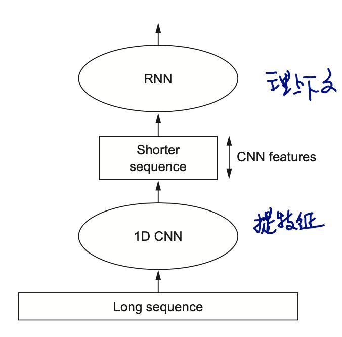

# Deep learning for text and sequences

空间上的序列，时间上的序列组成的数据，比如文本，视频，天气数据等，一般用`recurrent neural network`(RNN)和`1D convnets`

> 其实很多名词，包括convnets，我并没有在别的地方看到过，好像就是作者自己发明的，但这些不重要，知道它描述的是什么就可以了，不一定要公认术语。

通用场景：

* [分类: 文本分类] Document classification and timeseries classification, such as identifying the topic of an article or the author of a book
* [分类: 文本比较] Timeseries comparisons, such as estimating how closely related two documents or two stock tickers are
* [分类: 生成] Sequence-to-sequence learning, such as decoding an English sentence into French
* [分类: 情感分析]Sentiment analysis, such as classifying the sentiment of tweets or movie reviews as positive or negative
* [回归: 预测]Timeseries forecasting, such as predicting the future weather at a certain location, given recent weather data

我画蛇添足地加了是分类问题还是回归问题.

>  none of these deeplearning models truly understand text in a human sense

Deep learning for natural-language processing is `pattern recognition` applied to words, sentences, and paragraphs, in much **the same** way that computer vision is pattern recognition applied to pixels.

## tokenizer

图像用像素上的颜色来数字化，那文字也把什么数字化呢？
* 拆分为词，把每个词转化成向量
* 拆分为字（或字符），把每个字符转化为向量
* 把字（词）与前n个字（词）组合成单元，转化为向量，（类似滑窗），N-Grams

all of above are `tokens`, and breaking text into such tokens is called `tokenization`. These vectors, packed into sequence tensors, are fed into deep neural networks. 

`N-grams`这种生成的token是无序的，就像一个袋子装了一堆词：`bag-of-words`: a set of tokens rather than a list of sequence.

所以句子结构信息丢失了，更适合用于浅层网络。作为一种rigid, brittle（僵硬的，脆弱的）特征工程方式，深度学习采用多层网络来提取特征。

## vectorizer

token -> vector:

* one-hot encoding
* token/word embedding (word2vec)

### one-hot

1. 以token总数量（一般就是字典容量）为维度
2. 一般无序，所以生成的时候只需要按出现顺序编索引就好了
3. 有时候也往往伴随丢弃不常用词，以减小维度
4. 也可以在字符维度编码（维度更低）
5. 一个小技巧，如果索引数字过大，可以把单词hash到固定维度(未跟进)

特点/问题：

- sparse
- high-dimensional, 比如几千几万
- no spatial relationship
- hardcoded

### word embeddings

- Dense
- Lower-dimensional，比如128，256...
- Spatial relationships (语义接近的向量空间上也接近)
- Learned from data

to obtain word embeddings:

1. 当成训练参数之一(以Embedding层的身份)，跟着训练任务一起训练
2. pretrained word embeddings
    * Word2Vec(2013, google)
        + CBOW
        + Skip-Gram
    * GloVe(2014, Stanford))
    * 前提是语言环境差不多，不同学科/专业/行业里的词的关系是完全不同的
        * GloVe从wikipedia和很多通用语料库里训练，可以尝试在许多非专业场景里使用。

keras加载训练词向量的方式：
```python
model.layers[0].set_weights([embedding_matrix])
model.layers[0].trainable = False
```

pytorch：
```python
# TEXT, LABEL为torchtext的Field对象
from torchtext.vocab import Vectors
vectors=Vectors(name='./sgns.sogou.word') #使用预训练的词向量，维度为300Dimension
TEXT.build_vocab(train, vectors=vectors) #构建词典
LABEL.build_vocab(train)

vocab_size = len(TEXT.vocab)
vocab_vectors = TEXT.vocab.vectors.numpy() #准备好预训练词向量

self.embedding = nn.Embedding(num_embeddings=vocab_size， embedding_dim=embedding_size)

# 上面是为了回顾，真正用来做对比的是下面这两句
self.embedding.weight.data.copy_(torch.from_numpy(vocab_vectors))
self.embedding.weight.requires_grad = False
```

> 预训练词向量也可以继续训练，以得到task-specific embedding

## Recurrent neural networks(RNN)

sequence, time series类的数据，天然会受到前后数据的影响，RNN通过将当前token计算的时候引入上一个token的计算结果（反向的话就能获得下一个token的结果）以获取上下文的信息。


前面碰到的网络，数据消费完就往前走（按我这种说法，后面还有很多“等着二次消费的”模块，比如inception, resdual等等），叫做`feedforward network`。显然，RNN中，一个token产生输出后并不是直接丢给下一层，而是还复制了一份丢给了同层的下一个token. 这样，当前token的`output`成了下一个token的`state`。

* 因为一个output其实含有“前面“所有的信息，一般只需要最后一个output
* 如果是堆叠多层网络，则需要返回**所有**output

序列过长梯度就消失了，所谓的**遗忘** （推导见另一篇笔记，）  -> `LSTM`, `GRU`

### Long Short-Term Memory(LSTM)

1. 想象有一根传送带穿过sequence
2. 同一组input和state会进行三次相同的线性变换，有没有联想到`transformer`用同一个输出去生成`q, k, v`？

```python

output_t = activation(dot(state_t, Uo) + dot(input_t, Wo) + dot(C_t, Vo) + bo)
i_t = activation(dot(state_t, Ui) + dot(input_t, Wi) + bi) 
f_t = activation(dot(state_t, Uf) + dot(input_t, Wf) + bf) 
k_t = activation(dot(state_t, Uk) + dot(input_t, Wk) + bk)

c_t+1 = i_t * k_t + c_t * f_t  # 仍然有q，k，v的意思（i,k互乘，加上f， 生成新c）
```

> 不要去考虑哪个是**遗忘门**，**记忆门**，还是**输出门**，最终是由weights决定的，而不是设计。

Just keep in mind what the LSTM cell is meant to do: 
> allow past information to be `reinjected` at a later time, thus fighting the vanishing-gradient problem.

关键词：reinject

### dropout

不管是keras还是pytorch，都帮你隐藏了dropout的坑。 你能看到应用这些框架的时候，是需要你把dropout传进去的，而不是手动接一个dropoutlayer，原因是需要在序列每一个节点上应用同样的dropout mask才能起作用，不然就会起到反作用。

keras封装得要复杂一点：
```python
model.add(layers.GRU(32,
                    dropout=0.2,
                    recurrent_dropout=0.2,
                    input_shape=(None, float_data.shape[-1])))
```

### stacking recurrent layers

前面说过，设计好的模型的一个判断依据是至少让模型能跑到overfitting。如果到了overfitting，表现还不是很好，那么可以考虑增加模型容量（叠更多层，以及拓宽layer的输出维度）

堆叠多层就需要用到每个节点上的输出，而不只关心最后一个输出了。

### Bidriectional

keras奇葩的bidirectional语法：
```python
model.add(layers.Bidirectional(layers.LSTM(32)))
```
其实这是设计模式在类的封装上的典型应用，善用继承和多态，无侵入地扩展类的方法和属性，而不是不断魔改原代码，加参数，改API。但在脚本语言风格里的环境里，这么玩就有点格格不入了。

## Sequence processing with convnets

1. 卷积用到序列上去也是可以的
2. 一个向量只表示一个token，如果把token的向量打断就违背了token是最小单元的初衷，所以序列上的卷积，不可能像图片上两个方向去滑窗了。(`Conv1D`的由来)
3. 一个卷积核等于提取了n个关联的上下文（有点类似`n-grams`），堆叠得够深感受野更大，可能得到更大的上下文。
4. 但仍然理解为filter在全句里提取局部特征

归桕结底，图片的最小单元是一个像素（一个数字），而序列（我们这里说文本）的最小单元是token，而token又被我们定义为vector（一组数字）了，那么卷积核就限制在至少要达到最小单元(vector)的维度了。

### Combining CNNs and RNNs to process long sequences

卷积能通过加深网络获取更大的感受野，但仍然是“位置无关”的，因为每个filter本就是在整个序列里搜索相同的特征。

但是它确实提取出了特征，是否可把位置关系等上下文的作业交给下游任务RNN做呢？



不但实现，而且堆叠两种网络，还可以把数据集做得更大（CNN是矩阵运算，还能用GPU加速）。