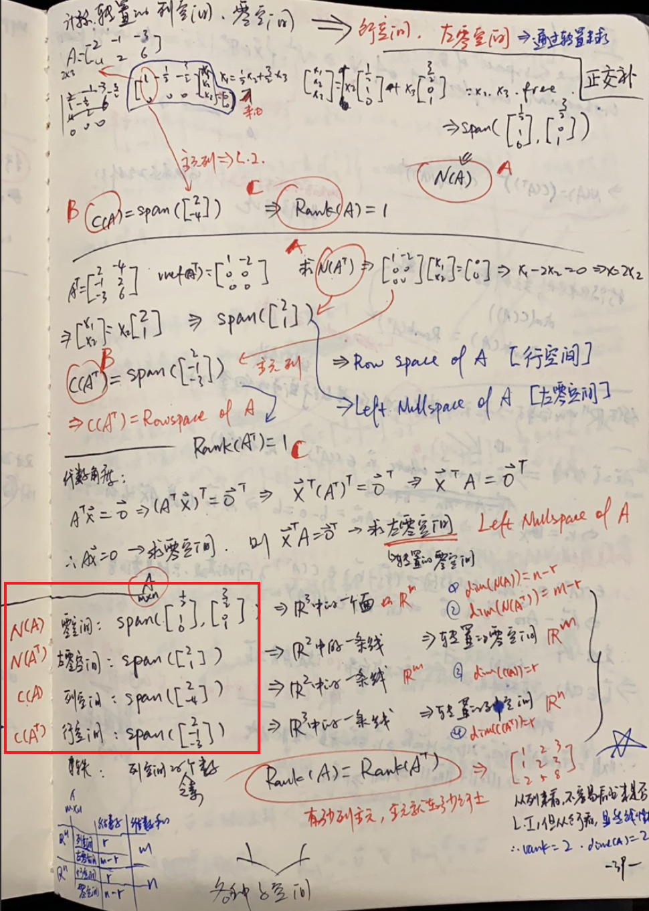
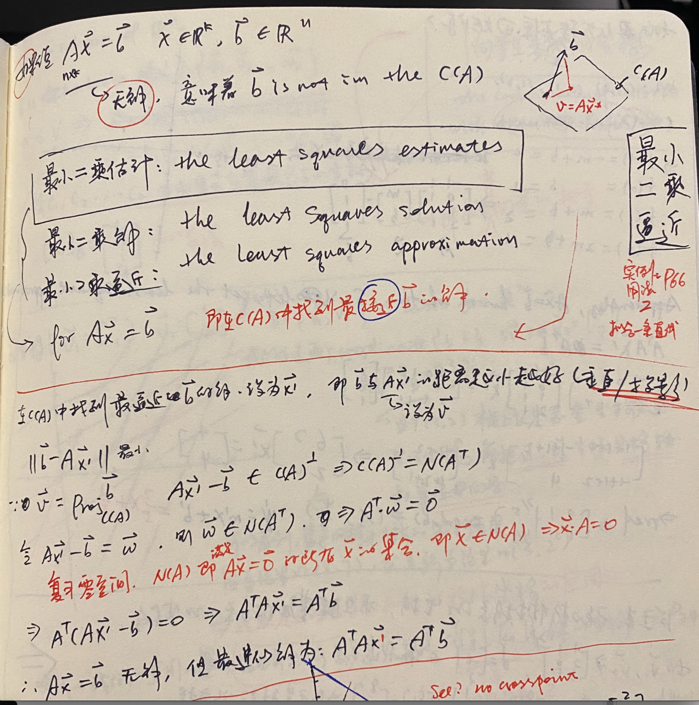

学习线性回归的时候，会教我们$X\theta=y$可以直接用**最小二乘法**直接把$\theta$求出来：

$\theta=(X^TX)^{-1}X^Ty$

并且还在我[之前的博文](https://blog.wzy.one/archives/%E7%9F%A9%E9%98%B5%E6%9C%80%E5%B0%8F%E4%BA%8C%E4%B9%98%E6%B3%95%E6%B1%82%E8%A7%A3%E4%BB%BF%E5%B0%84%E5%8F%98%E6%8D%A2%E7%9F%A9%E9%98%B5/)里直接应用了一番（那是根据公式来应用，即如何构建正确的A和y，从而应用公式直接求解$\theta$)，里面还引了一篇详实的证明文章。

首先，在吴恩达的教材里，这个并不叫最小二乘(`least suqare`），而是叫`Normal Equation method`，这个不重要，毕竟在可汗学院的教材里，又叫最小二乘了^^。今天补充的内容，就是在回顾之前的笔记的时候，发现了大量的证明和应用这个公式的地方，而且全是在引入了投影(`Projection`)概念之后。因为那个时候并没有接触机器学习，看了也就看了，现在看到了应用场景，那就闭环了，回顾一下：

首先，预备知识

## 子空间

 

笔记很清楚了，对于一个矩阵
$A= \begin{bmatrix}
   -2 & -1 & -3 \\
   4 & 2 & 6 \\
\end{bmatrix}$ 它的列空间是自然是C(A)，行空间自然是A的转置的后的`列空间`，然后各自拥有一个对应的零空间（即求解$Ax=0, A^Tx=0）$

上图用红框框出来的部分即是具体这个矩阵$A$的四个子空间。同时，拥有如下性质：
1. $C(A)$与$N(A^T)$正交(`orthogonal`)，即列空间与左零空间正交
2. $C(A^T)$与$N(A)$正交，即行空间与零空间正交

## 正交补
$V^\bot = \{\vec x \in \R^n | \vec x \cdot \vec{v} = 0\; for\; every\ \vec{v} \in V \text{\}}$ 即V的正交补为垂直于V内任意一个向量的所有向量。

那么:
* $C(A) = (N(A^T))^\bot$
* $C(A^T) = (N(A))^\bot$

## 投影是一个线性变换

这里已经看到我们熟悉的$(A^TA)^{-1}A^Tx$了，我们来看一下推导过程：
1. $\vec x$在$V \in \R^n$上的投影$Proj_V^{\vec x} = \vec v$必然能表示成该空间的`basis`{$\vec b_1, \vec b_2, \vec b_3, \dots$}的线性变换：$\vec v \in V = y_1\vec b_1 + y_2\vec b_2 + \cdots + y_k \vec b_k =  A\vec y$
2. 求出$\vec y$则求出了这个投影在哪里
3. $\vec x$能向$V$投影，自然也能向$V^\bot$投影($\vec w$)
  * 这里是故意这么说的，强调都是投影，其实在向$V$投影时，在$V^\bot$的投影（$\vec w$）就是那条**垂线**
4. $V \Rightarrow C(A),\; V^\bot \Rightarrow N(A^T), \vec v \in V, \vec w \in V^\bot$
5. 左零空间只不过是转置的零空间，那么零空间的特性是什么呢？即$A\vec x = 0$的空间，那么$\vec w$在左零空间里，意味着: $A^T\vec w = 0$
6. $\vec w = \vec x - \vec v = \vec x - A\vec y \Rightarrow A^T(\vec x - A\vec y) = 0 \Rightarrow A^T \vec x = A^TA\vec y$ 
7. 只要$A^TA$可逆的话: $\Rightarrow \vec  y= (A^TA)^{-1}A^T\vec x$
8. $\therefore Proj_V^{\vec x} = A\vec y = A(A^TA)^{-1}A^T\vec x$
9. 得证$\vec x$在$V$上的投影就是一个线性变换
10. $\vec y$即是机器学习中我们需要学习到的**系数** = $(A^TA)^{-1}A^T$

## 最小二乘逼近

由此到了下一课，`the lease squares approximation`，讲的就是$A\vec x = \vec b$无解时，意思就是在$\vec b$不存在A的张成子空间中，所以无论进行怎样的**线性变换**，都是不可能得到$\vec b$的，则取$\vec x$在$C(A)$中的投影作为近似的解（证明就不再展开了）

仍然用的是同一个思路，即"垂线在左零空间中"，来构造$A^T\cdot \vec w = \vec 0$

## 应用最小二乘拟合一条回归线
这里终于讲到了与机器学习最接近的内容：`regression`

可以看到，毫无业务思维的花花肠子，很多机器学习课程里会花大量工夫从感性到理性上给你讲这些内容，因为它的期望从0跟你讲清楚，而在循序渐进的数学理论体系里，这些根本就不需要关联感性认识的，什么每年的房价啊，数学关注的只是建模。

这个回归实例里，因为需要拟合的是一条直线：$y = b + ax$，那么既有的数据就成了机器学习里的“样本”，但我们这里不需要这么理解，而是直接理解为矩阵，得到
方程组：

$$\begin{cases}
b + a = 1 \\
b + 2a = 2 \\
b + 3a = 2
\end{cases}$$
提取矩阵：

$$A = \begin{bmatrix}1&1\\1& 2\\ 1& 3\end{bmatrix}, \vec b = \begin{bmatrix}1\\2\\ 2\end{bmatrix} \Rightarrow A\vec x = \vec b$$

好了，在上面提到的[这篇博文](https://www.jianshu.com/p/c2d0c743dc5d)里，我们不明就里地直接用了公式，已知A和b求变换矩阵M(即这里的$\vec x$)，还当成是机器学习的内容，而现在我们已经知道自己是在做什么，就是找b在$A$的张成子空间里的投影，就能得到最近似的解

$$\vec x \approx (A^TA)^{-1}A^T\vec b$$
