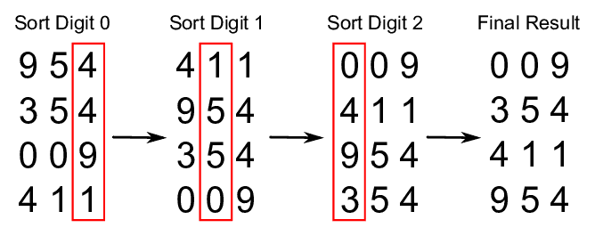

## 冒泡排序

冒泡排序基础原理是每一轮都让最大的值移到最右边，一句话就够了。

如果想小优化一下，可以在每一轮过后都把最后一个（已经是最大的值）排除出去，这种我把它称之为“压缩边界“，在下面的几种排序算法里都有反复提及。而且之所以说优化，就是不做也行，如果只是想演示算法核心思想的话。

```python
def bubble_sort(arr):
    for i in range(1, len(arr)):
        for j in range(len(arr)-i):
            if arr[j] > arr[j+1]:
                arr[j], arr[j+1] = arr[j+1], arr[j]
    return arr
bubble_sort([0, 2, 1, 3, 5, 1, 1])
```
ouput:
```
[0, 1, 1, 1, 2, 3, 5]
```

## 快速排序

选出一个合适的（或任意的）中值(`pivot`），把比它大的和小的分列到两边，再对两边进行上述分类的递归操作。实际操作中往往会选定了`pivot`后，从右往左搜小数，从左往右搜大数，以规避pivot本身过大或过小时，如果选定的方向不对，可能每一次都需要把整个数组几乎遍历完才找到合适的数的情况。

 again，这只是优化，如果不考虑这些，那么核心思想是非常简单的：


```python
def q_sort(arr):
    if len(arr) <= 1:
        return arr
    pivot = arr.pop()
    left  = [item for item in arr if item <= pivot]
    right = [item for item in arr if item > pivot]
    return q_sort(left) + [pivot] + q_sort(right)
```

 这个不但实现了（中值+两侧+递归）的思路+没有任何优化，效果已经出奇的好了！

但网上演示的都是下面这种花活，从两侧来压缩备选区域（压缩的意思是排好了的区域就不要管了），下面列了个表格来演示过程，看大家是不是能轻松看懂快排的两个核心机制：`标红位`，和`边界压缩`。说明如下：

- 任意写个数组[6,7,3,2,14,9]，任取一个数为pivot，就第1个吧（6），  
- 左箭头表示从右往左找第一个小于pivot的值，右箭头表示从左往右找第一个大于pivot的值 
- 红色代表标红位，废位，即当前位找到本轮符合要求的值，但挪到两侧去了，$\color{red}{下一轮的符合条件的值应该放入这个标红位里}$
- 括号里的表示是这一轮该位置赋的新值，它来自于标红位，同时，括号的位置也就是上一轮的标红位
- 划掉的表示已经压缩了左右边界，下一轮就不要在这些数里面选了（为了视觉简洁，标红位就不划了）

$$
\require{cancel}
\begin{array}{c|cccccc|l}
index&0&1&2&3&4&5&\\
\hline
array&\color{red}6&7&3&2&14&9\\
\underleftarrow{\small找小数}&\cancel{(2)}&7&3&\color{red}2&\cancel{14}&\cancel{9}&找到2，放到索引0\\
\underrightarrow{\small找大数}&\cancel{2}&\color{red}7&3&(7)&\cancel{14}&\cancel{9}&找到7，放到索引3\\
\underleftarrow{\small找小数}&\cancel{2}&(3)&\color{red}3&\cancel{7}&\cancel{14}&\cancel{9}&找到3，放到索引2\\
&2&3&(6)&7&14&9&(1,2)索引间已没有大于6的数，排序完成，回填6
\end{array}
$$


1. 注意第1次从右往左找比6小的数时，找到2，右边的14，9就可以全部划掉了，因为我永远是在用6在左右查找，这一次pass了，后面永远会pass
  * 这样边界压缩得非常快，这就是称之为“快速”排序的原因吧？
2. 目前只完成一次分割（即按6为标识切分左右），接下来用同样的逻辑递归6左边的`[2]`和右边的`[7,14,9]`排序即可
  * 所以快排就3个部分，一个主体，执行一次分割，然后对分割后的两个数组分别递归回去，这样代码怎么写也出来了：

```python
def q_sort(array, start, end):
    # （left， right）用来保存不断缩小的查找数组索引界限
    #  我上面模拟的过程里，就是划掉的数字的左右边界
    left, right = start, end
    index = start
    pivot = array[start]
    
    while left < right:
        # 从右往左选小于pivot的数
        matched = False # 标识这一轮有没有找到合适的数（如果没找到其实说明排序已经完成）
        for i in reversed(range(left+1, right+1)): # 去头，含尾, 反序
            if array[i] <= pivot:
                array[index] = array[i]
                right = i  # 从右到左比到第i个才有比pivot小的数，那么i右侧全大于pivot，下次可以缩小范围了
                index = i
                matched = True
                break
        if not matched:
            break  # 右侧没有找到更小的数，说明剩余数组全是大数，已经排完了
            
        left += 1 # 找到了填入新数后就顺移一位
        matched = False
        # 从左往右选大于pivot的数
        for i in range(left, right): # 有头无尾
            if array[i] > pivot:
                array[index] = array[i]
                left = i # 此时i左侧也没有比pivot大的数，下次再找也可以忽略了，也标记下缩小范围
                index = i
                matched = True
                break;
        if not matched:
            break
        right -= 1
    array[index] = pivot # 把标红位设为pivot
    
    # 开始递归处理左右切片
    if start < index-1:
        q_sort(array, start, index-1)
    if end > index+1:
        q_sort(array, index+1, end)

    return array

arr = [0, 2, 1, 3, 5, 1, 1]
# 我封装时为了兼容递归，要人为传入start, end，进入函数时自行计算一下好了
q_sort(arr, 0, len(arr)-1)  
```
output
```
[0, 1, 1, 1, 2, 3, 5]
```

## 堆排序

1. 其实就是把数字摆成二叉树，知道二叉树是啥就行，或者看下面的动图
2. 每当一个数字排入堆中的时候，都与父节点比一下大小，如果大于父节点，则与父节点交换位置
  * 不与兄弟节点比较，即兄弟节点之间暂不排序
3. 交换到父节点后再跟当前位置的父节点比较，如此往复，至到根节点（**递归警告**）
4. 一轮摆完后，最大的数肯定已经**上浮**到根节点了，把它与最末的一个数字调换位置（这个数字是一个相对小，但不一定是最小的），然后把最大的这个数从堆里移除（已经确认是最大的，位置也就确认了，不再参与比较）
5. 实现的时候，因为有“找父/子节点比大小”这样的逻辑，显然可以直接用上二叉树的性质，不要自己去观察或归纳了。

动图比较长，耐心看下：


> 在实现每一轮的遍历数字较大的那个子节点并交换数字的过程中，我之前用的是递归，在小数据量顺利通过，但上万条数据时碰到了`RecursionError: maximum recursion depth exceeded in comparison`, 查询本机迭代大小设置为1000，但设到几十万就不起作用了（虽然不报错），于是改成了`while`循环，代码几乎没变，但是秒过了。

递归只是让代码看起来简洁而牛逼，并没有创造什么新的东西，while能行那就算过了吧。

但是代码开始dirty了起来，大量的代码在控制边界和描述场景，显然有些条件可能是冗余的，我没有很好地合并这些边界和条件导致if太多，这是个不好的演示，但三个核心函数还是阐释了这种算法的思路：
* 摆成树（堆）
* 从leaf到root冒泡 (child去比parent)
* 从root到leaf冒泡 (parent去比child)

```python
# helper
get_parent_index = lambda i : max((i - 1) // 2, 0)
get_child_index  = lambda i : 2 * i + 1

def heap_sort(arr):
    heapify(arr)                    # 初排
    siftDown(arr, 0, len(arr)-1)    # 整理
    return arr

def heapify(arr):
    index = 1
    while index < len(arr):
        p_index = get_parent_index(index)
        parent  = arr[p_index]
        child   = arr[index]
        if child > parent:
            arr[p_index], arr[index] = arr[index], arr[p_index]
            siftUp(arr, p_index)
        index += 1
    return arr

def siftUp(arr, c_index):
    p_index = get_parent_index(c_index)
    parent  = arr[p_index]
    leaf    = arr[c_index]
    if parent < leaf:
        arr[p_index], arr[c_index] = arr[c_index], arr[p_index]
    if p_index > 0:
        siftUp(arr, p_index)

def siftDown(arr, start, end):
    '''
    1. 交换首尾两个数，这样尾数就变成了最大
    2. 跟两个子节点中较大的比较，并迭代，递归下去
    '''
    while start < end:
        if start == 0:
            arr[0], arr[end] = arr[end], arr[0]
        left_i  = get_child_index(start)
        if left_i >= end: 
            # 子结点是end，就不要比了，把当前节点设为新end
            start = 0
            end -= 1
            continue
        else:
            right_i = left_i + 1
            index = left_i
            if right_i < end:
                # 右边没有到end的话，取出值比大小
                # 并且把下一轮的start设为选中的子节点
                index = left_i if arr[left_i] > arr[right_i] else right_i
            parent  = arr[start]
            if parent < arr[index]:
                arr[start], arr[index] = arr[index], arr[start]
        # 如果左叶子已经被标记为end  (已提前return)
        # 如果右边叶子被标记为end
        # 如果下一个索引被标记为end
        # 都表示本轮遍历已经到底, end往前移一位即可
        if right_i >= end or (end - right_i) == 1:
            start = 0 # 用start=0表示需要进行一次首尾替换再从头到尾移动一次
            end -= 1
        else:
            # 否则进入下一个循环
            # 起点就是用来跟父级做比较的索引
            # 终点不变
            start = index

if __name__ == "__main__":
    import numpy as np
    import time
#     np.random.seed(7)
#     length = 20000
#     arr = list(np.random.randint(0, length*5, size=(length,)))
    arr = list("65318724")
    start = time.time()
    s = heap_sort(arr)
    print(time.time()-start, '\n', s[:100])
```
output
```
4.696846008300781e-05 
 ['1', '2', '3', '4', '5', '6', '7', '8']
```

## 归并排序

这次先看图吧，看你能总结出啥：


1. 第一步是把数组打散后两两排序，实现每一组（2个元素）是排好序的
2. 第二步仍然是两两排序，但是把前面排序好的每两个组成一个组：
  * 这样每组就有2个数了，但组数就减半了
  * 每一组拿出当前最前面的数出来比较，每次挑1个最小的，移出来
  * 剩下的组里数字有多有少，仍然比较组里面排最前的那个（因为每组已经从小到大排好了，最前面那个就是组里最小的）
  * 所以代码里能跟踪两个组里当前的“最前的索引”是多少就行了
3. 继续合并，单从理论上你也能发现，每组的数字个数会越来越多，组数却越来越少， 显然，最终会归并成一个组，而且已经是排好序了的。

这就是归并名字的**由来**。后面还有一种`希尔算法`，正好是它的相反，即打得越来越散，散成每组只有一个元素的时候，排序也排好了，看到那一节的时候注意对比。

```python
import math
def merge_sort(arr):
    '''
    每一轮比较的时候是把选中的元素填到另一个数组里
    为了减少内存消耗，就循环用两个数组
    我们用交替设置i和j为0和1来实现这个逻辑
    '''
    start    = 0
    step     = 1
    length   = len(arr) - 1
    lists    = [arr, []]
    i, j     = 0, 1
    while step < length:
        compare(lists[i], start, step, length, lists[j])
        step *= 2
        i, j  = j, i
    return lists[i]

def gen_indexs(start, step, length):
    '''
    根据左边界和步长确定本轮拿来比较的两个数组的边界
    '''
    left_end    = start + step - 1
    right_start = min(start + step, length)
    right_end   = min(right_start + step - 1, length)
    return start, left_end, right_start, right_end


def compare(arr, start, step, length, result):
    result.clear()
    left_start, left_end, right_start, right_end \
                = gen_indexs(start, step, length)
    left_index  = 0  # 组内索引(0, step-1)
    right_index = 0
    while left_start <= length:
        left    = left_start + left_index
        right   = min(right_start + right_index, length)
        l_done  = False
        r_done  = False
        if arr[left] < arr[right]:
            result.append(arr[left])
            left_index += 1
            left   = left_start + left_index
            l_done = left == right_start
        else:
            result.append(arr[right])
            right_index += 1
            r_done = (right_start + right_index) > right_end
        if l_done or r_done:
            if l_done:
                # 左边没数了，右边的数全塞到result里去
                result += arr[right:right_end]
                result.append(arr[right_end])
            else:
                # 右边没数了，左边剩下的数全塞到result里去
                result += arr[left:right_start]
            left_start, left_end, right_start, right_end \
                        = gen_indexs(right_end+1, step, length)
            left_index  = 0
            right_index = 0

if __name__ == "__main__":
    import numpy as np
    import time
#     np.random.seed(7)
#     length = 20000
#     arr = list(np.random.randint(0, length*5, size=(length,)))
    arr = [1,6,17,5,2,9,3,1,22,9,8,0,7,65]#,2,13,4,6,17,33,8,0,4,17,22]
    start = time.time()
    s = merge_sort(arr)
    print(time.time()-start, s[:100])
```
output
```
5.626678466796875e-05
[0, 1, 1, 2, 3, 5, 6, 7, 8, 9, 9, 17, 22, 65]
```

以上是我对着动画实现的一个版本，很繁琐，而且只是直观地把动画演示了一遍，即先两两组合，对比，再四四对比，直到最后只有两个大数组，比一次。直到我看到这个思路，我把它实现出来如下：
```python

def mergesort(arr, start=0, end=None):
    end = end or len(arr)
    if end - start > 1:
        mid = (start + end + 1) // 2
        mergesort(arr, start, mid) # left
        mergesort(arr, mid, end) # right
        sort(arr, start, mid, end) 
        # 最里层：([0:1],[1:2]) -> (start, mid, end) 为(0,1,2)
        # 所以退出条件是 end - start > 1

def sort(arr, left, mid, right):
    p1 = left
    p2 = mid
    temp = [] # 本轮排序的结果
    # 左右两个数组分别按顺序取出最前一个来比较大小
    # 小数拿到临时数组里去，游标加1
    while p1 < mid and p2 < right:
        if arr[p2] > arr[p1]:
            temp.append(arr[p1])
            p1 += 1
        else:
            temp.append(arr[p2])
            p2 += 1
    # 不管是左边还是右边，剩下的都是已经排好的（大数），直接接到数组后面
    if p1 < mid:
        temp += arr[p1:mid]
    elif p2 < right:
        temp += arr[p2:right]
    
    arr[left:right] = temp

```
sort部分没变，还是两边比较，永远取小的一个，直到排成一排变成一组。主体变成了mergesort()的递归。用文字描述的话，就是这个方法就做了一件事：把当前数组左右分开，然后用永远取最前一个来当最小值的方式（sort方法）完成排序。
等于是直接就走到了我实现的方法的最后一步，而用递归的方式，让更小的单元完成排序，比如每8个，每4个，每2个，真实发生排序的时候，仍然是我写的代码的第一层，就是两两排序。但是代码简洁抽象好多。

如果把递归理解为异步的话：
```javascript
await sort_lert()
await sort_right()
sort(left, right)
```
即代码真走到第3行了的话，所有的数据已经排好序了

## 基数排序



看图，为什么从个位向高位依次排过去为什么就能保证后面高位的排序不会影响低序的，直观来理解的话，就是
1. 如果高位数字不一样，那么低位顺序是没意义的，按高位大小排即可
2. 如果高位数字一样，那么低位已经排好序了
3. 按这个逻辑由低位向高位排，按归纳法，可以推到适用普遍情况的

这里就有一个逻辑bug了，我本来就是要根据大小排序比如1万个数字，结果你说要先把这1万个数字根据个位数大小排一遍，再根据十位数大小排一遍，我无数次地排这1万个数字，为何不直接按大小把它排好算了呢？

这就是这个算法存在的意义吧，根据位数排序数次快的很，因为你不需要排它，你只需要做10个容器，编号为0-9，你要排序的位数上，数字是几就把整个数字丢到对应编号的容器里，自然就实现了排序，因为0-9本身就是个排好了序的数组。

>你甚至可以用字典，key就是0到9，但数组天生自带了数字Index，何乐而不为？

演示：385, 17, 45, 26, 72, 1265, 用个位数字排序，排好后的容器（数组）应该是：
```python
[
    [],
    [],
    [72],
    [],
    [],
    [835, 45, 1265],
    [26],
    [17],
    [],
    []
]
```

其实这也是排序，和接下来要讲的插入排序很像。它没有查找的过程，时间复杂度为0。上面剧透的shell排序还没讲，又剧透了另一个。

别的就没啥好说的了，由低位到高位循环就是了。

```python
def get_number(num, index):
    '''
    提取指定位数数字的方法：
    个位：527 % 10^1 // 10^0 = 7
    十位：527 % 10^2 // 10^1 = 2
    百位：527 % 10^3 // 10^2 = 5
    千位：527 % 10^4 // 10^3 = 0
    '''
    return num % 10**(index+1) // 10**index

def digit_length(number):
    import math
    return 1 if abs(number) < 10 else int(math.log10(abs(number)) + 1)

def digit_sort(arr, index):
    '''
    对第index个数字进行排序
    '''
    results = []
    for i in range(11):
        results.append([]) # [[]] * 10 会造成引用传递
    for num in arr:
        i = get_number(num, index)
        results[i].append(num)
    return [digit for sublist in results for digit in sublist]  # flatten the 2-d array

def radix_sort(arr):
    length = digit_length(max(arr)) # 演示如何从数学上取得数字的长度（几十万次迭代效率只有毫米级的差别）
    for i in range(length):
        arr = digit_sort(arr, i)
    return arr

if __name__ == "__main__":
    import numpy as np
    import time
#     np.random.seed(7)
#     length = 20000
#     arr = list(np.random.randint(0, length*50, size=(length,)))
    arr = [954,354,309,411]
    start = time.time()
    s = radix_sort(arr)
    print(time.time()-start, s[:100])
```
output:
```
0.0008242130279541016
[309, 354, 411, 954]
```

## 插入排序

准备一个空数组，依次把原数组的每一个数插入到该数组里的适当位置。上面说的基数排序里的按位初排就有点类似插入排序，只不过基数排序里不需要比较大小（即235， 15， 1375）这样的数，如果看个位，都是在索引5的位置，且无序），而且插入的位置是固定的，所以没有时间复杂度。

而插入排序则实实在在地要在排入的数组里遍历才能找到正确的插入位置，越排到后面，新数组就越长，时间复杂度也就越来越大了。

```python
def insert_sort(arr):
    rst = arr[0:1]
    for i in arr[1:]:
        found = False
        for idx, j in enumerate(rst):
            if j > i:
                rst.insert(idx, i) # 排到第一个比它大的前面
                found = True
                break;
        if not found:
            rst.append(i)
    return rst

insert_sort([1,34,5,6,9,0])
```
output
```
[0, 1, 5, 6, 9, 34]
```

## 希尔排序

1. `归并排序`是化整为零，两两比较后再组合，分组越来越大，最终变成一组
2. 希尔排序是一开始就对半分（注：如果不能整除，如11//2=5, 这样会有3组），每一组相同位置的数做比较，实现一轮过后分组间`同位置的数`是顺序排列的
3. 每组元素再减半，就上一条来说是(5//2=2，即上一层一组5个，下一轮每组就只有2个了)，以此往复，让组数越来越多，组内元素却越来越少，极端情况就是每组只有1个了，再参考前面总结的“**分组间同位置的数是顺序排列的**”这一结论，说明整个数组已经排好序了（退出条件get）。这个思路妙不妙？

```python
def shell_sort(arr):
    group = len(arr) // 2
    
    while group > 0:
        for i in range(group, len(arr)):
            right   = arr[i]
            current = i
            while current >= group and arr[current - group] > right:
                arr[current] = arr[current - group]
                current -= group
            arr[current] = right
        group //= 2
    return arr

shell_sort([34,24,538,536,1])
```
output
```
[1, 24, 34, 536, 538]
```
-----
最后，生成可重复的随机数测几轮， quick sort要快一些：

```python
if __name__ == "__main__":
    import numpy as np
    import time
    np.random.seed(7)
    length = 20000
    arr = list(np.random.randint(0, length*50, size=(length,)))
    print(f'{length} random integers sort comparation:')
    for i in range(5):
        print(f'-------------round {i+1}------------')
        # insert is too slow
        # or my implementation is not so good
#         start = time.time()
#         s1 = insert_sort(arr)
#         print(f"insert_sort\t {time.time()-start:.5f} seconds")
        start = time.time()
        s2 = quick_sort(arr.copy())
        print(f"quick_sort\t {time.time()-start:.5f} seconds")
        start = time.time()
        s3 = shell_sort(arr.copy())
        print(f"shell_sort\t {time.time()-start:.5f} seconds")
        start = time.time()
        s4 = heap_sort(arr.copy())
        print(f"heap_sort\t {time.time()-start:.5f} seconds")
        start = time.time()
        s5 = merge_sort(arr.copy())
        print(f"merge_sort\t {time.time()-start:.5f} seconds")
        start = time.time()
        s6 = radix_sort(arr.copy())
        print(f"radix_sort\t {time.time()-start:.5f} seconds")
    print(f"first 10 numbers:\n{s2[:10]}\n{s3[:10]}\n{s4[:10]}\n{s5[:10]}\n{s6[:10]}")
```
output
```
20000 random integers sort comparation:
-------------round 1------------
quick_sort	 0.07970 seconds
shell_sort	 0.17623 seconds
heap_sort	 0.32919 seconds
merge_sort	 0.20177 seconds
radix_sort	 0.18000 seconds
-------------round 2------------
quick_sort	 0.05894 seconds
shell_sort	 0.15423 seconds
heap_sort	 0.28844 seconds
merge_sort	 0.20043 seconds
radix_sort	 0.19310 seconds
-------------round 3------------
quick_sort	 0.06169 seconds
shell_sort	 0.18299 seconds
heap_sort	 0.33159 seconds
merge_sort	 0.20836 seconds
radix_sort	 0.20003 seconds
-------------round 4------------
quick_sort	 0.05780 seconds
shell_sort	 0.15414 seconds
heap_sort	 0.26780 seconds
merge_sort	 0.18810 seconds
radix_sort	 0.17084 seconds
```
