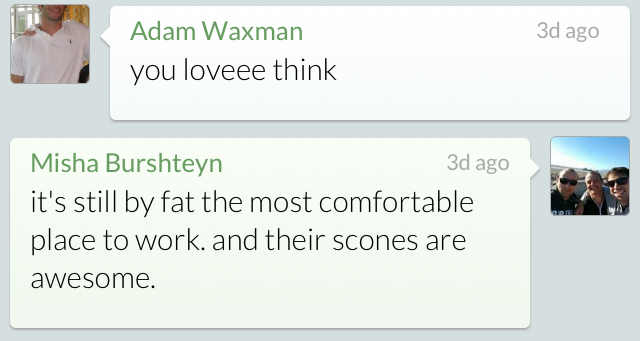

记记思路
```objective-c
- (void)drawRect:(CGRect)rect
{
    CGContextRef context=UIGraphicsGetCurrentContext();
    CGContextSetLineWidth(context, .5f);
    CGContextSetStrokeColorWithColor(context, [UIColor lightGrayColor].CGColor);
    CGContextSetRGBFillColor(context, 1, 1, 1, 1);

    rect.origin.y++;
    CGFloat radius = cornerRadius;

    CGFloat minx = CGRectGetMinX(rect), midx = CGRectGetMidX(rect), maxx = CGRectGetMaxX(rect);
    CGFloat miny = CGRectGetMinY(rect), midy = CGRectGetMidY(rect), maxy = CGRectGetMaxY(rect);

    CGMutablePathRef outlinePath = CGPathCreateMutable();

    if (![User isCurrentUser:message.user])
    {
        minx += 5;

        CGPathMoveToPoint(outlinePath, nil, midx, miny);
        CGPathAddArcToPoint(outlinePath, nil, maxx, miny, maxx, midy, radius);
        CGPathAddArcToPoint(outlinePath, nil, maxx, maxy, midx, maxy, radius);
        CGPathAddArcToPoint(outlinePath, nil, minx, maxy, minx, midy, radius);
        CGPathAddLineToPoint(outlinePath, nil, minx, miny + 20);
        CGPathAddLineToPoint(outlinePath, nil, minx - 5, miny + 15);
        CGPathAddLineToPoint(outlinePath, nil, minx, miny + 10);
        CGPathAddArcToPoint(outlinePath, nil, minx, miny, midx, miny, radius);
        CGPathCloseSubpath(outlinePath);

        CGContextSetShadowWithColor(context, CGSizeMake(0,1), 1, [UIColor lightGrayColor].CGColor);
        CGContextAddPath(context, outlinePath);
        CGContextFillPath(context);

        CGContextAddPath(context, outlinePath);
        CGContextClip(context);
        CGPoint start = CGPointMake(rect.origin.x, rect.origin.y);
        CGPoint end = CGPointMake(rect.origin.x, rect.size.height);
        CGContextDrawLinearGradient(context, [self normalGradient], start, end, 0);
    }
    else
    {
        maxx-=5;
        CGPathMoveToPoint(outlinePath, nil, midx, miny);
        CGPathAddArcToPoint(outlinePath, nil, minx, miny, minx, midy, radius);
        CGPathAddArcToPoint(outlinePath, nil, minx, maxy, midx, maxy, radius);
        CGPathAddArcToPoint(outlinePath, nil, maxx, maxy, maxx, midy, radius);
        CGPathAddLineToPoint(outlinePath, nil, maxx, miny + 20);
        CGPathAddLineToPoint(outlinePath, nil, maxx + 5, miny + 15);
        CGPathAddLineToPoint(outlinePath, nil, maxx, miny + 10);
        CGPathAddArcToPoint(outlinePath, nil, maxx, miny, midx, miny, radius);
        CGPathCloseSubpath(outlinePath);

        CGContextSetShadowWithColor(context, CGSizeMake(0,1), 1, [UIColor lightGrayColor].CGColor);
        CGContextAddPath(context, outlinePath);
        CGContextFillPath(context);

        CGContextAddPath(context, outlinePath);
        CGContextClip(context);
        CGPoint start = CGPointMake(rect.origin.x, rect.origin.y);
        CGPoint end = CGPointMake(rect.origin.x, rect.size.height);
        CGContextDrawLinearGradient(context, [self greenGradient], start, end, 0);
    }


    CGContextDrawPath(context, kCGPathFillStroke);

}

- (CGGradientRef)normalGradient
{

    NSMutableArray *normalGradientLocations = [NSMutableArray arrayWithObjects:
                                               [NSNumber numberWithFloat:0.0f],
                                               [NSNumber numberWithFloat:1.0f],
                                               nil];


    NSMutableArray *colors = [NSMutableArray arrayWithCapacity:2];

    UIColor *color = [UIColor whiteColor];
    [colors addObject:(id)[color CGColor]];
    color = [StyleView lightColorFromColor:[UIColor cloudsColor]];
    [colors addObject:(id)[color CGColor]];
    NSMutableArray  *normalGradientColors = colors;

    int locCount = [normalGradientLocations count];
    CGFloat locations[locCount];
    for (int i = 0; i < [normalGradientLocations count]; i++)
    {
        NSNumber *location = [normalGradientLocations objectAtIndex:i];
        locations[i] = [location floatValue];
    }
    CGColorSpaceRef space = CGColorSpaceCreateDeviceRGB();

    CGGradientRef normalGradient = CGGradientCreateWithColors(space, (__bridge CFArrayRef)normalGradientColors, locations);
    CGColorSpaceRelease(space);

    return normalGradient;
}
```
效果


来源[StackOverflow](http://stackoverflow.com/questions/11196112/speech-bubble-in-ios-sdk-using-objective-c)
