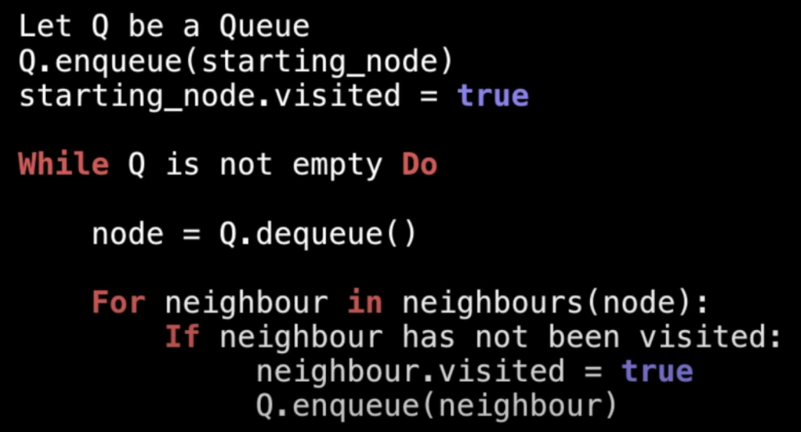

这是一位 google 工程师分享的8小时的[数据结构](https://www.youtube.com/watch?v=RBSGKlAvoiM)的视频,我的笔记

前几个比较基础,只记录了些关键字和提纲

# Static and Dynamic Arrays

**static array**
* fixed length
* indexable

usage:
* sequential data
* IO routines as buffers
* lookup tables and inverse lookup tables
* return multiple values

operation complexity:
access: O(1)
search: `O(n)`
insert: `O(n)`
append: O(1)
delet: `O(n)`
需要遍历的操作就是O(n)

Q: How to implement a dynamic array?
A:
1. static array with an initial capacity
2. add new elements, keep tracking the size
3. if exceed capacity, create a new static array with `twice the capacity`
    * and copy the original elements into it

## Singly and Doubly Linked Lists

单向/双向链表

sequential list of nodes that hold data which point to other nodes also containing data. 
* 节点序列，
* 节点拥有指向别的节点的数据（指针）
* 别的节点也拥有这种指针

usage:
* many `List, Queue & Stack` implementations
* circular lists
* model real world objects such as `trains`
* implementation of adjancy list for graphs
* separate chaining -> ? 
    * deal with hashing collisions -> ?

> 上述两上问号后续在`Hash Table`一节里自然就解惑了

**Terminology**
Head / Tail / Pointer / Node

Singly vs Doubly
* Doubly holds a `next` and `prev` reference, which Singly has no `prev`
    * 插入删除的时候需要更新所有引用
* both maintain a reference of `head` and `tail` for quick additions / removals

**insertion**
* create a traverser and move by sepcific steps
* create new node
* singly:
    * 原node的next指向新node
    * 新node的next指向原next的node
* doubly:
    * 新node的next和prev分别指向原node和下一个node
    * 两个node分别用next和prev指向新node

**removal**

singly需要两个游标:
* pt1指向head, pt2指向head->next
* pt1, pt2一起移动，直到pt2找到目标
* pt2再向前移动一步
* pt1位置的node用next指向pt2位置
* now can sefely remoing the element between pt1 and pt2

doubly却只需要一个：
* pointer找到目标元素
* 用prev和next找到上一个和下一个
* 下一个和下一个node分别互相指向

**Complexity**
searth: `O(n)`
insert at head/tail: O(1)
remove at head: O(1)
remove at tail: `O(n)` (singly) / O(1) (doubly)
因为即使我们知道tail在哪，在单向链表中，我们也找不到它的前一个去设置为新的tail
remove in middle: `O(n)`

# Stack

* one-ended linear data structure (LIFO)
* two operation: `push` and `pop`

**Usage**
* undo mechanisms
* compiler syntax checking for matching brackets and braces
    * 开括号压入栈内，每碰到一个闭括号，与栈顶的比较，匹配就出栈，不匹配就报错
* model a pile of books or plates
    * 汉诺塔(tower of hanoi)
* tracking previous function calls
* DFS on a graph

**Complexity**
push/pop/peek/size: O(1)
search: `O(n)`

双向链表实现一个Stack，基本上就是操作tail

# Queues

* a linear data structure, model real world queues (FIFO)
* two primary operations: `enqueue`, `dequeue`

**Usage**

* any waiting line models a queue
* keep track of the x most recently added elements -> ?
* web server request management where you want first come first serve
* BFS graph traversal

**Complexity**

只有`contains, revomval`需要遍历，其它操作（出入列等）都是O(1)

实现一个BFS：

基本就是动态往 queue 里添加子节点,当前级别元素访问完后, 再 dequeue 出来的就是所有的下一级子节点

双向列表实现Queue，入列用tail，出列用head，即添加的总在尾巴，永远从头部取出。
