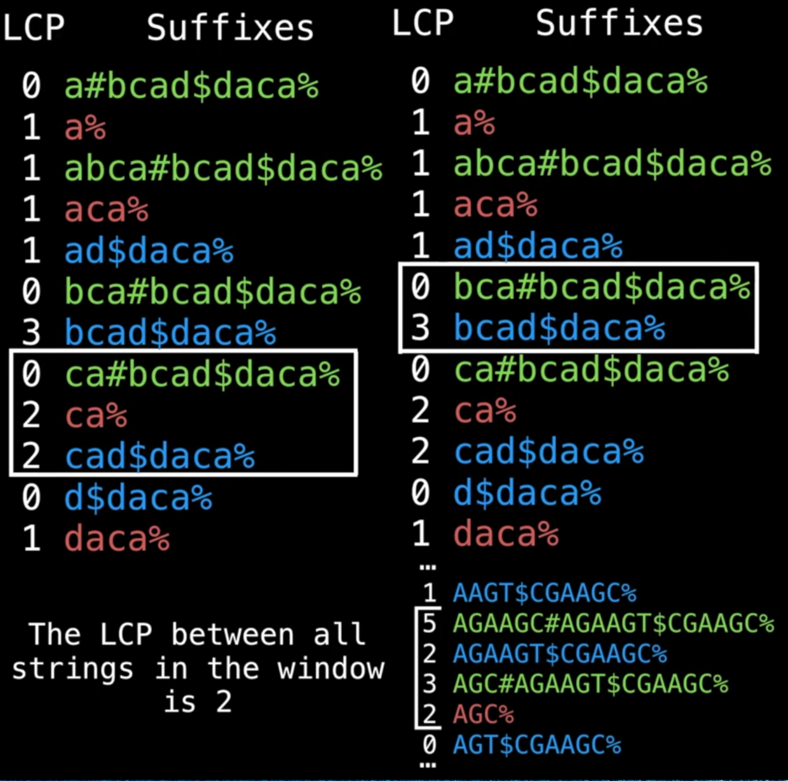
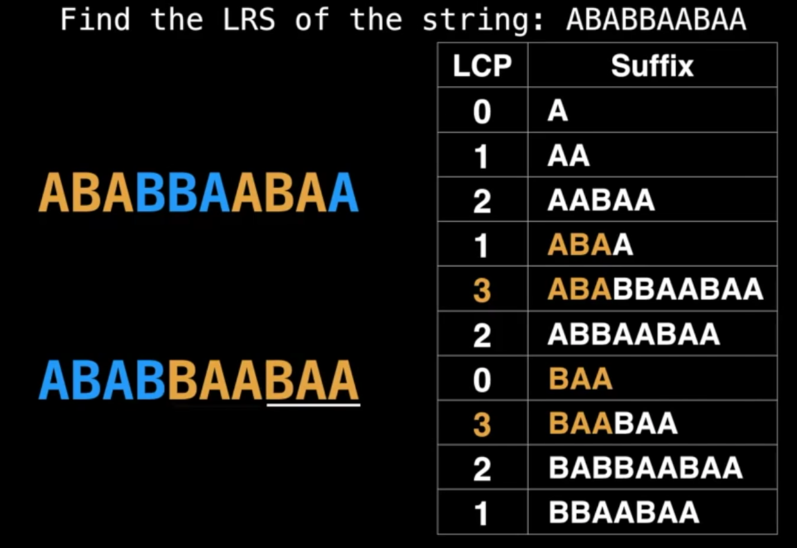

这是一位 google 工程师分享的8小时的[数据结构](https://www.youtube.com/watch?v=RBSGKlAvoiM)的视频,我的笔记

-----

# Suffix Array

* 字符串的所有子字符串后缀组成数组
* 对子串根据首字母进行排序
* 排序后原有的index就被打乱了
* 这个乱序的indices就是`Suffix Array`

做尾缀子串的时候通常是从单个字母开始越找越多，这就有了一个原生顺序，然后用首字母排序后，这个顺序就被打乱了

提供了一种`compressd representation` of sorted suffixes而无需真的把这些子串存起来。

* A space efficient alternative to a `suffix tree`
    * a compressd version of a `trie`?

能做所有`suffix tree`能做的事，并加添加了`Longest Common Prefix`(LCP) array

# Longest Common Prefix (LCP) array

继续上面的Suffix Array，字母排序后，我们一个个地用每一个元素同上一个元素比，标记相同前缀的字母个数，这个数字序列就是`LCP`

比如adc, adfgadc, 前缀`ab`是相同的，那就是2。

第一个元素没有“上一个”去比，所以LCP数组第1位永远是0？（是的，其实是undefined，但一般设0）

衡量的是相邻的suffix array元素的前缀间有多少个字母相同。

当前也可以和下一个元素比（这样最后一个元素的LCP肯定是0了，原理同上）

## Find unique substrings

找到（或计数）一个数组的所有（不重复的）子元素。可以逐个substring遍历，$O(n^2)$，下面看看更快也更省空间的LCP方案。

找“AZAZA”的不重复子串:
A,AZ,AZA,AZAZ,AZAZA,Z,ZA,ZAZ,ZAZA,`A,AZ,AZA,Z,AZ,A`，把重复的标注了出来。
LCP是这样的：
LCP|Sorted Suffixes|
-|-
0|A
1|AZA
3|AZAZA
0|ZA
2|ZAZA

我们知道第一列指的是“重复个数”，也就是说，如果按我们手写的那样去遍历，至少有这么多重复的子串，重复的既是“个数”，也是“组合方式”。

所以如果我们只需要计数的话，把右边的数出来就知道有会有多少个重复的了，此例为6.

$$\tt unique\ count = \underbrace{\frac{n(n+1)}{2}}_{substr\ count} - \underbrace{\sum_{i=1}^n LCP[i]}_{duplicates}$$

这是LCP的应用之一，利用了LCP本身就是在数重复次数的特征。

## K common substring problem

n个字符串，找出一个子串，它至少是k个字符串的子串，求最大子串。$2\leq k \leq n$

即如果有k=2，那么这个子串只需要是其中两个的子串就行了，如果k=n，那么就需要是每一个字符串的子串。

直接上图

* 图1演示k=3时，找到了`ca`，即3个串里都有的是`ca`
* 图2演示k=2时，找到了`bca`，即`bca`存在2个串里
* 图3演示的是用了size=4的滑窗才包含了3个字符串，以及最大匹配是`AG`

步骤：
1. 首先，用几个分隔符把字符串拼接起来
    * 分隔符字符串里不会出现
    * 分隔符的排序要小于所有字符
2. 图中染色的依据是prefix是哪个串里的就染成什么颜色
3. 开始滑窗比较
    * 滑窗必须要能包含k种颜色
    * 所以滑窗大小不是固定的，有时候相邻几个都是来自同一个字符串
    * 滑窗里除0外的最小值，就是符合条件的最大共同长度，如图3，最大匹配长度是2
    * 课程里动画演示滑窗其实不是用滑的，而是用的爬行
        * 即下界往下，包含了所有颜色之后，上界也往下，这样蠕行前进，每一步判断滑窗里的内容
4. 额外需要一个hash table来保存切片与颜色的映射关系。
    * 如果是例子这么简单，我可以直接检查第一个出现的分隔符，是#就是绿色，出现$就是蓝色，%就是红色

核心就是：
* 取子串是从后向前取的
* 但比较是从前向后比的
* 前面的元素可能来自任何一个子串（只要足够长）
* 从前面排序，客观上就把来自不同字符串的相同字母打头的子串给排到一起了

这就是为什么在`Suffix` Array的内容里面出现Longest Common `Prefix`的内容的原因了.

聪明。

## Longest Repeated Substring (LRS)

这个比暴力遍历要简单太多，直接找LCP最大值即可
