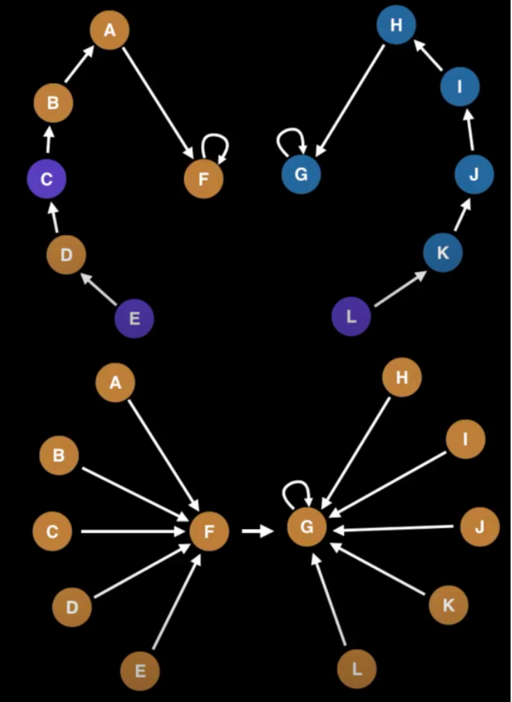

这是一位 google 工程师分享的8小时的[数据结构](https://www.youtube.com/watch?v=RBSGKlAvoiM)的视频,我的笔记

-----

# Union Find

* keep track of elements in different sets
* primary operations: `find` and `union`

**Usage**

* Kruskal's `minimum spanning tree` algorithm
* Grid percolation
* Network connectivity
* Least common ancestor in trees
* Image processing

**Complexity**
* construction: O(n)
* union/join/size/check connected/: $\alpha$(n) :接近常量时间
* count: O(1)

给定一个无向图，如果它任意两个顶点都联通并且是一棵树，那么我们就称之为生成树(`Spanning Tree`)。如果是带权值的无向图，那么权值之和最小的生成树，我们就称之为最小生成树(MST, `Minimum Spanning Tree`)。
-> 用最少的边连接所有的顶点

* sort edges by ascending edge weight
* walk through edges
    * 检查顶点，如果两个顶点都已经unified，就忽略
        * 其实就是这两个点分别被别的边连过了
    * 否则就添加edge，并且unify顶点

看到这里，首先想知道什么是unified，看实现，也就是在一个集合里(component)

* 观察C_J，因为C和J已经在一个组里了，这条边就不需要了
* 观察D_E，一旦连上后，紫色和绿色其实就是一个组了

* 观察D_H，一旦连上后，紫色和红色也成为了一个组
* 连接B_C，所有顶点就全部连上了，并且只有一条紫线

Find: 找元素在哪个component里，然后找到它的root
Union: 找两个元素分别在哪个component里，然后找到它们的root，如果不是同一个root，就让其中一个成为另一个的parent

* component的个数与root的个数一致
* root的个数只减不增（因为通常只合并而不拆分）

union find里
* 为每个元素分配一个索引，每个元素指向自己（即初始是n个root，n个component)
* 描述两两之间的关系，以任一元素为parent （谁来描述？）
* 有一个元素已经属于别的component里的，就将它也加到那个component里去
    * 如果这个元素也是别的component里的顶点，就把整个组指向另一个组的root

## Path Compression Union Find

由一层层找到root改为所有顶点直接指向顶点（星形结构），实现路径压缩

这段代码演示的是，查找p的root节点，在查找的过程中，顺便进行了路径压缩

合并的逻辑就是比较谁的元素多就把谁当作root，另一个component的root的parent设为元素多的组的root    
合并完成后组数就少了1

看代码，这一步里面并没有路径压缩，也就是小组里面的元素并没有**进一步**再星状地指向新的parent，仍然指向的是老的组的root。
