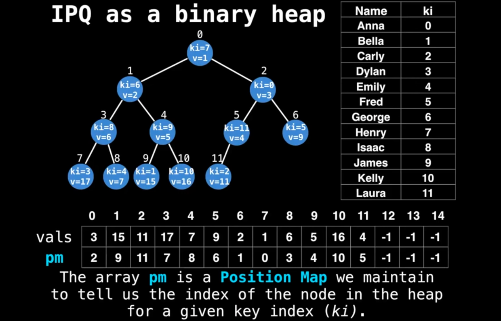
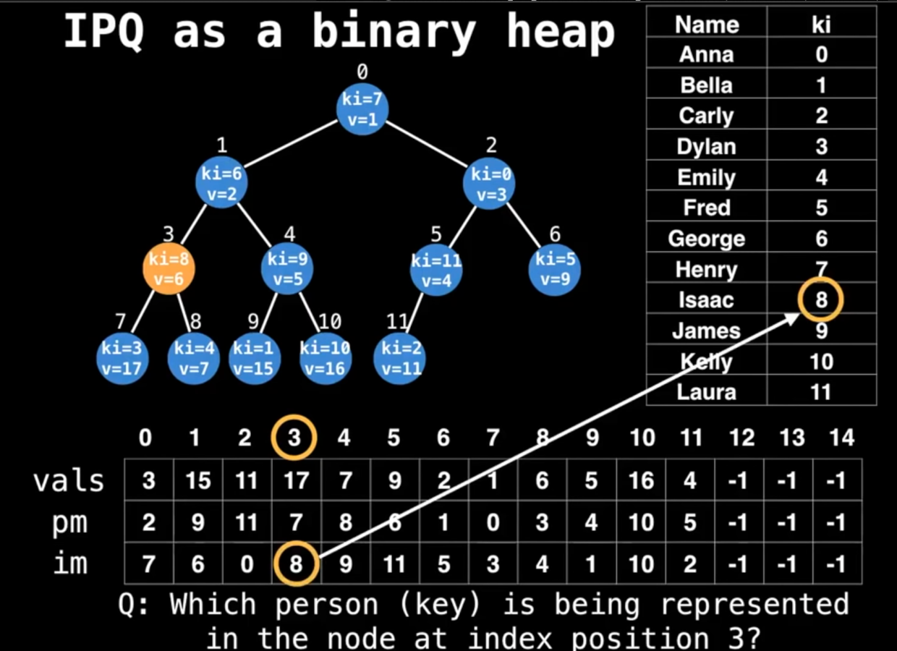
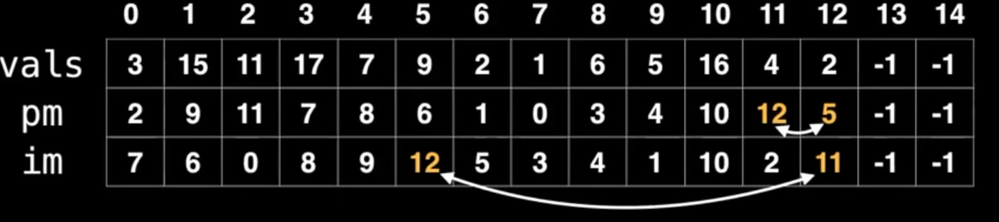

这是一位 google 工程师分享的8小时的[数据结构](https://www.youtube.com/watch?v=RBSGKlAvoiM)的视频,我的笔记

-----

# Indexed Priority Queue

* a traditional priority queue variant
* top node supports `quick update and deletions of key-value paris`


观察这个图，数据是Anna, Bella...等等，
* 首先，为这一堆数据进行任意排序，得到一堆索引(0,1,...)
* 然后组一个binary heap，这样每个元素又获得一个索引，就是在heap上的序号（`Position Map`）

通过两组索引迅速找到key（就是人名）在堆中的位置，比如：
* George，ki = 6, pm = 1
* kelly, ki = 10, pm = 10
* ...

现在能迅速找到数据源在堆上的位置了，那么如果反过来呢？比如堆上索引3是数据源的谁？
* pm = 3 -> ki = 8 -> Issac **BINGO!!!**

但神奇的事发生了，有人希望复用ki这个自然数序列（闲的蛋疼？），于是多做了一个数组，把ki定义为heap上的索引，与元素原来的ki进行映射（`Inverse Map`）:IM


可以看到，这张图上张个ki到im的映射，与pm到ki的映射其实是一样的，也就是说重定义了一下，并没有引入新的东西。(pm表里找到3，对应的第一行ki表里就是8）

这个时候，我们直接用ki的3就能找到im的8，继而找到数据源的*Issac*了。

## Insertion

上面的数组，我们往里面添加第12条数据试试: 
* {ki:12, pm: 12, im:12, value:2}
* 显然违反了binary heap的 invariant，向上冒泡，也就是跟{ki:12, pm:5, im:2, value:4}的节点互换
* 此时，数据源肯定不会变，但是节点变了，pm的值就要交换（5， 12 互换）
* pm变了，把pm当成ki的映射表im也要变（12， 11互换）


仔细观察图片，搞清楚第一行ki在两次互换时的身份就明白了
* pm的互换是直观的，就是节点的位置
* 知道pm互换的依据后（2，5），在第一行找2，5对应的im值互换，因为在这个映射里，相当于pm与原ki的映射，pm此时是（2，5）了。

同样逻辑继续冒泡就是了。

pseudo code:
```python
# Inserts a value into the min indexed binary 
# heap. The key index must not already be in 
# the heap and the value must not be null. 
function insert(ki, value):
    values[ki] = value
    # ‘sz’ is the current size of the heap
    pm[ki] = sz  # 对应上图，意思就第一行索引器是ki
    im[sz] = ki  # 对应上图，意思就是一行索引器是pm
    swim(sz)     # 这里传进去的pm，即heap上节点的索引
    sz = sz + 1  # 添加成功，size加1
```
理论上，添加元素到最后一个, sz和ki应该是相等的（因为都是尾巴上）

```python
# Swims up node i (zero based) until heap 
# invariant is satisfied.
function swim(i):
    # 比父节点小就冒泡，注意入参i是节点上的索引，即pm
    for (p = (i-1)/2; i > 0 and less(i, p)): 
        swap(i, p)  # 所以这里传的也是pm
        i=p
        p = (i-1)/2

function swap(i, j): 
    # 我们交换了节点，需要交换pm表里的值，和im表里的值
    # 交换pm的值需要数据源的索引，即ki，而ki能从im表里用pm算出来
    # 所以ki = im[pm] 这里i,j是pm，所以im[i]自然就是i对应ki
    # pm[ki]当然就是pm[im[i]]了：
    pm[im[j]], pm[im[i]] = j, i
    im[i], im[j] = im[j], im[i]

function less(i, j):
    return values[im[i]] < values[im[j]]
```

还是那句话，理解清楚那三行映射表里第一行的动态含义，就不会有问题。
* pm表要key index来索引
* im表要node index来索引
在操作时，只需要知道传入的是哪种索引，及时转化就行了。

有了索引，lookup的时间复杂度就是常量时间了：O(1)

## Polling and Removals

没有什么特殊的,仍然是找到节点,与最后一个交换,移除最后一个节点,然后再看最后一个在堆里是上升还是下降.
仍然是记得每一步交换,相应的几个索引值也需要随之交换.(polling 其实就是移除第1个节点,本质上还是 removal)


pseudo code
```python
# Deletes the node with the key index ki
# in the heap. The key index ki must exist 
# and be present in the heap.
function remove(ki):
    # 注意，这里送进来的是ki，而不是node index(pm)
    # 说明业务需求一般是操作数据源，而不是操作堆
    i = pm[ki]    # 转成节点索引
    sz = sz - 1   # 与最后一个元素交换，用size来做节点索引
    
    # 下面三个子函数送入的就是节点索引了
    swap(i, sz) 
    sink(i)
    swim(i)

    values[ki] = null  # 数据源对应的值置空，所以用ki
    pm[ki] = -1        # 数据源对应的节点置空，所以用ki
    im[sz] = -1        # 反查表用节点索引，此处size就是最后一个节点的索引
```

sink pseudo code
```python
# Sinks the node at index i by swapping 
# itself with the smallest of the left 
# or the right child node.
function sink(i):
    # 这是堆操作,传入的索引也是节点索引,没问题
    # sink是下沉，但不是跟BTS一样找左侧最大右则最小那种直接换
    # 而是一层层往下换
    # 即一次while只跟左右子级比大小，确实比子级还小的话，就替换，然后再跟下一层比较
    while true:
        # 利用二叉树特性算出子节点
        # 默认左边最小，然后再看右边是不是更小
        left =2*i+1
        right = 2*i + 2
        smallest = left
    # 右边不越界，且小于左边，就设右边
    if right < sz and less(right, left):
        smallest = right
    # 左侧都越界了，或已经比最小值大了，说明不需要下沉了
    if left >= sz or less(i, smallest):
        break
    # 只要没有break，说明能交换，然后把交换后的作为下一个循环的起点
    swap(smallest, i)
    i = smallest
```

## Updates

更新节点要简单的多:
* 用ki找到value，把值更新
* 然后根据新value实际情况上浮或下沉
```python
# Updates the value of a key in the binary 
# heap. The key index must exist and the
# value must not be null.
function update(ki, value):
    i = pm[ki]
    values[ki] = value
    sink(i)
    swim(i)
```

## Decrease and Increase key

不好说，先看代码吧：
```python
# For both these functions assume ki and value 
# are valid inputs and we are dealing with a
# min indexed binary heap.
function decreaseKey(ki, value):
    if less(value, values[ki]): 
        values[ki] = value 
        swim(pm[ki])
        
function increaseKey(ki, value): 
    if less(values[ki], value):
        values[ki] = value 
        sink(pm[ki])
```
代码里是跟一个固定值比较，只要ki对应的值比它大(desreaseKey)或小(increaseKey），就用这个固定值来替换它，并且在value改变后根据实际情况上浮或下沉。
