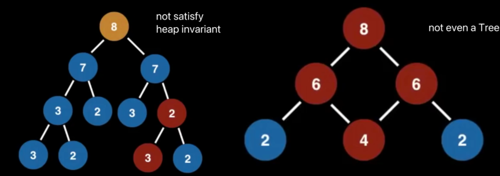

这是一位 google 工程师分享的8小时的[数据结构](https://www.youtube.com/watch?v=RBSGKlAvoiM)的视频,我的笔记

优先队列和堆的插曲，在优先队列里引入了heap只是个插曲而不算正式介绍，但其实讲得差不多了。

-----

# Priority Queues (PQs) with an interlude on heaps

* A priority queue is an `Abstract Data Type` (ADT)
* except each element has a certain priority
    * determine the order (removed from the PQ)
* need `comparable data`

每次取出最小（或最大）的->pool，添加到PQ，如何得知极值呢？-> heap

## Heap

* a tree based data structure
* statisfies the `heap invariant`(heap property):
    * if A is a parent node of B then A is `ordered with respect ot B` for all nodes A, B in the heap
    * 说人话，A是B的父节点，如果A比B大，那么比B的所有子节点都大，vice versa

Priority Queue有时候也被叫做Heap，因为它只是一个ADT，当然它也可以用别的数据结构实现。

以下四个，都是heap

这些就不是

**Usage**

* certain implementations of `Dijkstra's Shortest Path algorithm`
* anytime you need the *dynamically* fetch the **next** `best` or `worst` element
* `Huffman coding` -> lossless data compression
* BFS，PQs `continuously grab the next` most promising node
* `Minimum Spaning Tree` (MST) algorithm

可见是很多算法的基础

**Complexity**

- Binary Heap construction: O(n)
- Polling: O(log n)
- Peeking: O(1)
- Adding: O(log n)
- 原生删除：O(n)
    - with hash table: O(log n)
- 原生contains: O(n)
    - with hash table: O(1)

**Turning Min PQ into Max PQ**

大多数编程语言标准库只提供了min PQ。

1. 在构建min pq的时候，把比较标准从`x>=y`变成`x<=y`（operator重载）
2. 在构建min pq的时候，把x变成`-x`，取出的时候再取反一次 

原则都是取巧，而且，第二种方法，存在pq里的，并不是你要使用（和本想存储）的对象，所以取出的时候需要处理。

## Priority Queue with Binary Heap

实现了`heap invariant`的binary tree.

除了Binary Heap，还有很多
* Fibonacci Heap
* Binomial Heap
* Paring Heap
* ...
都能实现一个PQ

**Adding Elements to Binary Heap**

* 从尾部(last leaf)添加
* 如果违反了heap invairant(即比parent大)，则交换
* 向上冒泡

**Removing Elements From a  Binary Heap**

1. Poll()
* 因为root总是优先级最高的元素，`poll`移掉的就是root
* root当然不能直接移，所以先跟最后一个元素swap
* swap后原root就没有children了，直接移除
* 最低优先级的元素到了top，所以要向下冒泡
    * 先左后右，先低再高
    * 即如果两个子级优先级一样，那么直接与左边交换
    * 否则哪个优先级最低就与哪个子级交换
    * 子级优先级都比它低，就完成了pool()
2. Remove(m) 即删除一个特定元素
* linear scan，找到元素位置
* 与last node交换，然后移除
* last node用先上向下的原则冒泡
    * 即先看能不能往上冒泡，不能的话再看往下冒泡

**Complexity**
Pool(): O(log n)
Remove(): O(n) (最坏情况下，可能要删的元素在最后一个)

用hashtable优化remove

* hashtable为lookup和update提供constant time
* 因为为Index和value建立了映射，这样不需要通过遍历，直接通过映射就能找到元素
    * 如果两个node拥有同样的value呢？
    * 直接把每个value对应的n个索引全部存起来(set)
    * 但我应该remove哪一个呢？
        * 随便，只要最终satisfy the heap variant
