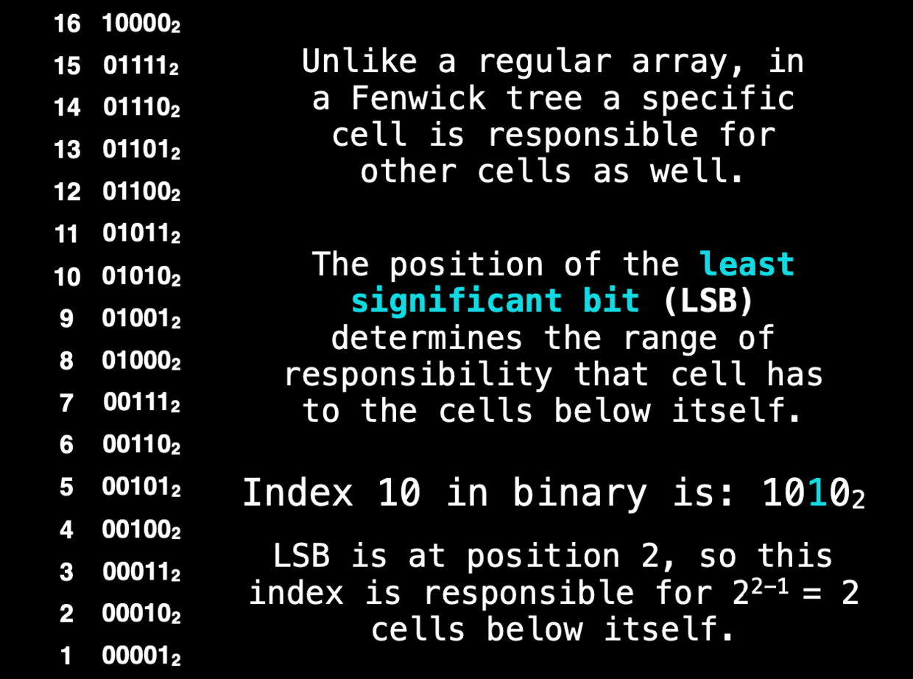
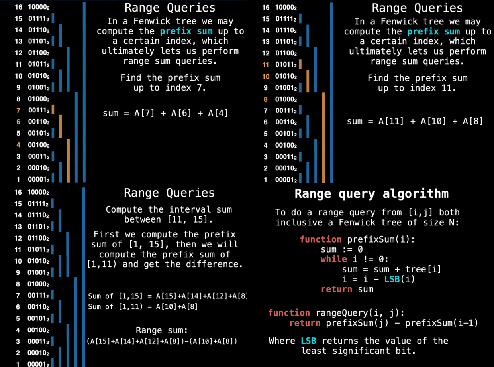

这是一位 google 工程师分享的8小时的[数据结构](https://www.youtube.com/watch?v=RBSGKlAvoiM)的视频,我的笔记

-----

# Fenwick Tree (Binary Indexed Tree)

树状数组

**Motivation**


* 计算数组里任意连续片段的和，最直观的方案当然是累加：线性时间O(n)
* 但是如果你有一个记录了每个节点到当前位置时的累加和的数组（`prefix sum`），立刻变成了常量时间
* 问题是更新数据变成了线性时间（后续所有的求和都要改一遍）
    * great for `static arrays`

所以引入了:
`Fenwick Tree` is an efficient data structure for performing range/point queries/updates.(即在上面的动机上，还考虑了update的效率)

前面的例子在update时效率不高，所以Fenwick Tree用了一种聪明的方式，不是累加所有的值，而是分段累加，具体实现看下图：


* 把索引值用二进制表示
* `LSB`的解释看图，实际应用上，就是看从低位到高位第一个1的右边有几个0，假设为`n`个
* 那么该cell上存的值就是前$2^n$个cell的值的和

图中例子是索引10，不直观，我们换成12， 二进制是1100， 最右边有2个零，那么它保存它$2^2=4$个位置的和。
也就是说，如果你要求和，如果用了cell 12位置的值的话，至少可以省掉3次累加。

当然，它还有更牛逼的特性，结合range query一起来看吧：


蓝线表示的是当然位置上累加了前几个位置的值，已经很有规律了

假如计算前11个值的和，过程是：
1. 11的索引是1011，右边没有0，所以当前的和为A[11]
2. 根据$2^0$来移位，来到10。
    * 右边一个0，所以它管$2^1$个presum，目前A[11] + A[10]
    * 下一个索引自然要减2了，来到8
3. 8是1000，3个零，所以它存了$2^3=8$个值的和，那就是全部了

所以：sum = A[11] + A[10] + A[8]

* 心算sum(0,7)巩固一下
* 用sum(11,15)演示子区间，其实就是多减1次，至于是减到10还是减到11，看描述，比如这里11是要参与计算的，那就是把前10个减掉就行了。

上面演示的都是`worst`的情况，即首位为1，除了这种情况，别的位都至少存了前$2^n$个元素的值（比如16，直接得到16个元素的和）

> 这里都没讲你是怎么做这个tree的，而是怎么使用它。先弄清楚使用场景再谈构建。

## Point Update

复习一下`LSB`，虽然可以直接数最右边的零的个数，但数学其实是：
* 13 = 1101 ($2^3 + 2^2 + 2^0 \Rightarrow 10^3 + 10^2 + 10^0 $)
* 减去最右边的1和0 => 1100 （$2^3+2^2=12$) 所以下一个数是12
* 减去最右边的1和0 => 1000 就是8了
* 再减就是0了
而按$2^n$来计算个数的话就是这样的：
* 13 = 1101, 没有0，就是移1位，变成12
* 12 = 1100， 2个0， 就是移4位，变成8
* 8 = 1000， 3个0， 移8位，变成0

现在来讲update，前面知道，update会级联影响到所以把该cell考虑进去的节点，因此，它需要反着往上找（极端情况当然是找到最后一个元素，通常这个元素就是整个数组的值，所以任何元素的更改，肯定都会影响到它）

前面找下一个节点用的是减法，现在就要用加法了，比如我更新了cell 9, 用以上两种任意一种方法来计算：
* $9 = 2^3 + 1 \Rightarrow 10^3 + 1 = 1001, +1 = 1010 = 10$
* 1010 + 10 = 1100 = 12
* 1100 + 100 = 10000 = 16 到顶了，
所以需要把9, 10, 12, 16分别应用这个point的更新，也就是说只有这几个cell把9计算进去了。


当然，可以看一下左边的示意图，更直观

```python
function add(i, x): 
    while i < N:
        tree[i] = tree[i] + x 
        i = i + LSB(i)
```
代码非常简单，就是不断通过LSB找下一个位置去更新就行了。

## Construction

现在来讲构建
```python
function construct(values): N := length(values)
    # Clone the values array since we’re # doing in place operations
    tree = deepCopy(values)
    for i = 1,2,3, ... N:
        j := i + LSB(i)
        if j < N:
            tree[j] = tree[j] + tree[i]
    return tree
```

几乎就一句话，就是把元素按原数据摆好（即不加别的节点）后，每次找到当前元素影响的上一级（不再向上冒泡）
* 比如1，把1算进去的有2，虽然上面还有4， 8， 16，但只把1更新到2
* 到2的上一级是4 (2 + lsb(2) = 4), 把节点2的现值（已经加了节点1）加到4去
* 所以核心算法始终只有两个变量，i，j代表最近的包含关系

**一些算法换成位运算**
* lsb(i): `i & -i`
* i -= lsb(i) => `i &= ~lsb(i)`
