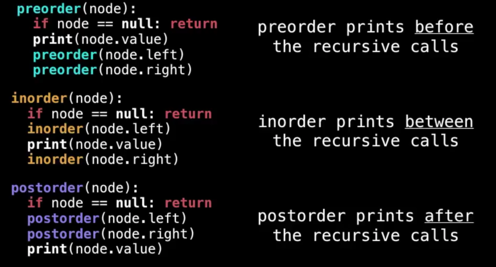
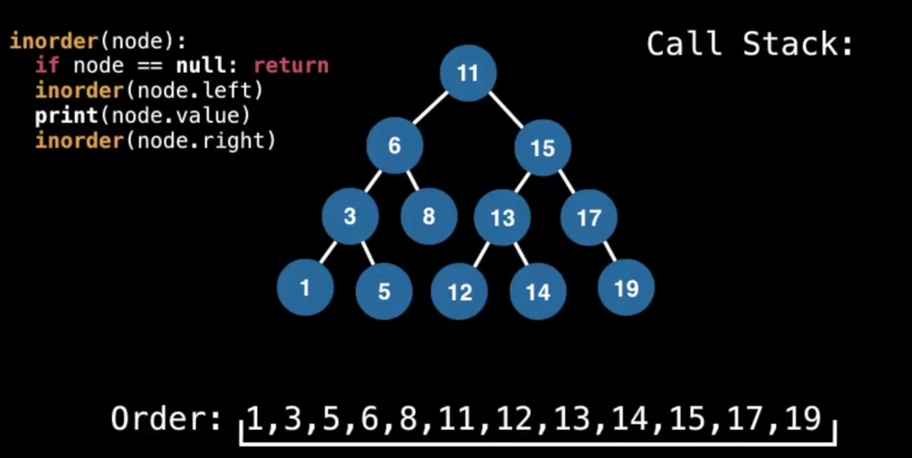
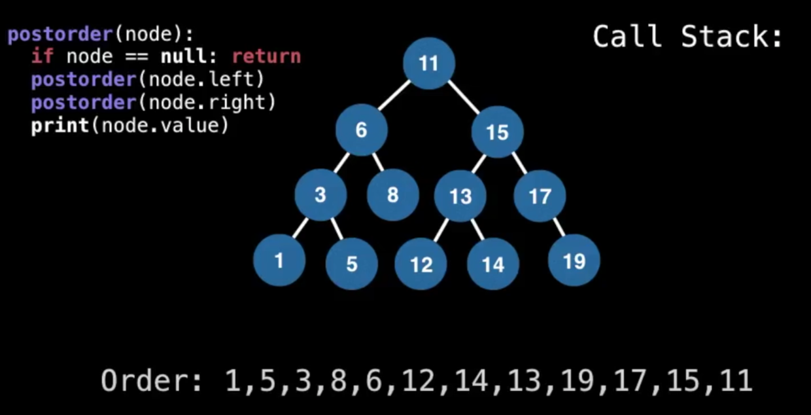
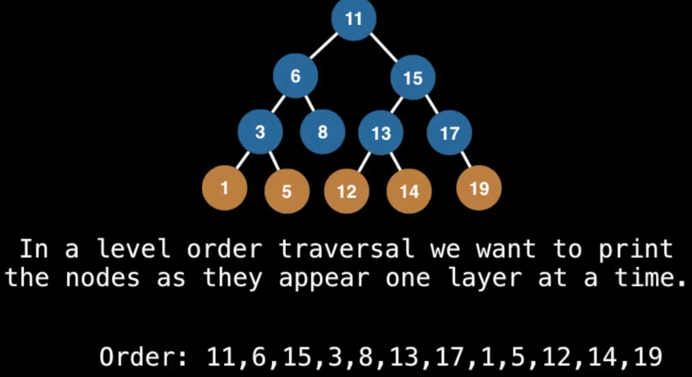
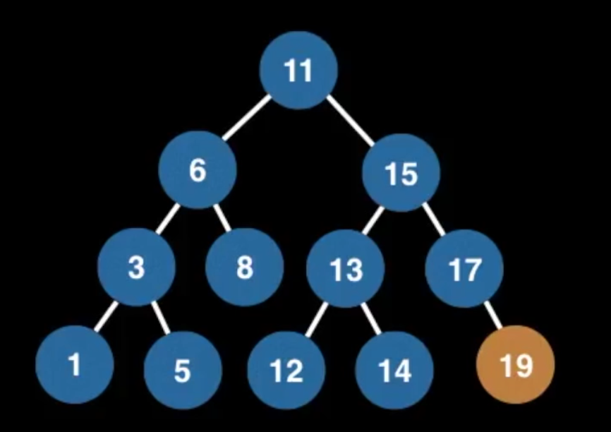

这是一位 google 工程师分享的8小时的[数据结构](https://www.youtube.com/watch?v=RBSGKlAvoiM)的视频,我的笔记

-----

Tree: 满足以下定义的`undirected graph`(无向图)

* An acyclic(非循环的) connected graph
* N nodes and N-1 edges
* 有且只有一条路径连接*任意*两个顶点

> 任意一个节点都可以被理解为root

**Binary Tree**
拥有最多两个节点的Tree

**Binary Search Tree**
服从以下特性的`binary tree`
* 左子树的元素小于右子树

拥有重复元素是允许的，但多数情况下我们只研究不重复的元素

这是一个有效的BST吗？


是的（对于单链下来的，几乎会直接就满足右边比左边大）

**Usage**
* BSTs
    * implementation of some map and set ADTs
    * red black trees
    * AVL trees
    * splay trees
    * ...
* binary heaps
* syntax trees (by compiler and calculators)
* Treap - a probabilistic DS (uses a randomized BST)

**Complexity**
增删查平均为O(log n)，但最差情况下都为O(n)，即线性时间

## Adding elements to a BST

* 第一个为root
* 每一个新数，比顶点大，放右边，比顶点小，放左边，顺序下行
    * 不是从左到右摆满再做subtree
    * 比如3,6,9, 会得一棵全部数字摆在右边的数，而不是顶3左6右9的三角形
    * 这也是为什么极端情况下，时间复杂度是`O(n)`，因为就是一条线到底
    * 这也是`balanced binary search trees`被引入的原因

## Removing elements from a BST
* find
    * 从root开始，小的走左右，大的走右边
* replace (to maintain the BST invariant)

找继任者的时候，如果删除元素没有子节点，只有左或右子节点，都很好办，但如果它有两个子节点，那么应该用哪个来接续呢？

原则仍然是要服从左边的比右边的小，所以你其实有两种选择：
* 把左边最大的数选出来 或
* 把右边最小的数选出来
因为它们的“来源”，肯定是能保证bst invariant的
    * 这个数是要替换这个节点的，所以要比这个节点左边的数都大，及比右边所有的数都小，显然就是左边的最大数，或右边的最小数了。
    * 只是把找到的元素复制过去后，多了的那个怎么办呢？
* 递归
新找到的元素当然要从原来的位置删除，这时又根据它是否叶节点，单子节点还是全节点，来反复进行前面的操作，最终总是可以退出的


## Tree Traversals

(Preorder, Inorder, Postorder & Level order)



* preorder，在遍历左侧元素的时候，每次已经先取到元素了（最顶层）
* inorder里，遍历元素的时候，直到所有的left走完了，才取到第一个元素（最底层的）
* postorder里，也是遍历到最底层，但是下一步就是取兄弟节点了


inorder一个重要特征：它是从小到大排好序的！

preorder 和 postorder没什么特征，举一个post的例子观察下

而levelorder则是一`层`一层地取的：


这就是广度优先了（`Breadth First Searth`)BFS

实现BFS
1. 每处理一个parent的时候，把parent加到结果数组里
2. parent的子节点加到队列里
3. 每次从队列里取出一个值加到结果数组里（步骤1）
4. 该值的child加到队列里（步骤2）

其实就是步骤1，2的重复，比如：


```
[11], [6, 15] 处理第1个数11， 队列里多了两个元素6， 15
[11, 6], [15, 3, 8] 从队列里取出6， 加入结果，它的子元素(3, 8)加入队列
[11, 6, 15], [3, 8, 13, 17]
[11, 6, 15, 3], [8, 13, 17, 1, 5]
[11, 6, 15, 3, 8], [13, 17, 1, 5] 这一步，8没有子节点了，队列变短了
[11, 6, 15, 3, 8, 13], [17, 1, 5, 12, 14]
[11, 6, 15, 3, 8, 13, 17], [1, 5, 12, 14, 19] 17只有一个child
[11, 6, 15, 3, 8, 13, 17, 1, 5, 12, 14, 19] 剩下的都没child了，全部拼进去
```
