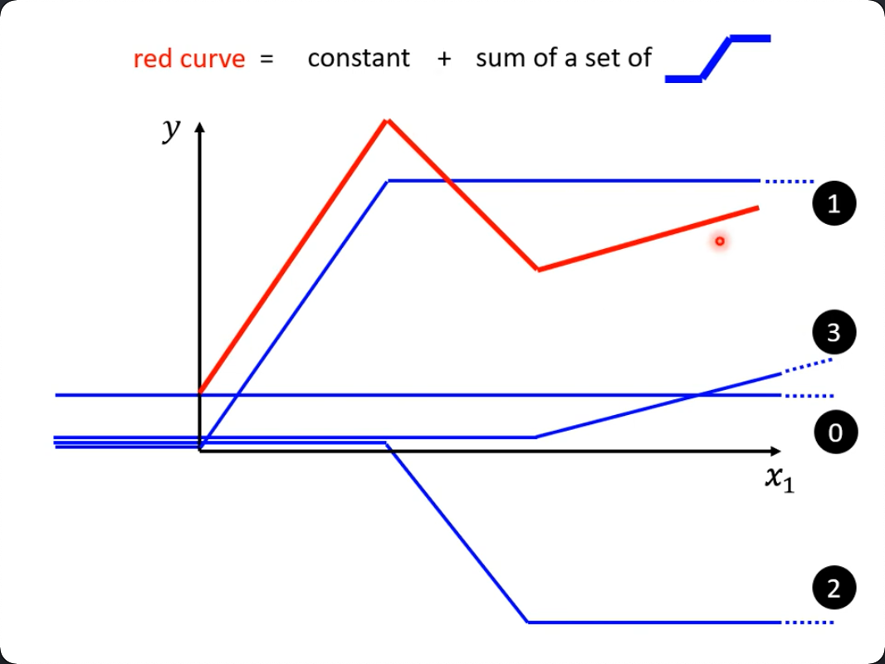
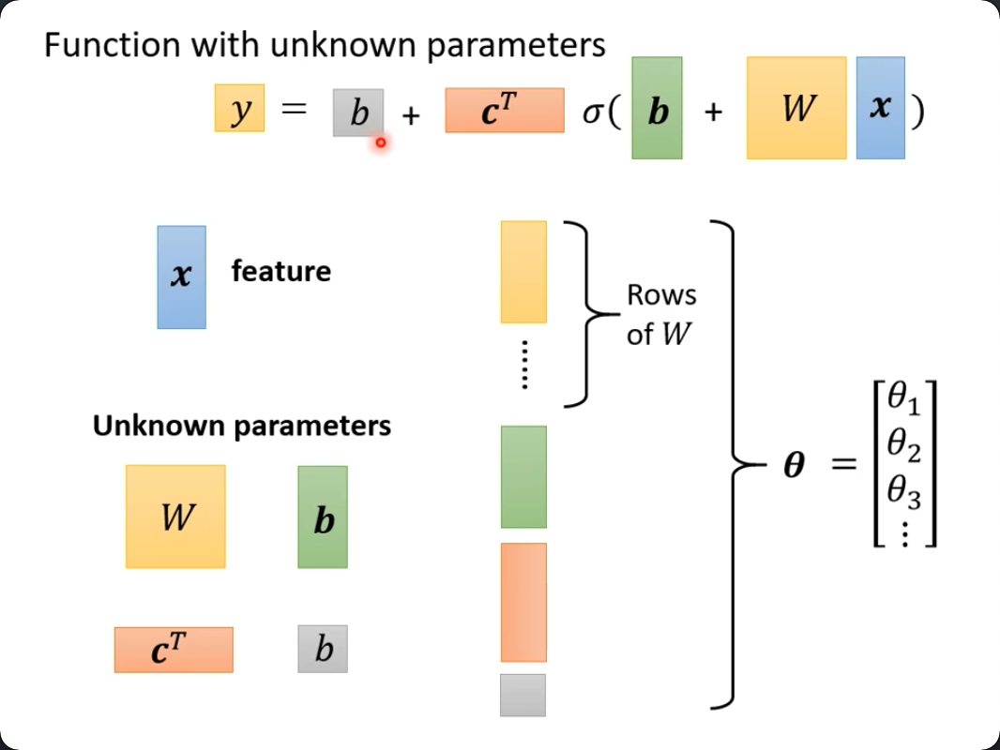

> 纯听课时一些思路和笔记，没有教程作用。
> 这个课程后面就比较水了，大量的全是介绍性的东西，也罗列了大量的既往课程和论文，如果你在工作过研究中碰到了它提过的场景或问题，倒是可以把它作索引用。

# Linear Model

## Piecewise Linear
线性模型永远只有一条直线，那么对于折线（曲线），能怎样更好地建模呢？这里考虑一种方法，
1. 用一个`常数`加一个`整流函数`
    * 即左右两个阈值外y值不随x值变化，阈值内才是线性变化（天生就拥有两个折角）。
2. 每一个转折点加一个新的整流函数

如下：

如果是曲线，也可以近似地理解为数个折线构成的（取决于近似的精度），而蓝色的整流函数不好表示，事实上有sigmoid函数与它非常接近（它是曲线），所以蓝线又可以叫：`Hard Sigmoid`

所以，最终成了一个常数(`bias`)和数个`sigmoid`函数来逼近真实的曲线。同时，每一个转折点`i`上s函数的具体形状（比如有多斜多高），就由一个新的线性变换来控制：$b_i + w_ix_n$，把`i`上**累积的线性变换**累加，就得到与$x_n$最可能逼近的曲线。

下图演示了3个转折点的情况：

至此，一个简单的对b,w依赖的函数变成了对（$w_i, b_i, c_i$)和, x, b的依赖，即多了很多变量。

* $y = b + wx_1$
* $y = b + \sum_i c_i sigmoid(b_i + w_i x_{\color{red} 1})$ 

注意这个$x_1$，即只转了一个x就要堆一个`sum`，而目前也只是演示了只有一个特征的情况。

如果更复杂一点的模型，每次不是看一个x，而看n个x，（比如利用前7天的观看数据来预测第8天的，那么建模的时候就是每一个数都要与前7天的数据建立w和b的关系）：

> 其实就是由一个feature变成了n个feature了，一般的教材会用不同的feature来讲解（比如影响房价的除了时间，还有面积，地段等等），而这里只是增加了天数，可能会让人没有立刻弄清楚两者其实是同一个东西。其实就是x1, x2, x3...不管它们对应的是同一**类**特征，而是完全不同的多个**角度**的特征。

现在就有一堆$wx$了

* $y = b + \sum_j w_j x_j$
* 现在就变成了(注意，其实就是把加号右边完整代入）：
* $y = b + \sum_i c_i sigmoid(b_i + \color{red}{\sum_j w_{ij} x_j})$

展开计算，再根据特征，又可以看回矩阵了（而不是从矩阵出发来思考）：

矩阵运算结果为(r)，再sigmoid后，设结果为a:

* $a_i = c_i \sigma(r_i)$
* $y = b + \sum_i a_i$ c 和 a要乘加，仍然可以矩阵化（其实是向量化）：
* $y = b + c^T a$， 把上面的展开回去：
* $y = b + c^T \sigma(\bold b + W x)$ 
    * 前后两个b是不同的，一个是数值，一个是向量

这里，我们把目前所有的“未知数”全部拉平拼成了一个向量 $\theta$：

这里，如果把$c^T$写成`W'`你会发现，我们已经推导出了一个2层的神经网络：一个隐层，一个输出层：
* b+wx 是第一层 得到`a`
* 对`a`进行一次sigmoid（别的教材里会说是激活）得到`a'`
* 把`a'`当作输入，再进行一次 b+wx (这就是隐层了)
* 得到的输出就是网络的输出`o`

> 这里在用另一个角度来尝试解释神经网络，激活函数等，但要注意，sigmoid的引入原本是去”对着折线描“的，也就是说是人为选择的，而这里仍然变成了机器去”学习“，即没有告诉它哪些地方是转折点。也就是说有点陷入了用机器学习解释机器学习的情况。

> 但是如果是纯曲线，那么其实是可以无数个sigmoid来组合的，就不存在要去拟合某些“特定的点”，那样只要找到最合适“数量”的sigmoig就行了（因为任何一个点都可以算是折点）

## Loss

loss 没什么变化，仍旧是一堆$\theta$代入后求的值与y的差，求和。并期望找到使loss最小化的$\theta$：

$\bold \theta = arg\ \underset{\theta}{min}\ L$
