# Optimization

真实世界训练样本会很大，
* 我们往往不会把整个所有数据直接算一次loss，来迭代梯度，
* 而是分成很多小份(mini-batch)每一小份计算一次loss（然后迭代梯度）
* 下一个小batch认前一次迭代的结果
* 也就是说，其实这是一个不严谨的迭代，用别人数据的结果来当成本轮数据的前提
    * 最准确的当然是所有数据计算梯度和迭代。
    * 一定要找补的话，可以这么认为：
        * 即使一个小batch，也是可以训练到合理的参数的
        * 所以前一个batch训练出来的数据，是一定程度上合理的
        * 现在换了新的数据，但保持上一轮的参数，反而可以防止`过拟合`

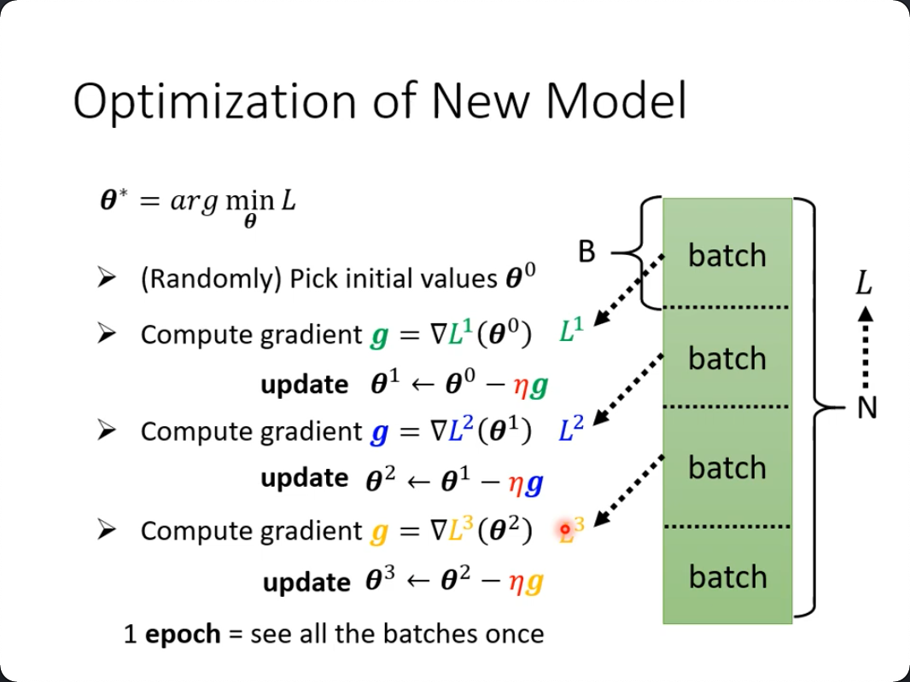

minibatch还有一个极端就是batchsize=1，即每次看完一条数据就与真值做loss，这当然是可以的，而且它非常快。但是：
1. 小batch虽然快，但是它非常noisy（及每一笔数据都有可能是个例，没有其它数据来抵消它的影响）
2. 因为有gpu平行运算的原因，只要不是batch非常大（比如10000以上），其实mini-batch并不慢
3. 如果是小样本，mini-batch反而更快，因为它一来可以平行运算，在计算gradient的时候不比小batch慢，但是它比小batch要小几个数量级的update.

仍然有个但是：实验证明小的batch size会有更高的准确率。
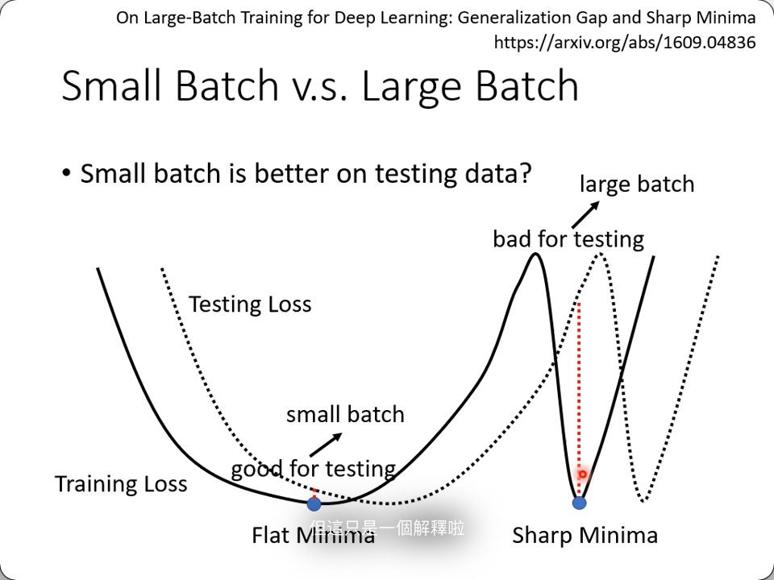

两个local minimal，右边那个认为是不好的，因为它只要有一点偏差，与真值就会有巨大的差异。但是没懂为什么大的batch会更容易落在右边。

这是什么问题？其实是optimization的问题，后面会用一些方法来解决。

## Sigmoid -> RelU

前面我们用了soft的折线来模拟折线，其实还可以叠加两个真的折线(`ReLU`)，这才是我一直说的`整流函数`的名字的由来。

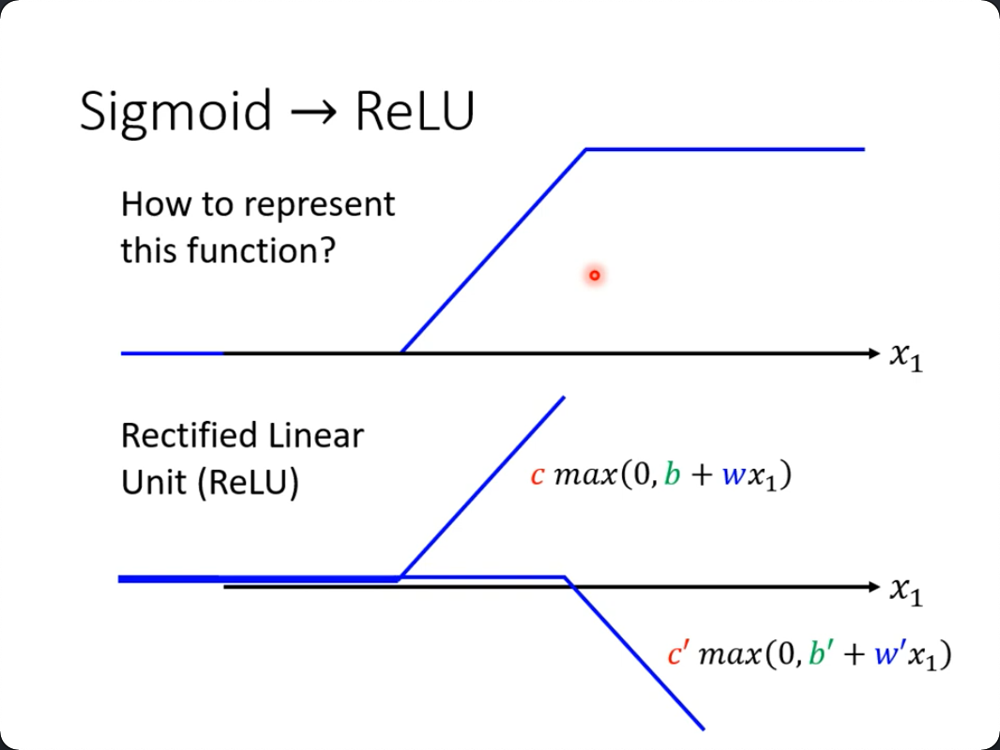

仔细看图，c和c'在第二个转折的右边，一个是向无穷大变，一个是向无穷小变，只要找到合理的斜率，就能抵消掉两个趋势，变成一条直线。

如果要用ReLU，那么简单替换一下： 

* $y = b + \sum_i {\color{ccdd00}{c_i}} sigmoid(\color{green}{b_i} + \sum_j \color{blue}{w_{ij}} x_j)$
* $y = b + \sum_{\color{red}2i} {\color{ccdd00}{c_i}} \color{red}{max}(\color{red}0,\ \color{green}{b_i} + \sum_j \color{blue}{w_{ij}} x_j)$

红色的即为改动的部分，也呼应了2个relu才构成一个sigmoid的铺垫。

把每一个a当成之前的x，我们可以继续套上新的w,b,c等，生成新的a->a'

而如果再叠一层，在课程里的资料里，在训练集上loss仍然能下降（到0.1），但是在测试集里，loss反而上升了（0.44)，这意味着开始过拟合了。

这就是反向介绍神经元和神经网络。先介绍数学上的动机，组成网络后再告诉你这是什么，而不是一上来就给你扯什么是神经元什么是神经网络，再来解释每一个神经元干了什么。

而传统的神经网络课程里，sigmoid是在逻辑回归里才引入的，是为了把输出限定在1和0之间。显然这里的目的不是这样的，是为了用足够多的sigmoid或relu来逼近真实的曲线（折线）

## Framework of ML

### 通用步骤：
1. 设定一个函数来描述问题$y = f_\theta(x)$, 其中$\theta$就是所有未知数（参数）
2. 设定一个损失函数$L(\theta)$
3. 求让损失函数尽可能小的$\theta^* = arg\ \underset{\theta}{\rm min}L(\theta)$

### 拟合不了的原因：
1. 过大的loss通常“暗示”了模型不合适（**model bias**），比如上面的用前1天数据预测后一天，可以尝试改成前7天，前30天等。
    * 大海里捞针，针其实不在海里
2. 优化问题，梯度下降不到目标值
    * 针在大海里，我却没有办法把它找出来

### 如何判断是loss optimization没做好？
用不同模型来比较（更简单的，更浅的）
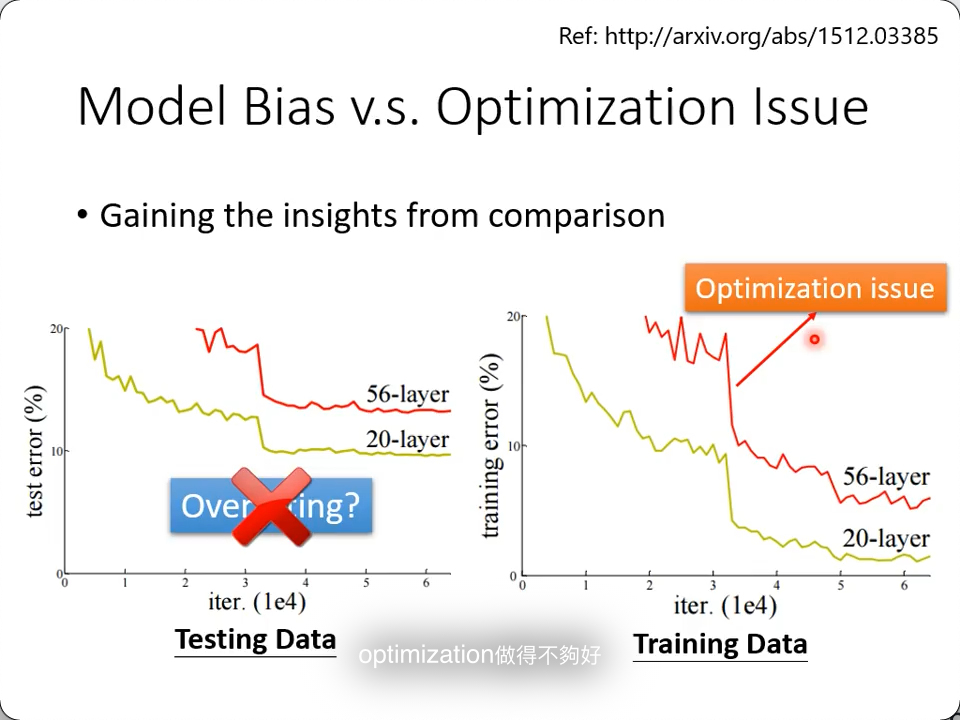

上图中，为什么56层的表现还不如20层呢？是`overfitting`吗？**不一定**。

我们看一下在训练集里的表现，56层居然也不如20层，这合理吗？ **不合理**

> 但凡20层能做到的，多出的36层可以直接全部identity（即复制前一层的输出），也不可能比20层更差（神经网络总可以学到的）

这时，就是你的loss optimization有问题了。

### 如何解决overfitting

1. 增加数据量
    * 增加数据量的绝对数量
    * data augmentation数据增强（比如反复随机从训练集里取，或者对图像进行旋转缩放位移和裁剪等）
3. 缩减模型弹性
    * （低次啊，更少的参数「特征」啊）
    * 更少的神经元，层数啊
    * 考虑共用参数
    * early stopping
    * regularization 
        * 让损失函数与每个特征系数直接挂勾，就变成了惩罚项
        * 因为它的值越大，会让损失函数越大，这样可以“惩罚”过大的权重
    * dropout
        * 随机丢弃一些计算结果

## Missmatch

课上一个测试，预测2/26的观看人数（周五，历史数据都是观看量低），但因为公开了这个测试，引起很多人疯狂点击，结果造成了这一天的预测结果非常差。

这个不叫overfitting，而是`mismatch`，表示的是**训练集和测试集的分布是不一样的**

mismatch的问题，再怎么增加数据也是不可能解决的。

## optimization problems

到目前为止，有两个问题没有得到解决：
1. loss optimization有问题怎么解决
    * 其实就是判断是不是saddle point（鞍点）
2. mismatch怎么解决

### saddle point
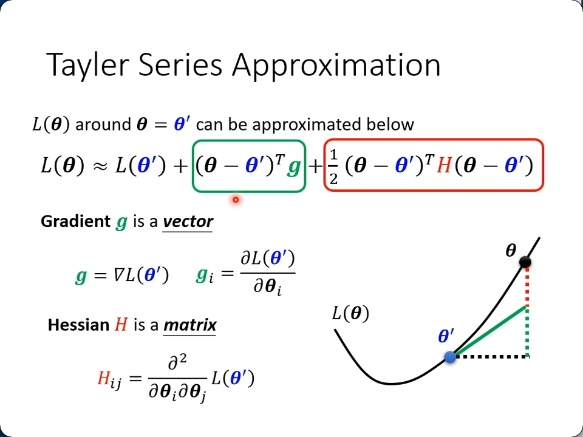

hessian矩阵是二次微分，当一次微分为0的时候，二次微分并不一定为0。这是题眼。 

对于红杠内的部分，设$\theta - \theta^T = v$，有：
* for all v: $v^T H v > 0 \rightarrow \theta'$附近的$\theta$都要更大
    * -> 确实是在`local minima`
* for all v: $v^T H v < 0 \rightarrow \theta'$附近的$\theta$都要更小
    * -> 确实是在`local maxima`
* 而时大时小，说明是在`saddle point`

事实上我们不可能去检查`所有的v`，这里用Hessian matrix来判断：
* $\rm H$ is `positive definite` $\rightarrow$ all eigen values are positive $\rightarrow$ local minimal
* $\rm H$ is `negative definite` $\rightarrow$ all eigen values are negative $\rightarrow$ local maximal

用一个很垃圾的网络举例，输入是1，输出是1，有w1, w2两层网络参数，因为函数简单，两次微分得到的hessian矩阵还是比较简单直观的：

由于特征值有正有负，我们判断在些(0, 0)这个`critical point`，它是一个`saddle point`.

如果你判断出当前的参数确实卡在了鞍点，它同时也指明了`update direction`!

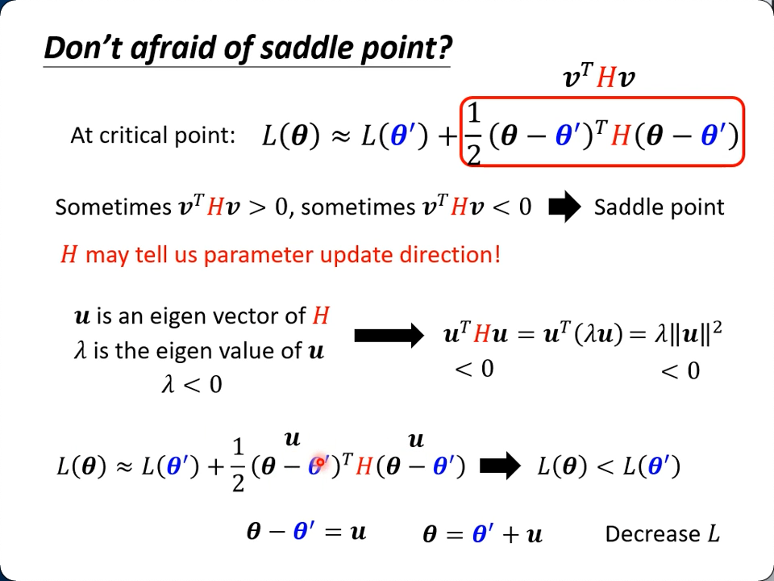

图中，
1. 先构建出了一个小于0的结果，以便找到可以让$L(\theta)$收敛的目标
2. 这个结果依赖于找到这样一个u
    * 这个u是$\theta, \theta'$相减的结果
    * 它还是$H$的`eigen vector`
    * 它的`eigen value`$\rightarrow \lambda$ 还要小于0

实际上，`eigen value`是可以直接求出来的（上例已经求出来了），由它可以推出`eigen vector`，比如[1, 1]$^T$（自行补相关课程），往往会一对多，应该都是合理的，我们顺着共中一个u去更新$\theta$，就可以继续收敛loss。

> 实际不会真的去计算hessian matrix?

### Momentum
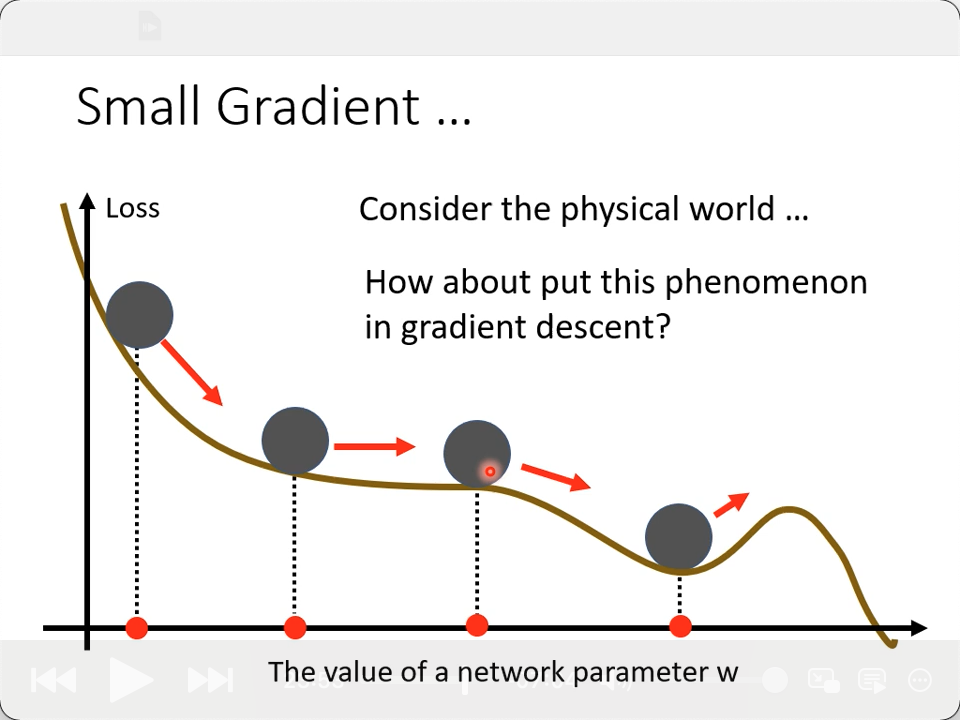

不管是较为平坦的面，还是saddle point，如果小球以图示的方式滚下去，真实的物理世界是不可能停留在那个gradient为0或接近于0的位置的，因为它有“动量”，即惯性，甚至还可能滚过local minima，这恰好是我们需要的特性。

不但考虑当前梯度，还考虑之前累积的值（动量），这个之前，是之前所有的动量，而不是前一步的：
$$
\begin{aligned}
m^0 &= 0 \\
m^1 &= -\eta g^0 \\
m^2 &= -\lambda \eta g^0 - \eta g^1 \\
&\vdots
\end{aligned}
$$

### adaptive learning rate

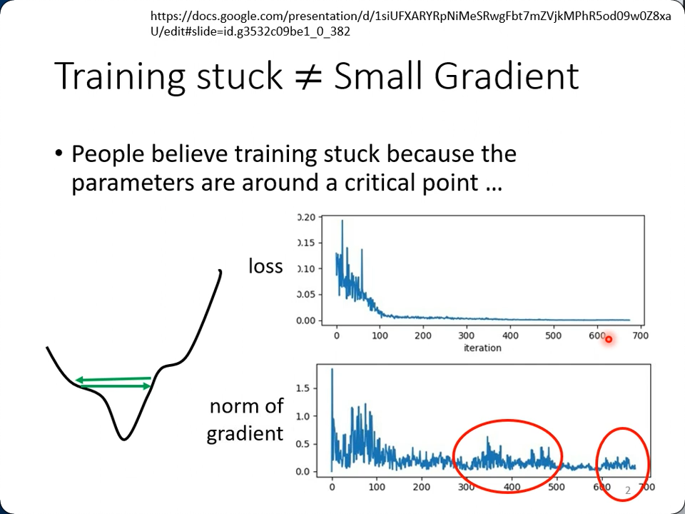

不是什么时候loss卡住了就说明到了极点(最小值，鞍点，平坦的点)

看下面这个error surface，两个参数，一个变动非常平缓，一个非常剧烈，如果应用相同的`learning rate`，要么反复横跳（过大），要么就再也挪不动步（太小）：

### Adagrad (Root Mean Square)

于是有了下面的优化方法，思路与`l2正则化`差不多，利用不同参数本身gradient的大小来“惩罚”它起到的作用。

1. 这里用的是相除，因为我的梯度越小，步伐就可以跨得更大了。
2. 并且采用的是梯度的平方和(`Root Mean Square`)

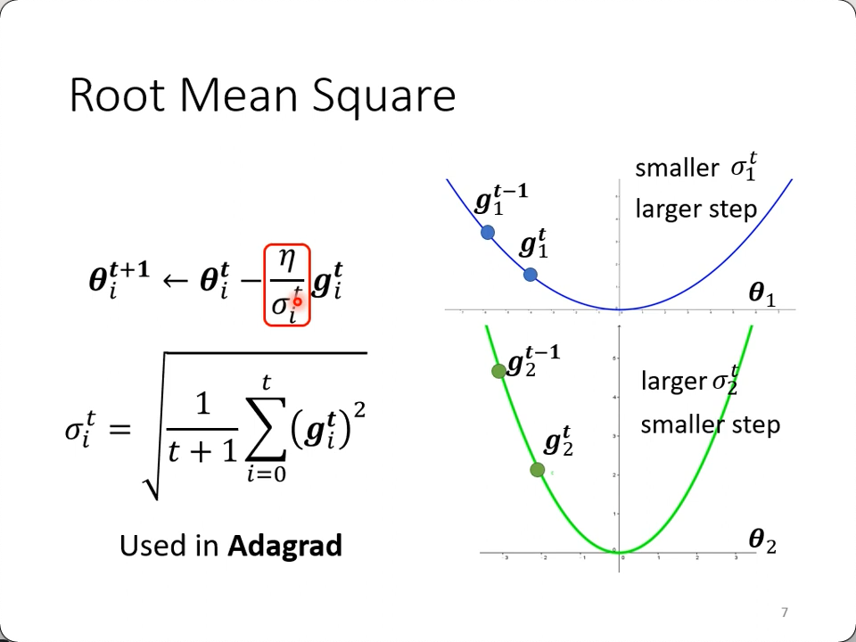

图中可以看出平缓的$\theta_1$就可以应用大的学习率，反之亦然。这个方法就是`Adagrad`的由来。不同的参数用不同的步伐来迭代，这是一种思路。

这就解决问题了吗？看下面这个新月形的error surface，不卖关子了，这个以前接触的更多，即梯度随时间的变化而不同，

### RMSProp

这个方法是找不到论文的。核心思想是在`Adagrad`做平方和的时候，给了一个$\alpha$作为当前这个梯度的权重(0,1)，而把前面产生的$\sigma$直接应用$(1-\alpha)$：

* $\theta_i^{t+1} \leftarrow \theta_i^t - \frac{\eta}{\color{red}{\sigma_i^t}} g_i^t$
* $\sigma_i^t = \sqrt{\alpha(\theta_i^{t-1})^2 + (1-\alpha)(g_i^t)^2}$

### Adam: (RMSProp + Momentum)

### Learning Rate Scheduling

终于来到了最直观的lr scheduling部分，也是最容易理解的，随着时间的变化（如果你拟合有效的话），越接近local minima，lr越小。

而RMSProp一节里说的lr随时间变化并不是这一节里的随时间变化，而是设定一个权重，始终让**当前**的梯度拥有最高权重，注重的是当前与过往，而schedule则考量的是有计划的减小。

下图中，应用了adam优化后，由于长久以来横向移动累积的小梯度会突然爆发，形成了图中的局面，应用了scheduling后，人为在越靠近极值学习率越低，很明显直接就解决了这个问题。
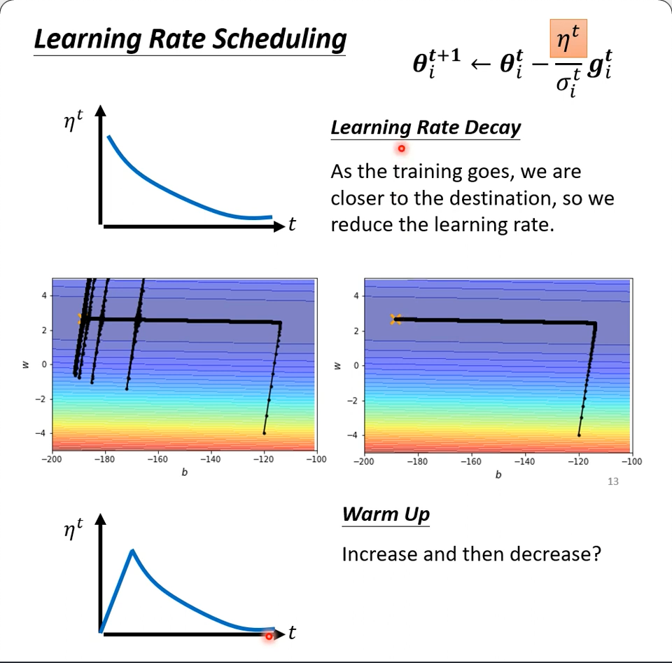

而`warm up`没有在原理或直观上讲解更多，了解一下吧，实操上是很可行的，很多知名的网络都用了它：

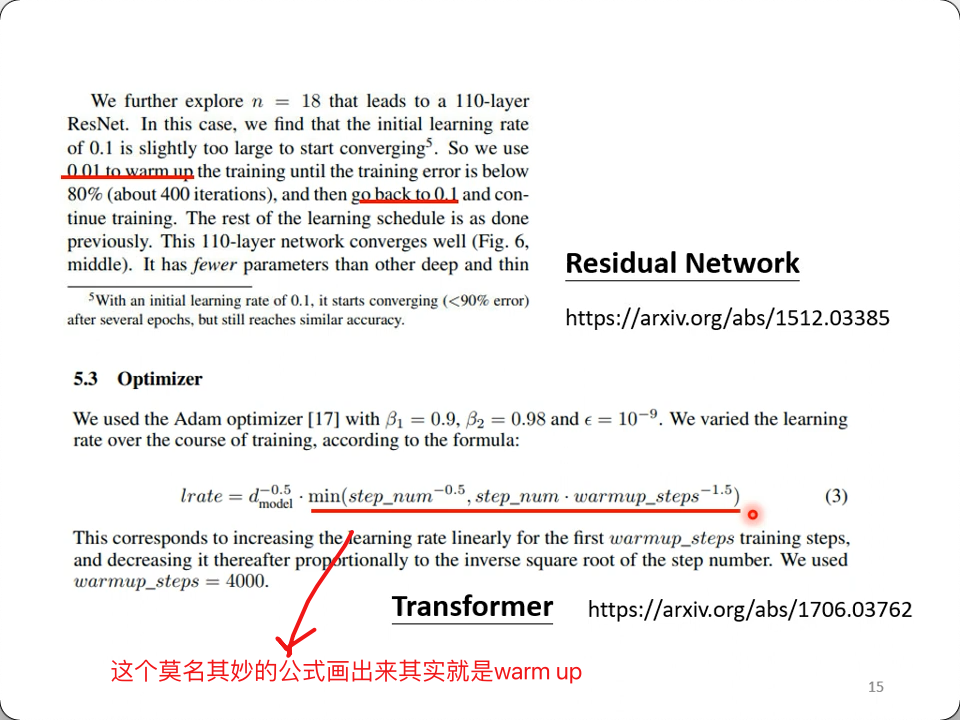

要强行解释的话，就是adam的$\theta$是一个基于统计的结果，所以要在看了足够多的数据之后才有意义，因此采用了一开始小步伐再增加到大步伐这样一个过度，拿到足够的数据之后，才开始一个正常的不断减小的schedule的过程。

更多可参考：`RAdam`: https://arxiv.org/abs/1908.03265

### Summary of Optimization
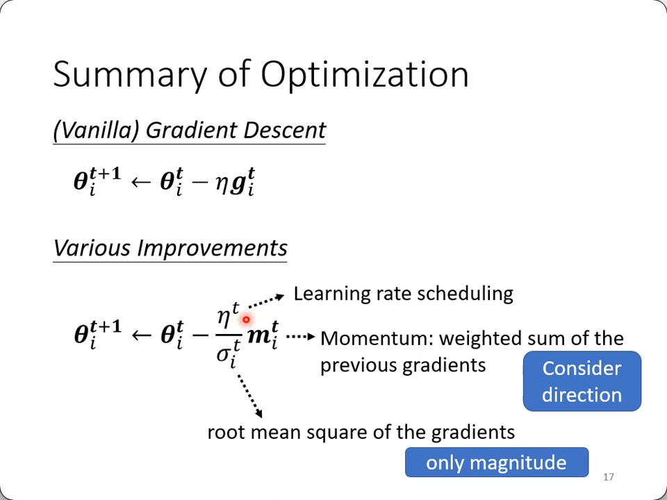

回顾下`Momentum`，它就是不但考虑当前的梯度，还考虑之前所有的梯度（加起来），通过数学计算，当然是能算出它的”动量“的。

那么同样是累计过往的梯度，一个在分母（$\theta$)，一个在分子（momentum)，那不是抵消了吗？

1. momentum是相加，保留了方向
2. $\sigma$是平方和，只保留了大小

## Batch Normalization

沿着cost surface找到最低点有一个思路，就是能不能把山“铲平”？即把地貌由崎岖变得平滑点？ `batch normalization`就是其中一种把山铲平的方法。
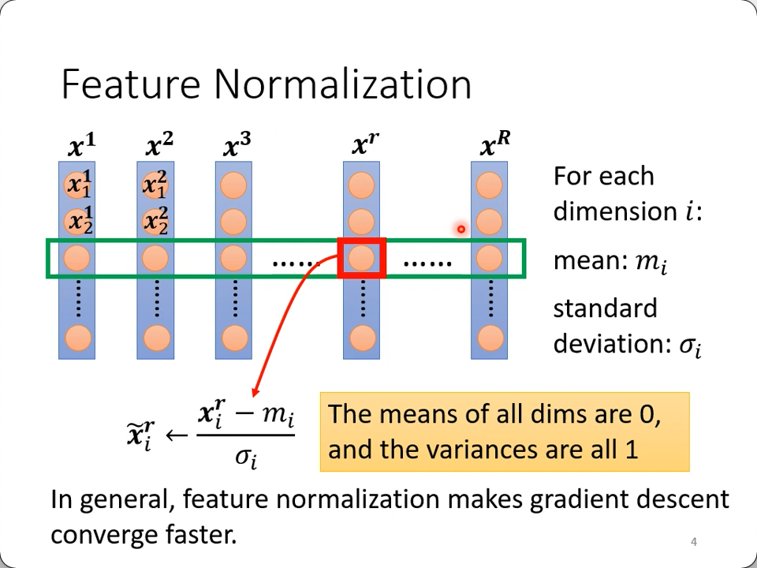

其实就是人为控制了error的范围，让它在各个feature上面的“数量级”基本一致（均值0，方差1），这样产生的error surface不会出现某参数影响相当小，某些影响又相当大，而纯粹是因为input本身量级不同的原因（比如房价动以百万计，而年份是一年一年增的）

error surface可以想象成每一个特征拥有一个轴（课程用二到三维演示），BN让每条轴上的ticks拥有差不多的度量。

然后，你把它丢到深层网络里去，你的输出的分布又是不可控的，要接下一个网络的话，你的输出又成了下一个网络的输入。虽然你在输出前nomalization过了，但是可能被极大和极小的权重w又给变了了数量级不同的输出

再然后，不像第一层，输入的数据来自于训练资料，下一层的输入是要在上一层的输出进行sigmoid之后的

再然后，你去看看sigmoid函数的形状，它在大于一定值或小于一定值之后，对x的变化是非常不敏感了，这样非常容易了出现梯度消失的现象。

于是，出于以下两个原因，我们都会考虑在输出后也接一次batch normalization::
1. 归一化（$\mu=0, \delta=1$)
2. 把输入压缩到一个（sigmoid梯度较大的）小区间内

照这个思路，我们是需要在sigmoid之前进行一次BN的，而有的教材会告诉你之前之后做都没关系，那么之后去做就丧失了以上第二条的好处。

**副作用**

* 以前$x_1 \rightarrow z_1 \rightarrow a_1$
* 现在$\tilde z_1$是用所有$z_i$算出来的，不再是独立的了

**后记1**

最后，实际还会把$\tilde z_i$再这么处理一次：
* $\hat z_i = \gamma \odot \tilde z_i + \beta$

不要担心又把量级和偏移都做回去了，会以1和0为初始值慢慢learn的。

**后记2**

推理的时候，如果batch size不够，甚至只有一条时，怎么去算$\mu, \sigma$呢？

pytorch在训练的时候会计算`moving average`of $\mu$ and $\sigma$ of the batches.(每次把当前批次的均值和历史均值来计算一个新的历史均值$\bar \mu$)
* $\bar \mu \leftarrow p \bar \mu + (1-p)\mu_t$

推理的时候用$\bar \mu, \bar \sigma$。

最后，用了BN，平滑了error surface，学习率就可以设大一点了，加速收敛。

# Classification

用数字来表示class，就会存在认为1跟2比较近与3比较远的可能（从数学运算来看也确实是的，毕竟神经网络就是不断地乘加和与真值减做对比），所以引入了one-hot，它的特征就是class之间无关联。

恰恰是这个特性，使得用one-hot来表示词向量的时候成了一个要克服的缺点。预测单词确实是一个分类问题，然后词与词之间却并不是无关的，恰恰是有距离远近的概念的，而把它还原回数字也解决不了问题，因为单个数字与前后的数字确实近了，但是空间上还是可以和很多数字接近的，所以向量还是必要的，于是又继续打补丁，才有了稠密矩阵embedding的诞生。

## softmax

softmax的一个简单的解释就是你的真值是0和1的组合(one-hot)，但你的预测值可以是任何数，因为你需要把它normalize到(0,1)的区间。

当class只有两个时，用softmax和用sigmoid是一样的。

## loss

可以继续用MeanSquare Error(MSE) $ e = \sum_i(\hat y_i - y'_i)^2$，但更常用的是：

### Cross-entropy

$e = - \sum_i \hat y_i lny'_i$

> `Minimizing cross-entropy` is equivalent to `maximizing likelihood`

linear regression是想从真值与预测值的差来入手找到最合适的参数，而logistic regression是想找到一个符合真值分布的的预测分布。

在吴恩达的课程里，这个损失函数是”找出来的“：

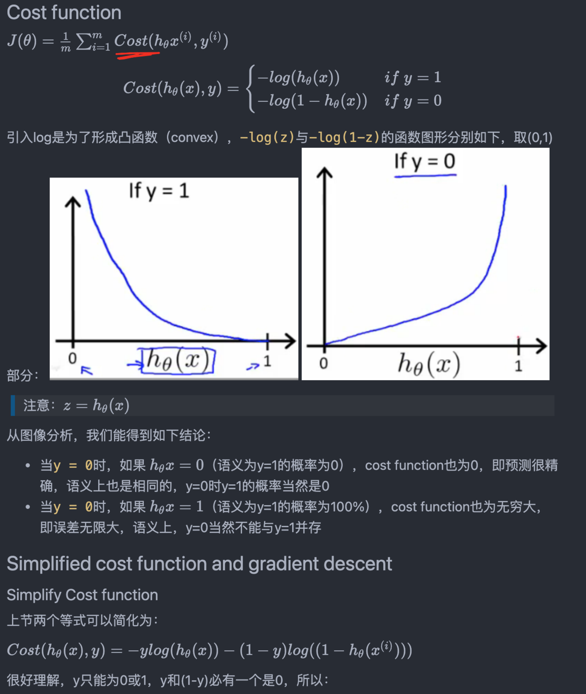

1. 首先，$\theta x$后的值可以是任意值，所以再sigmoid一下，以下记为hx
2. hx的意思就是`y为1的概率`
3. 我需要一个损失函数，希望当真值是0时，预测y为1的概率的误差应该为无穷大
    * 也就是说hx=0时，损失函数的结果应该是无穷大
    * 而hx=1时, 损失应该为0
4. 同理，当y为1时，hx=0时损失应该是无穷大，hx=1时损失为0
5. 这时候才告诉你，log函数**刚好长这样**，请回看上面的两张图

而别的地方是告诉你log是为了把概率连乘变成连加，方便计算。李宏毅这里干脆就直接告诉你公式长这样了。。。

这里绕两个弯就好了：
1. y=1时，预测y为1的概率为1， y=0时，应预测y=1的概率为0
2. 而这里是做损失函数，所以预测对了损失为0，错了损失无穷大
3. 预测为1的概率就是hx，横轴也是hx

> 课程里说softmax和cross entorpy紧密到pytorch里直接就把两者结合到一起了，应用cross entropy的时候把softmax加到了你的network的最后一层（也就是说你没必要手写）。这里说的只是pytorch是这么处理的吗？
>
> ----是的

### CE v.s. MSE

数学证明：http://speech.ee.ntu.edu.tw/~tlkagk/courses/MLDS_2015_2/Lecture/Deep%20More%20(v2).ecm.mp4/index.html

单看实验结果，初始位置同为loss较大的左上角，因为CE有明显的梯度，很容易找到右下角的极值，但是MSE即使loss巨大，但是却没有梯度。因此对于逻辑回归，选择交叉熵从实验来看是合理的，数学推导请看上面的链接。