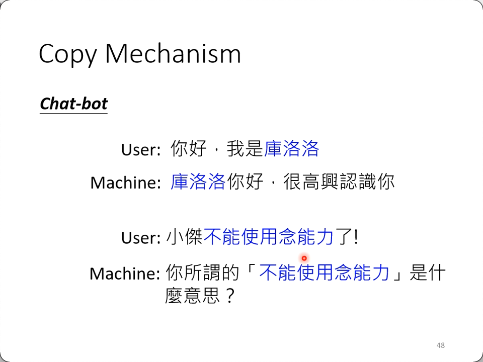
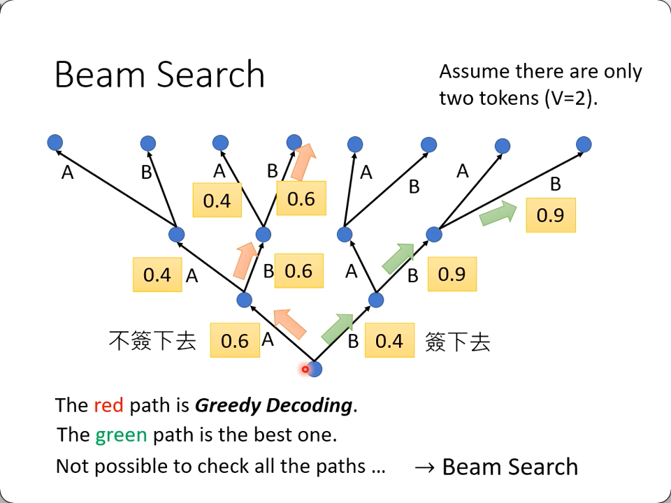
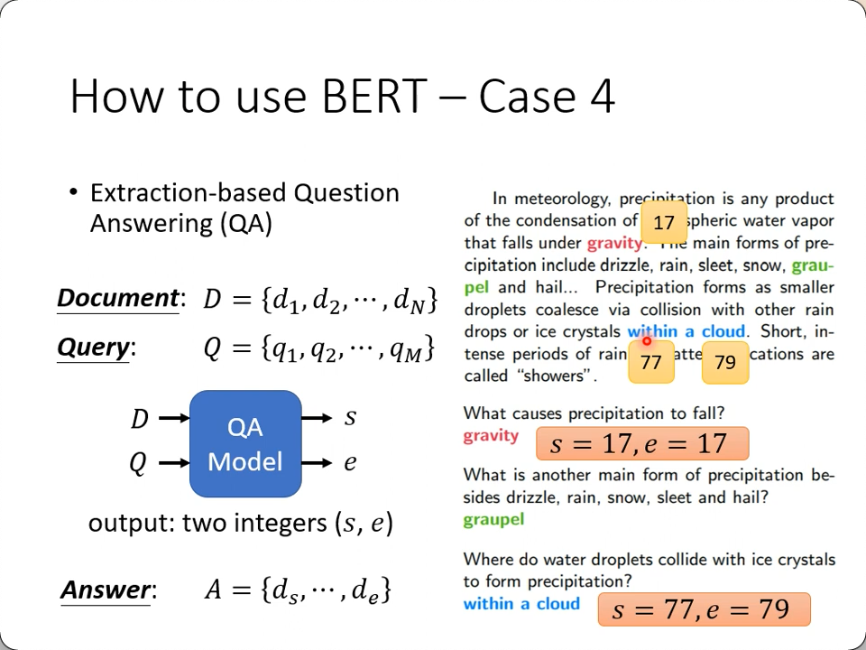
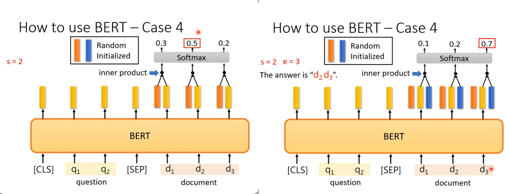
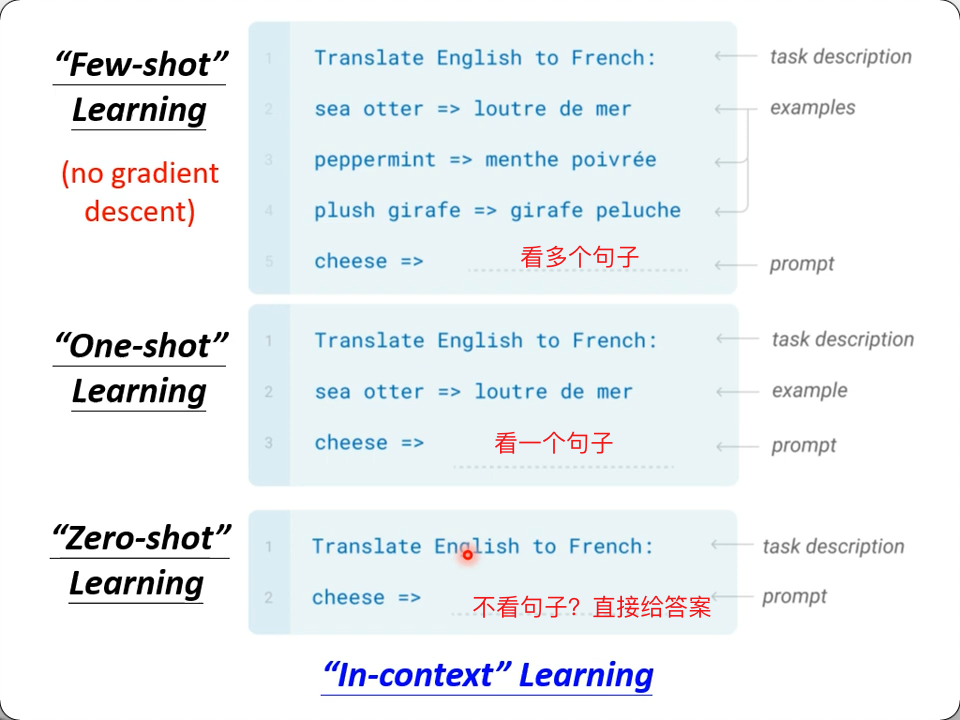
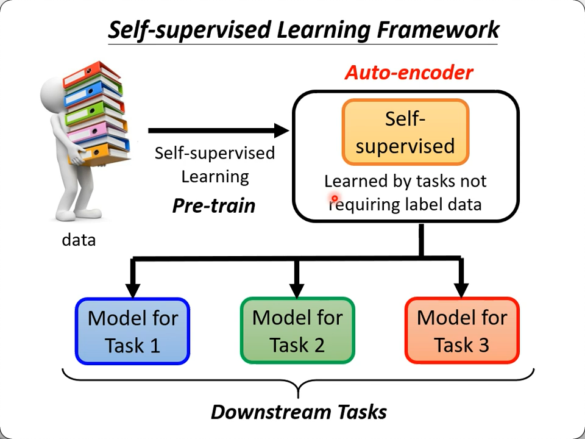
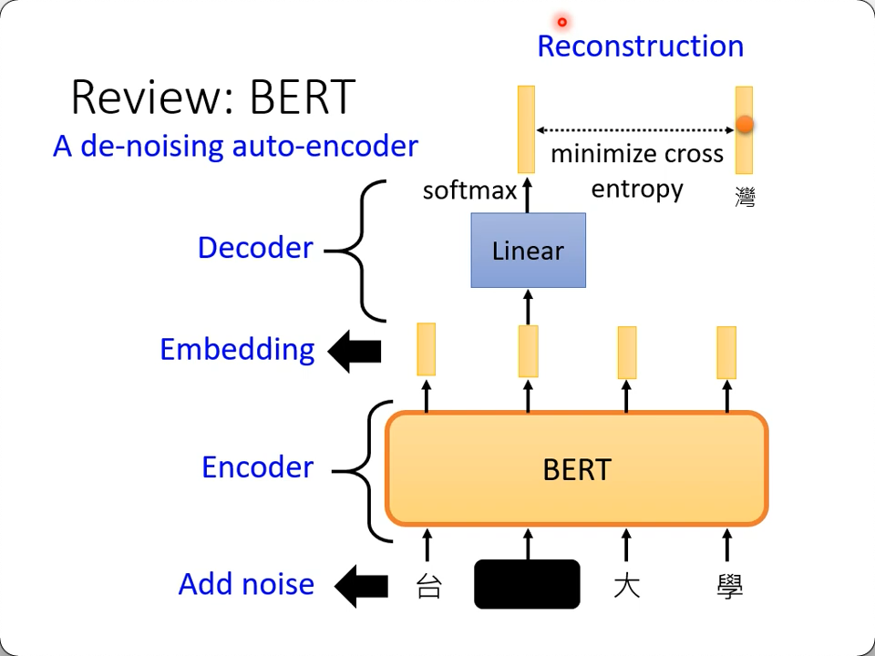
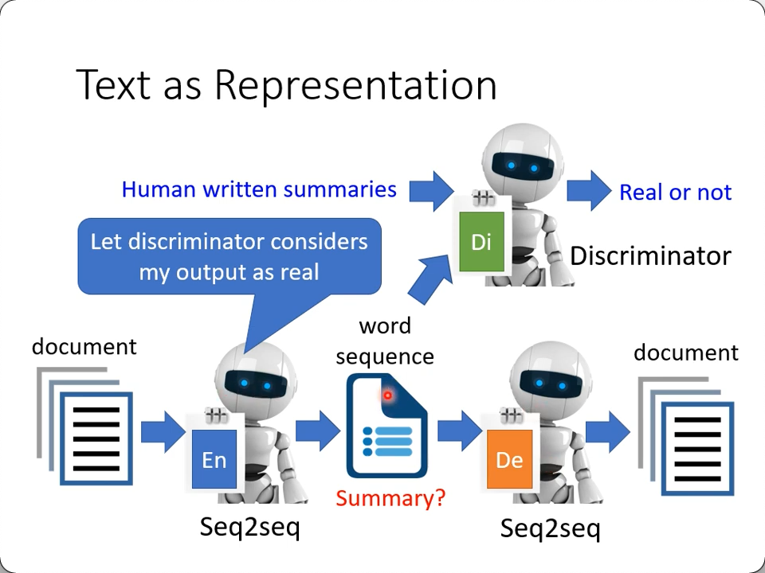
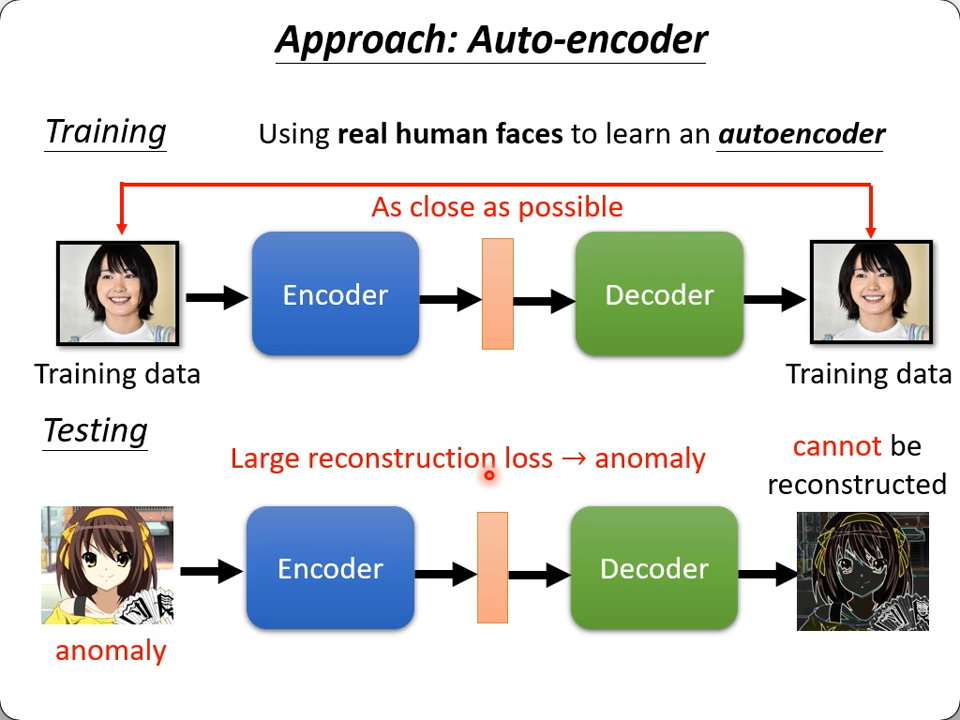

# CNN

1. **Receptive field**

不管是计算机，还是人脑，去认一个物，都是去判断特定的patten（所以就会有错认的图片产生），这也说明，如果神经网络要去辨识物体，是不需要每个神经元都把整张图片看一次的，只需要关注一些特征区域就好了。（感受野, `Receptive field`)

如果你一直用3x3，会不会看不到大的patten呢？$\rightarrow$ 会也不会。

首先，小的filter当然是不可能看到它的感受野以外的部分，但是，神经网络是多层架构，你这层的输出再被卷一次，这时候每一个数字代表的就是之前的9个像素计算的结果，这一轮的9个数字就是上一层的81个像素（因为stride的原因，大部分是重复的）的计算结果，换言之，感受野大大增强了，也就是说，你只需要增加层数，就可以在小的filter上得到大的patten.

2. **filter & feature map**

从神经元角度和全连接角度出发的话，每个框其实可以有自己的参数的（即你用了64步把整个图片扫描完的话，就有64组参数），而事实上为了简化模型，可以让某些框对应同样的参数（**参数共享**），原因就是同一特征可能出现在多个位置，比如人有两只脚。

再然后，实际上每一次都是用一组参数扫完全图的，意思是在每个角落都只搜索这**一个特征**。

我们把这种机制叫`filter`，一个filter只找一种特征，乘加出来的结果叫`feature map`，即这个filter提取出来的特征图。

因此，
* 你想提取多少个特征，就得有多少个filter
* 表现出来就成了你这一层输出有多少个channel
* 这就是为什么你的图片进来是3channel，出来就是N个channel了，取决于你设计了多少个filter

3. **Pooling & subsampling**

由于图像的视觉特征，你把它放大或缩小都能被人眼认出来，因此就产生了pooling这种机制，可以降低样本的大小，这主要是为了减小运算量吧（硬件性能足够就可以不考虑它）。

4. **Data Augmentation**

CNN并不能识别缩放、旋转、裁切、翻转过的图片，因此训练数据的增强也是必要的。

## AlphaGo

**layer 1**
1. 能被影像化的问题就可以尝试CNN，围棋可以看成是一张19x19的图片
2. 每一个位置被总结出了48种可能的情况(超参1)
3. 所以输入就是19x19x48
4. 用0来padding成23x23
5. 很多patten、定式也是影像化的，可以被filter扫出来
6. 总结出5x5大小的filter就够用了（超参2）
7. 就用了192个fitler（即每一次output有48层channel)（超参3）
8. stride = 1
9. ReLU

**layer 2-12**
1. padding成 21x21
2. 192个 3x3 filter with stride = 1
3. ReLU

**layer 13**
1. 1x1 filter stride = 1
2. bias
3. softmax

其中192(个filter)这个超参对比了128，256，384等，也就是说人类并不理解它每一次都提取了什么特征。

> subsampling对围棋也有用吗？ 上面的结构看出并没有用，事实上，围棋你抽掉一行一列影响是很大的。

# Self-Attention

前面说的都是输入为一个向量（总会拉平成一维向量），如果是多个向量呢？有这样的场景吗？
* 一段文字，每一个文字都用one-hot或word-embedding来表示
    * 不但是多个向量，而且还长短不齐
* 一段语音，每25ms采样形成一个向量，步长为每10ms重复采样，形成向量序列
    * 400 sample points (16khz)
    * 39-dim MFCC
    * 80-dim filter bank output
    * 参考人类语言处理课程
* 一个Graph组向量（比如social network)
    * 每个节点（每个人的profile）就是一个向量
* 一个分子结构
    * 每个原子就是一个one-hot

**输出是什么样的？**

1. 一个向量对应一个输出
    * 文字 -> POS tagging
    * 语音 -> a, a, b, b(怎么去重也参考[人类语言处理](https://speech.ee.ntu.edu.tw/~hylee/dlhlp/2020-spring.html)课程)
    * graph -> 每个节点输出特性（比如每个人的购买决策）
2. 只有一个输出
    * 文字 -> 情绪分析，舆情分析
    * 语音 -> 判断是谁说的
    * graph -> 输出整个graph的特性，比如亲水性如何
3. 不定输出（由network自己决定）
    * 这就叫seq2seq
    * 文字 -> 翻译
    * 语音 -> 真正的语音识别

self-attention

稍稍回顾一下self attention里最重要的q, k, v的部分：

图示的是q2与所有的k相乘，再分别与对应的v相乘，然后相加，得到q2对应的输出：b2的过程。

下图则是矩阵化后的结论：

具体细节看专题

真正要学的，就是图中的$W^q, W^k, W^v$

## Multi-head Self-attention

CNN是Self-attention的特例

## Self-attention for Graph

了解更多：https://youtu.be/eybCCtNKwzA

# Transformer

Transformer是一个seq2seq的model

以下场景，不管看上去像不像是seq2seq的特征，都可以尝试用seq2seq（trnasformer）来“硬train一发”

* QA类的问题，送进去question + context，输出answer
    * 翻译，摘要，差别，情感分析，只要训练能套上上面的格式，就有可能
* 文法剖析，送入是句子，输出是树状的语法结构
    * 把树状结构摊平（其实就是多层括号）
    * 然后就用这个对应关系来当成翻译来训练（即把语法当成翻译）
* multi-label classification
    * 你不能在做multi-class classification的时候取top-k,因为有的属于一个类，有的属于三个类，k不定
    * 所以你把每个输入和N个输出也丢到seq2seq里去硬train一发，网络会自己学到每个文章属于哪“些”类别（不定个数，也像翻译一样）
* object dectection
    * 这个更匪夷所思，感兴趣看论文：https://arxiv.org/abs/2005.12872(End-to-End Object Detection with Transformers)

## Encoder

Q, K, V(relavant/similarity), zero padding mask, layer normalization, residual等, 具体看`self-attention`一节。

## Decoder

### AT v.s. NAT

我们之前用的decoder都是一个一个字地预测（输出的）
* 所以才有position-mask（用来屏蔽当前位置后面的字）

这种叫`Auto Regressive`，简称`AT`,`NAT`即`Non Auto Regressive`

它一次生成输出的句子。

至于seq2seq的输出是不定长的，它是怎么在一次输出里面确定长度的，上图已经给出了几种做法：
1. 另做一个predictor来输出一个数字，表示应该输出的长度
2. 直接用一个足够长的<bos>做输入（比如300个），那输出也就有300个，取到第一个<eos>为止

因为不是一个一个生成了，好处
1. 可以平行运算。
2. 输出的长度更可控

> NAT通常表现不如AT好 (why? **Multi-mmodality**)

detail: https://youtu.be/jvyKmU4OM3c (Non-Autoregressive Sequence Generation)

### AT

在decoder里最初有让人看不懂的三个箭头从encode的输出里指出来:

其实这就是`cross attention`

它就是把自己第一层(self-attention后)的输出乘一个$W^q$得到的`q`，去跟encoder的输出分别乘$W^k, W^v$得到的k和v运算($\sum q \times k \times v$)得到当前位置的输出的过程。

而且研究者也尝试过各种`cross attention`的方法，而不仅仅是本文中的无论哪一层都用`encoder`最后一层的输出做q和v这一种方案：

## Training Tips

### 复制机制

一些场景，训练的时候没必要去“生成”阅读材料里提到的一些概念，只需要把它“复制”出来即可，比如上述的人名，专有名字，概念等，以及对文章做摘要等。

* Pointer Network: https://youtu.be/VdOyqNQ9aww
* Copying Mechanism in Seq2Seq https://arxiv.org/abs/1603.06393

### Guided Attention

像语音这种连续性的，需要强制指定(guide)它的attention顺序，相对而言，文字跳跃感可以更大，语音一旦不连续就失去了可听性了，一些关键字：
* Monotonic Attention
* Location-aware attention

### Beam Search

### Optimizing Evaluation Metrics / BLEU

* 训练的时候loss用的是cross entropy，要求loss越小越好，
* 而在evaluation的时候，我们用的是预测值与真值的`BLEU score`，要求score越大越好

* 那么越小的cross entropy loss真的能产生越高的BLEU score吗？ 未必
* 那么能不能在训练的时候也用BLEU score呢？ 不行，它太复杂没法微分，就没法bp做梯度了。

### Exposure bias

训练时候应用了`Teaching force`，用了全部或部分真值当作预测结果来训练（或防止一错到底），而eval的时候确实就是一错到底的模式了。

# Self-supervised Learning

* 芝麻街家庭：elmo, bert, erine...
* bert就是transformer的encoder

## Bert

### GLUE

GLUE: General Language Understanding Evaluation

基本上就是看以下这九个模型的得分：

训练：
1. 预测mask掉的词(masked token prediction)
    * 为训练数据集添加部分掩码，预测可能的输出
    * 类似word2vec的C-Bow
2. 预测下一个句子（分类，比如是否相关）(next sentence prediction)
    * 在句首添加<cls>用来接分类结果
    * 用<sep>来表示句子分隔

下游任务（Downstream Task） <- Fine Tune:
1. sequence -> class: sentiment analysis
    * 这是需要有label的
    * <cls>节点对的linear部分是随机初始化
    * bert部分是pre-train的
2. sequence -> sequence(等长): POS tagging
3. 2 sequences -> class: NLI(从句子A能否推出句子B)(Natural Language Inferencee)
    * 也比如文章下面的留言的立场分析
    * 用<cls>输出分类结果，用<sep>分隔句子
4. Extraction-based Question Answering: 基于已有文本的问答系统
    * 答案一定是出现在文章里面的
    * 输入文章和问题的向量
    * 输出两个数字(start, end)，表示答案在文章中的索引

QA输出：

思路：
1. 用<cls>input<sep>document 的格式把输入摆好
2. 用pre-trained的bert模型输出同样个数的向量
3. 准备两个与bert模型等长的向量（比如768维）a, b（random initialized)
4. a与document的每个向量相乘(inner product)
5. softmax后，找到最大值，对应的位置(argmax)即为start index
6. 同样的事b再做一遍，得到end index

### Bert train seq2seq

也是可能的。就是你把输入“弄坏”，比如去掉一些字词，打乱词序，倒转，替换等任意方式，让一个decoder把它还原。 -> **BART**

### 附加知识

有研究人员用bert去分类DNA，蛋白质，音乐。以DNA为例，元素为A,C,G,T,分别对应4个随机词汇，再用bert去分类（用一个英文的pre-trained model），同样的例子用在了蛋白质和音乐上，居然发现效果全部要好于“纯随机”。

如果之前的实验说明了bert看懂了我们的文章，那么这个荒诞的实验（用完全无关的随意的英文单词代替另一学科里面的类别）似乎证明了事情没有那么简单。

### More

1. https://youtu.be/1_gRK9EIQpc
2. https://youtu.be/Bywo7m6ySlk

## Multi-lingual Bert

略 

## GPT-3

训练是predict next token...so it can do generation(能做生成)

> Language Model 都能做generation

https://youtu.be/DOG1L9lvsDY

别的模型是pre-train后，再fine-tune， GPT-3是想实现zero-shot，

### Image

**SimCLR**

* https://arxiv.org/abs/2002.05709
* https://github.com/google-research/simclr

**BYOL**

* **B**ootstrap **y**our **o**own **l**atent
* https://arxiv.org/abs/2006.07733

### Speech

在bert上有九个任务(GLUE)来差别效果好不好，在speech领域还缺乏这样的数据库。

## Auto Encoder

也是一种`self-supervised` Learning Framework -> 也叫 pre-train, 回顾：

在这个之前，其实有个更古老的任务，它就是`Auto Encoder`

* 用图像为例，通过一个网络encode成一个向量后，再通过一个网络解码(reconstrucion)回这张图像（哪怕有信息缺失）
* 中间生成的那个向量可以理解为对原图进行的压缩
* 或者说一种降维

降维的课程：
* PCA: https://youtu.be/iwh5o_M4BNU
* t-SNE: https://youtu.be/GBUEjkpoxXc

有一个de-noising的Auto-encoder, 给入的是加了噪音的数据，经过encode-decode之后还原的是没有加噪音的数据

这就像加了噪音去训练bert

### Feature Disentangle

去解释auto-encoder压成的向量就叫`Feature Disentagle`，比如一段音频，哪些是内容，哪些是人物；一段文字，哪些表示语义，哪些是语法；一张图片，哪些表示物体，哪些表示纹理，等。

应用： voice conversion -> 变声器

传统的做法应该是每一个语句，都有两种语音的资料，N种语言/语音的话，就需要N份。有Feature Disentangle的话，只要有两种语音的encoder，就能知道哪些是语音特征，哪些是内容特征，拼起来，就能用A的语音去读B的内容。所以**前提**就是能分析压缩出来的向量。

### Discrete Latent Representation

如果压缩成的向量不是实数，而是一个binary或one-hot
* binary: 每一个维度几乎都有它的含义，我们只需要看它是0还是1
* one-hot: 直接变分类了。-> `unsupervised classification`

**VQVAE**

* Vector Quantized Variational Auot-encoder https://arxiv.org/abs/1711.00937

### Text as Representation

* https://arxiv.org/abs/1810.02851

如果压缩成的不是一个向量，而也是一段`word sequence`，那么是不是就成了`summary`的任务？ 只要encoder和decoder都是seq2seq的model

-> seq2seq2seq auto-encoder -> `unsupervised summarization`

事实上训练的时候encoder和decoder可能产生强关联，这个时候就引入一个额外的`discriminator`来作判别:

有点像cycle GAN，一个generator接一个discriminator，再接另一个generator

### abnormal detection

* Part 1: https://youtu.be/gDp2LXGnVLQ
* Part 2: https://youtu.be/cYrNjLxkoXs
* Part 3: https://youtu.be/ueDlm2FkCnw
* Part 4: https://youtu.be/XwkHOUPbc0Q
* Part 5: https://youtu.be/Fh1xFBktRLQ
* Part 6: https://youtu.be/LmFWzmn2rFY
* Part 7: https://youtu.be/6W8FqUGYyDo