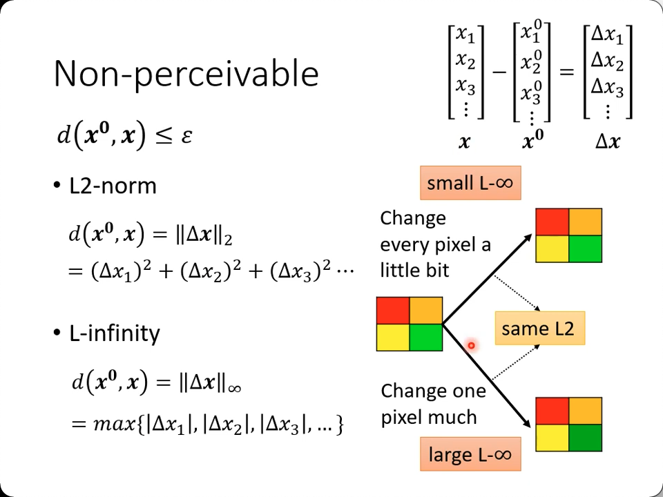
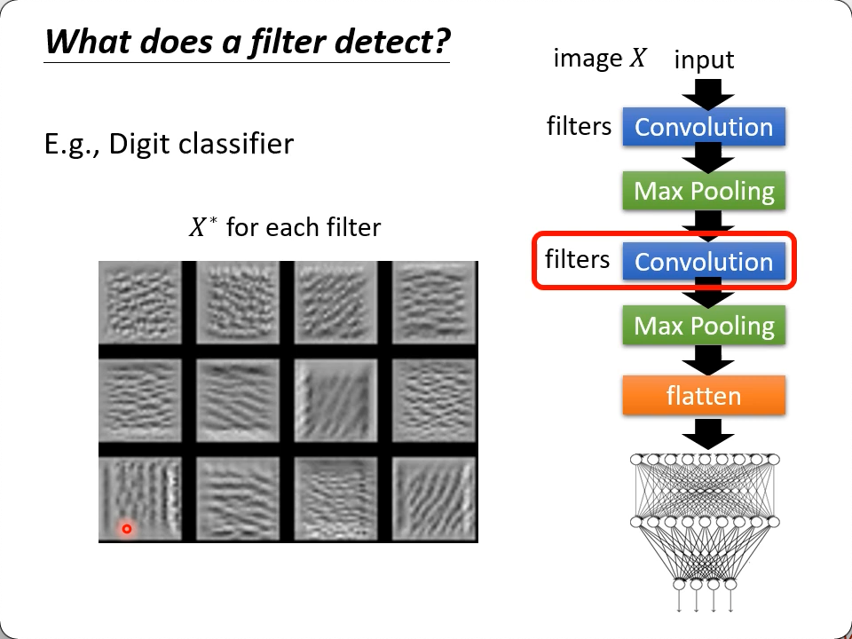
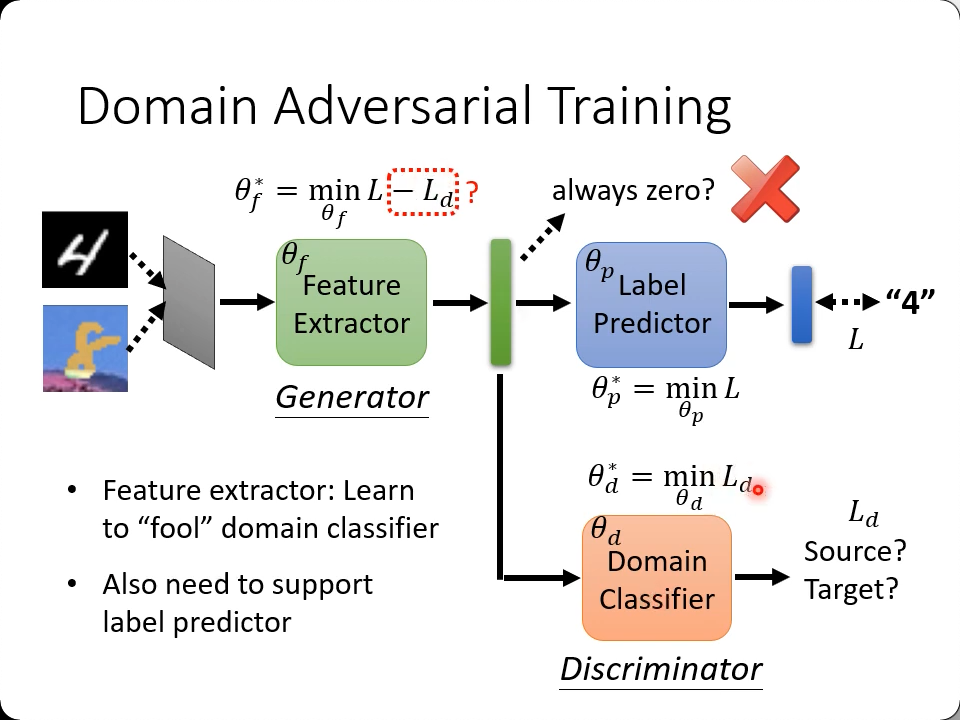
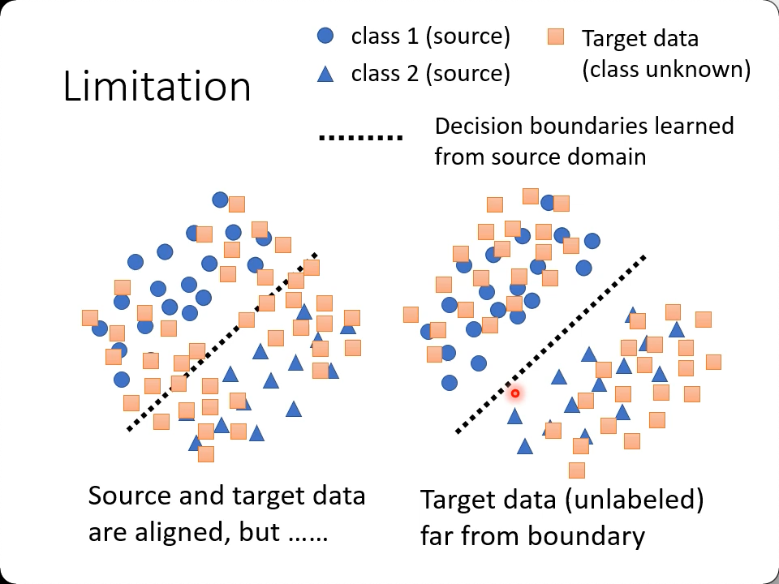
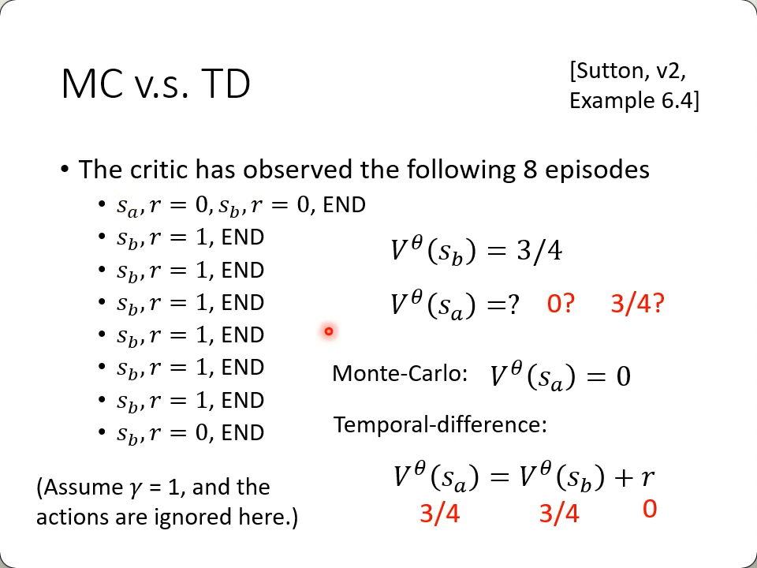
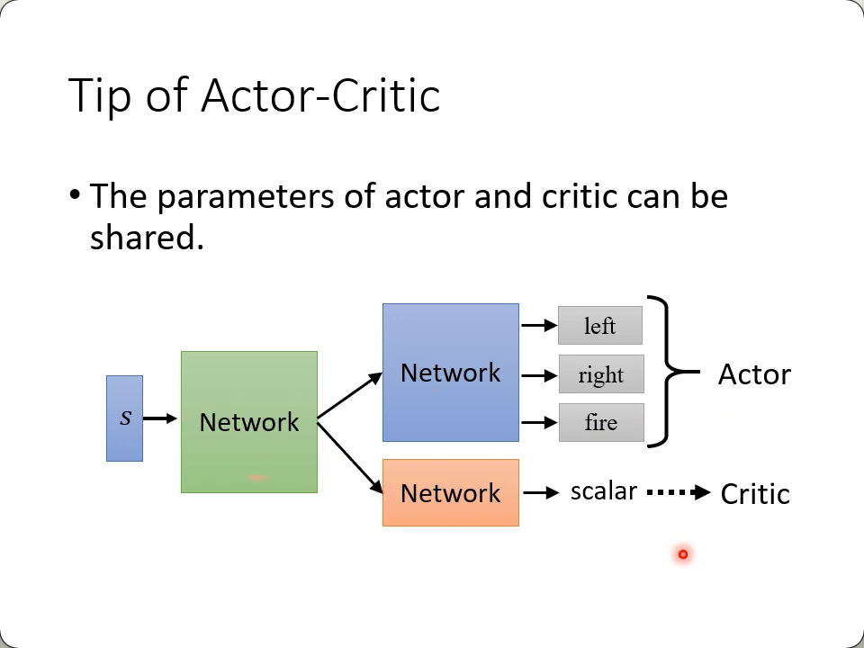
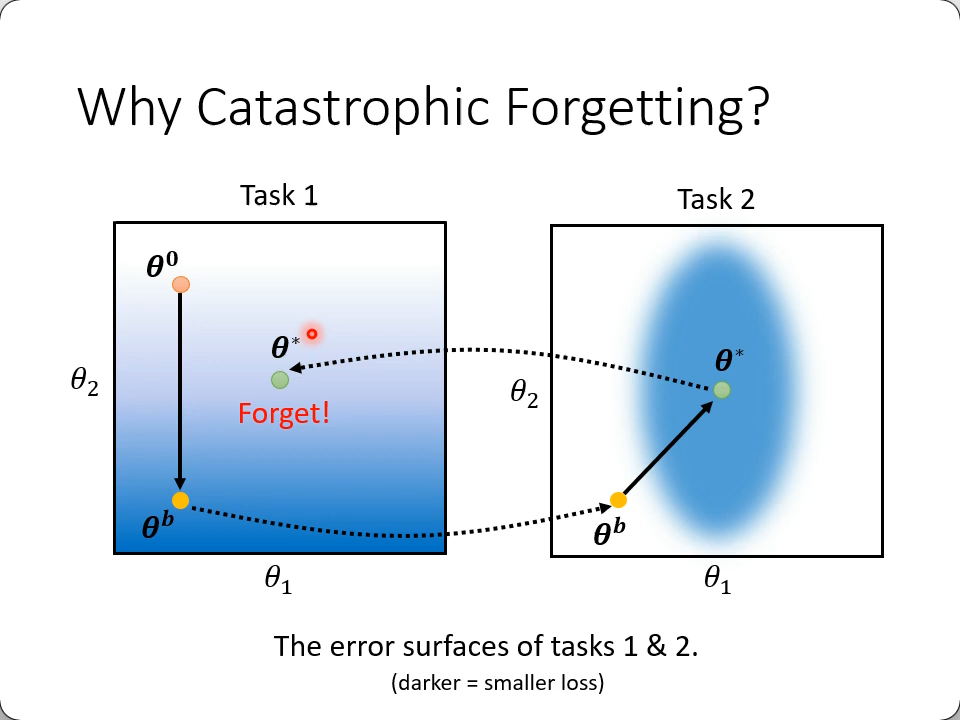
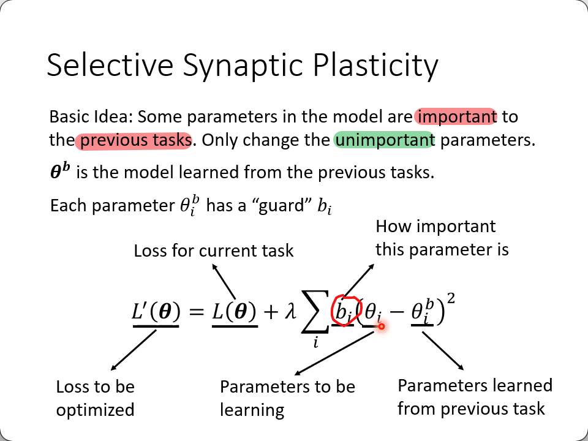
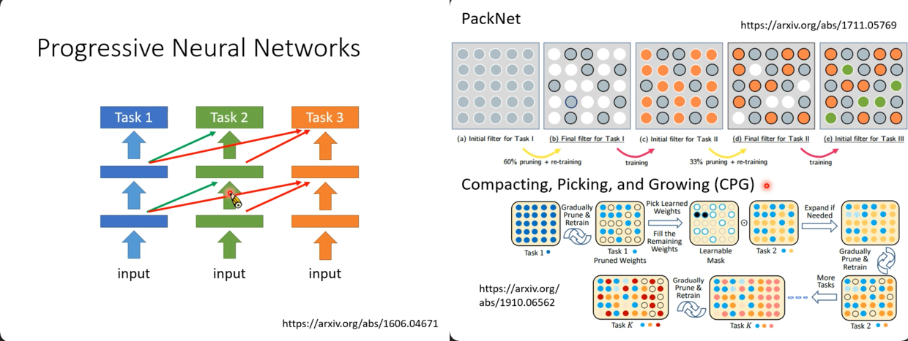

# Adversarial Attack

给你一张猫的图片，里面加入少许噪音，以保证肉眼看不出来有噪音的存在：
1. 期望分类器认为它不是猫
2. 期望分类器认为它是一条鱼，一个键盘...

比如你想要欺骗垃圾邮件过滤器

* 找到一个与$x^0$非常近的向量x
* 网络正常输出y
* 真值为$\hat y$
* $L(x) = -e(y, \hat y)$
* $x^* = arg\underset{d(x^0, x) \leq \epsilon}{\rm min}\ L(x)$ 即要找到令损失最大的x
    1. 这里L(x)我们取了反
    2. $\epsilon$越小越好，指的是$x^0$要与x越接近越好（欺骗人眼）
* 如果还期望它认成是$y^{target}$，那就再加上与其的的损失
* $L(x) = -e(y, \hat y) + e(y, y^{target})$
* 注意两个error是反的，一个要求越远越好(真值），一个要求越近越好（target)

怎么计算$d(x^0, x) \leq \epsilon$呢？

图上可知，如果都改变一点点，和某一个区域改动相当大，可能在L2-norm的方式计算出来是一样的，但是在L-infinity看来是不一样的（它只关心最大的变动）。

显然L-infinity更适合人眼的逻辑，全部一起微调人眼不能察觉，单单某一块大调，人眼是肯定可以看出来的。

而如果是语音的话，可能耳朵对突然某个声音的变化反而不敏感，整体语音风格变了却能立刻认出说话的人声音变了，这就要改变方案了。

## Attack Approach

如何得到这个x呢？其实就是上面的损失函数。以前我们是为了train权重，现在train的就是x本身了。
1. 损失达到我们的要求 （有可能这时候与原x相关很远）
2. 与原x的距离达到我们的要求, 怎么做？
    * 其实就是以$x^0$为中心，边长为$2\epsilon$的矩形才是期望区域
    * 如果update后，$x^t$仍然落在矩形外，那么就在矩形里找一个离它最近的点，当作本轮更新后的$x^t$，进入下一轮迭代

Fast Gradient Sign Method(FGSM): https://arxiv.org/abs/1412.6572
* 相比上面的迭代方法，FGSM只做一次更新
* 就是根据梯度，判断是正还是负，然后把原x进行一次加减$\epsilon$的操作（其实等于是落在了矩形的四个点上）
* 也就是说它直接取了四个点之一作为$x^0$

## White Box v.s. Black Box

讲上述方法的时候肯定都在疑惑，分类器是别人的，我怎么可能拿到别人的模型来训练我的攻击器？ -> **White Box Attack**

那么`Black Box Attack`是怎么实现的呢？
1. 如果我们知道对方的模型是用什么数据训练的话，我们也可以训练一个类似的(proxy network)
    * 很大概率都是用公开数据集训练的
2. 如果不知道的话呢？就只能尝试地丢一些数据进去，观察（记录）它的输出，然后再用这些测试的输入输出来训练自己的proxy network了。

* one pixel attack
    * https://arxiv.org/abs/1710.08864
    * https://youtu.be/tfpKIZIWidA
* universal adversarial attack
    * 万能noise
    * https://arxiv.org/abs/1610.08401
* 声音
* 文本
* 物理世界
    * 比如欺骗人脸识别系统，去认成另一个人
    * 又比如道路环境，车牌识别等，也可以被攻击
    * 要考虑摄像头能识别的分辨率
    * 要考虑训练时候用的图片颜色与真实世界颜色不一致的问题
* Adversarial Reprogramming
* Backdoor in Model
    * attack happens at the training phase
    * https://arxiv.org/abs/1804.00792
    * be careful of unknown dataset...

## Defence

### Passive Defense（被动防御）

进入network前加一层filter
* 稍微模糊化一点，就去除掉精心设计的noise了
    * 但是同时也影响了正常的图像
* 对原图进行压缩
* 把输入用Generator重新生成一遍

如果攻击都知道你怎么做了，其实很好破解，就把你的filter当作network的一部分重新开始设计noise，所以可以选择加入随机选择的一些预处理(让攻击者不可能针对性地训练)：

### Proactive Defense（主动防御）

训练的时候就训练比较不容易被攻破的模型。比如训练过程中加入noise，把生成的结果重新标注回真值。

* training model
* find the problem
* fix it

有点类似于`Data Augmentation`

仍然阻挡不了新的攻击算法，即你对数据进行augment之外的范围。

# Explainable Machine Learning(可解释性)

* correct answers $\neq$ intelligent
* 很多行业会要求结果必须可解释
    * 银行，医药，法律，驾驶....

**Local Explanation**

Why do you thing **this image** is a cat?

**Global Explanation**

What does a "**cat**" look like?

1. 遮挡或改变输入的某些部分，观察对已知输出的影响
    * （比如拦到某些部分确实认不出图像是一条狗了）
2. 遮挡或改变输入的某些部分，把两种输出做loss，对比输入变化与loss变化：
    * $|\frac{\varDelta e}{\varDelta x}| \rightarrow \frac{\partial e}{\partial x_n}$

把上述（任一种）每个部分（像素，单词）的影响结果输出，就是：`Saliency Map`

## Saliency Map

图1，2就是为了分辨宝可梦和数码宝贝，人类一般很难区分出来，但机器居然轻松达到了98%的准确率，经过绘制`Saliency Map`，发现居然就是图片素材（格式）的原因，一个是png，一个是jpg，造成背景一个是透明一个是不透明的。

也就是说，能发现机器判断的依据不是我们关注的本体（高亮部分就是影响最大的部分，期望是在动物身上）

第三张图更可笑，机器是如何判断这是一只马的？居然也不是马的本体，而是左下角，标识图片出处的文字，可能是训练过程中同样的logo过多，造成了这个“人为特征”。

解决方案：

### Smooth Gradient

随机给输入图片加入噪点，得到saliency map（们），然后取平均

### Integrated gradient(IG)

一个特征在从无到有的阶段，梯度还是明显的，但是到了一定程度，特征再增强，对gradient影响也不大了，比如从片子来判断大象，到了一定长度，一张图也不会“更像大象”

一种思路：https://arxiv.org/abs/1611.02639

## global explaination

**What does a filter detect?**

如果经过某层（训练好的）filter，得到的feature map一些位置的值特别大，那说明这个filter提取的就是这类特征/patten。

我们去"创造"一张包含了这种patten的图片：$X^* = arg\ \underset{X}{\rm max}\sum_i\sum_j a_{ij}$，即这个图片是“训练/learn“出来的，通过找让X的每个元素($a_{ij}$)在被filter乘加后结果最大的方式。 -> `gradient ascent`

然后再去观察$X^*$有什么特征，就基本上可以认定这个（训练好的）filter提取的是什么样的patten了。

> `adversarial attack` 类似的原理，但这是对单filter而言。如果你想用同样的思路去让输出y越大越好，得到X，看X是什么，得到的X大概率都是一堆噪音。如果能生成图像，那是`GAN`的范畴了。

于是，尝试再加一个限制，即不但要让y最大，还要让X看起来最有可能像一个数字：

* $R(X)$: how likely X is a digit 
* $X^* = arg\ \underset{X}{\rm max}y_i + \color{red}{R(X)}$
* $R(X) = -\sum_{i,j}|X_{i,j}|$ 比如这个规则，期望每个像素越黑越好

# Domain Adaptation

`Transfer Learning`的一种，在训练数据集和实际使用的数据集不一样的时候。 https://youtu.be/qD6iD4TFsdQ

需要你对`target domain`的数据集有一定的了解。

有一种比较好的情况就是，target domain既有数据，还有标注（但不是太多，如果太多的话就不需要`source domain`了，直接用target来训练就好了），那就像bert一样，去`fine tune`结果，要注意的是标本量过小，可能很容易`overfitting`.

如果target doamin有**大量**资料，但是没有标注呢？

## Domain Adversarial Training

* 把source domain的network分为特征提取器（取多少层cnn可以视为超参，并不一定要取所有层cnn）和分类器
* 然后在特征取层之后跟另一个分类器，用来判断图像来自于source还是target（有点像`Discriminator`
* 与真值有一个loss，source, target之间也有一个loss，要求找到这样的参数组分别让两个loss最小
* loos和也应该最小（图中用的是减，但其实$L_d$的期望是趋近于0，不管是正还是负都是期望越小越好）（不如加个绝对值？）
* 每一小块都有一组参数，是一起训练的
* 目的就是既要逼近训练集的真值，还要训练出一个网络能模糊掉source和target数据集的差别

### Limit

如果target数据集如上图左，显然结果是会比上图右要差一点的，也就是说尽量要保持同分布。在这里用了另一个角度，就是让数据**离boundary越远越好**

* Decision-boundary Iterative Refinement Training with a Teacher(`DIRT-T`)
    * https://arxiv.org/abs/1802.08735
* Maximum Classifier Discrepancy https://arxiv.org/abs/1712.02560

## More

* 如果source 和 target 里的类别不完全一样呢？
    * Universal domain adaptation
* 如果target既没有label，数据量也非常少（比如就一张）呢？
    * Test Time Training(TTT) https://arxiv.org/abs/1909.13231

**Domain Generalization**

# Deep Reinforcement Learning (RL)

* **Environment** 给你 `Observation`
* **Actor** 接收入 `Observation`, 输出 `Action`
* `Action` 反馈给 **Environment**, 计算出 `Reward` 反馈给 **Actor**
* 要求 `Reward` 最大

与 GAN 的不同之处，不管是生成器还是判别器，都是一个network，而RL里面，Actor和Reward都是黑盒子，你只能看到结果。

## Policy Gradient

https://youtu.be/W8XF3ME8G2I

1. 先是用很类似监督学习的思路，给每一步的最优（或最差）方案一个label，有label就能做loss。先把它变成一个二分类的问题。
2. 打分还可以不仅仅是“好”或“不好”，还可以是一个程度，比如1.5比0.5的“支持”力度要大一些，而-10显然意味着你千万不要这么做，非常拒绝。
3. 比如某一步，可以有三种走法，可以用onehot来表示，其中一种走法可以是[1,0,0]$^T$，表示期望的走法是第一种。
4. 但是也可以是[-1,0,0]$^T$，标识这种走法是不建议的
5. 也可以是[3.5,0,0]$^T$等
6. 后面会用`1, -1, 10, 3.5`这样的scalar来表示，但要记住其实它们是ont-hot中的那个非零数。

现实世界中很多场景不可能执行完一步后就获得reward，或者是全局最佳的reward（比如下围棋）。

**v1**

一种思路是，每一步之后，把游戏/棋局进行完，把当前reward和后续所有步骤的reward加一起做reward -> `cumulated reward` $\rightarrow G_t = \sum_{n=t}^Nr_n$

**v2**

这种思路仍然有问题，游戏步骤越长，当前步对最终步的影响越小。因此引入一个小于1的权重$\gamma < 1$: $G_1' = r_1 + \gamma r_2 + \gamma^2r_3 + \cdots$

这样越远的权重越小： $G_t' = \sum_{n=t}^N \color{red}{\gamma^{n-t}} r_n$

> 注意，目前得到的`G`就是为了给每一次对observation进行的action做loss的对象。

**v3**

标准化reward。你有10分，是高是低？如果所有人都是20分，那就是低分，所以与G做对比的时候，通常要减去一个合适的值`b`，让得分的分布有正有负。

**Policy Gradient**

普通的gradient descent是搜集一遍数据，就可以跑for循环了，而PG不行，你每次得到梯度后，要重采一遍样，其实也很好理解，你下了某一步，经过后续50步后，输了，你的下一轮测试应该是下一盘随机的棋，而不是把更新好的参数再用到同一盘棋去。

还是不怎么好理解，至少要知道，我做参数是不为了训练出这一盘棋是怎么下出来的，而是根据这个（大多是输了的）结果，以及学到的梯度，去下一盘新的棋试试。

## Actor Critic

**Critic**: 
* Given `actor` $\theta$, how good it is when `observing` s (and taking action a)

**Value function** $V^\theta(s)$:
* 使用actor $\theta$的时候，预测会得到多少的`cumulated reward`
* 分高分低其实还是取决于actor，同样的局面，不同的actor肯定拿的分不同。

### Monte-Carlo based approach (MC)

蒙特卡洛搜索，正常把游戏玩完，得到相应的G.

### Temporal-difference approach (TD)

不用玩完整个游戏，就用前后时间段的数据来得到输出。

关键词：
* 我们既不知道v(t+1)，也不知道v(t)，但确实能知道`v(t+1)-v(t)`.

这个例子没看懂，后面七次游戏为什么没有sa了？

**v3.5**

上文提到的V可以用来作更早提到的b:
* $\{S_t, a_t\}\ A_t = G_t' - V^\theta(S_t)$
* 回顾一下，$V^\theta(S_t)$是看到某个游戏画面时算出来的reward
* 它包含$S_t$状态下，后续各种步骤的reward的平均值
* 而$G_t'$则是这一步下的rewared
* 两个数相减其实就是看你的这一步是比平均水平好还是差
* 比如你得到了个负值，代表在当前场景下，这个actor执行的步骤是低于平均胜率的，需要换一种走法。

**v4**

3.5版下，G只有一个样本（一次游戏）的结果，这个版本里，把st再走一步，试难$S_{t+1}$的各种走法下reward的平均值，用它来替换G'，而它的值，就是当前的reward加上t+1时刻的V:
* $r_t + V^\theta(S_{t+1}) - V^\theta(S_t)$

这就是：

### Advantage Actor-Critic

就看图而言，感觉就是坚持这一步走完，后续所有可能的rewawrd， 减去， 从这一步开始就试验所有走法的reward

More:

Deep Q Network (DQN)
* https://arxiv.org/abs/1710.02298
* https://youtu.be/o_g9JUMw1Oc
* https://youtu.be/2-zGCx4iv_k

## Reward Shaping

前面说过很多场景要得到reward非常困难（时间长，步骤长，或根本不会结束），这样的情况叫`sparse reward`，人类可以利用一些已知知识去人为设置一些reward以增强或削弱机器的某些行为。

比如游戏：
1. 原地不动一直慢慢减分
2. 每多活一秒也慢慢减分（迫使你去获得更高的reward, 避免学到根本就不去战斗的方式）
3. 每掉一次血也减分
4. 每杀一个敌人就加分
5. 以此类推，这样就不至于要等到一场比赛结束才有“一个”reward

又比如训练机械手把一块有洞的木板套到一根棍子上：
1. 离棍子越近，就有一定的加分
2. 其它有助于套进去的规则

还可以给机器加上**好奇心**，让机器看到有用的“新的东西”也加分。

## No Reward, learn from demostration

只有游戏场景才会有明确的reward，大多数现实场景都是没有reward的，比如训练自动驾驶的车，或者太过死板的reward既不能适应变化，也容易被打出漏洞，比如机器人三定律里，机器人不能伤害人类，却没有禁止囚禁人类，又比如摆放盘子，却没有给出力度，等盘子摔碎了，再去补一条𢱨碎盘子就负reward的规则，也晚了，由此引入模仿学习：

### Imitation Learning

略

# Life-Long Learning

持续学习，机器学习到一个模型后，继续学下一个模型（任务）。

1. 为什么不一个任务学一个模型
    * 不可能去存储所有的模型
    * 一个任务的知识不能转移到另一个任务
2. 为什么不直接用迁移学习（迁移学习只关注迁移后的新任务）

## Research Directions

### Selective Synaptic Plasticity

选择性的神经突触的可塑性？（Regularization-based Approach）

**Catastrophic Forgetting** 灾难性的遗忘

在任务1上学到的参数，到任务2里接着训练，顺着梯度到了任务2的最优参数，显然不再是任务1的做以参，这叫灾难性的遗忘

一种思路： 

任务2里梯度要更新未必要往中心，也可以往中下方，这样既在任务2的低loss区域，也没有跑出任务1的低loss区域，实现的方式是找到对之前任务影响比较小的参数，主要去更新那些参数。比如上图中，显然$\theta_1$对任务1的loss影响越小，但是更新它之后会显著影响任务2的loss，而$\theta_2$的改动才是造成任务1loss变大的元凶。

Elastic Weight Consolidation(EWC)
* https://arxiv.org/abs/1612.00796

Synaptic Intelligence(SI)
* https://arxiv.org/abs/1703.04200

Memory Aware Synapses(MAS)
* https://arxiv.org/abs/1711.09601

RWalk
* https://arxiv.org/abs/1801.10112

Sliced Cramer Preservation(SCP)
* https://openreview.net/forum?id=BJge3TNKwH

### Memory Reply

1. 在训练task1的时候，同时训练一个相应的generator
2. 训练task2的时候，用task1的generator生成pseudo-data，一起来训练生成新的model
3. 同时也训练出一个task1&2的generator
4. ...

# Network Compress

## pruning (剪枝)

Networks ar typically over-parameterized (there is significant redundant weights or neurons)

* 可以看哪些参数通常比较大，或值的变化不影响loss（梯度小）-> 权重，为0的次数少 -> 神经元 等等
* 剪枝后精度肯定是会下降的
* 需要接着fine-tune
* 一次不要prune to much
* 剪参数和剪神经元效果是不一样的
    * 剪参数会影响矩阵运算，继而影响GPU加速

那么为什么不直接train一个小的network呢？
* 小的network通常很难train到同样的准确率。 （大乐透假说）

## Knowledge Distillation (知识蒸馏)

老师模型训练出来的结果，用学生模型（小模型）去模拟（即是模拟整个输出，而不是模拟分类结果），让小模型能达到大模型同样的结果。

一般还会在输出的softmax里面加上温度参数（即平滑输出，不同大小的数除一个大于1的数，显然越大被缩小的倍数也越大，比如100/10=10，少了90，10/10=1, 只少了9，差别也从90变成了9）(或者兴趣个极端的例子，T取无穷大，那么每个输出就基本相等了)

## Parameter Quantization

1. Using less bits to represent a value
2. Weight clustering
    * 把weights分成预先确定好的簇（或根据分布来确定）
    * 对每簇取均值，用均值代替整个簇里所有的值
3. represent frequent clusters by less bits, represent rare clusters by more bits
    * Huffman encoding

极限，`Binary Weights`，用两个bits来描述整个网络，扩展阅读。

## Depthwise Separable Convolution

回顾下CNN的机制，参数量是：
* 卷积核的大小 x 输入图像的通道数 x 输出的通道数
* ($k\times k$) x in_channel x out_channel

而`Depthwise Separable Convolution`由两个卷积组成：
1. Depthwise Convolution
    * 很多人对CNN的误解刚好就是Depthwise Convolution的样子，即一个卷积核对应一个输入的channel（事实上是一组卷积核对应所有的输入channel）
    * 因此它的参数个数 k x k x in_channel
2. PointWise Convolution
    * 这里是为了补上通道与通道这间的关系
    * 于是用了一个1x1的`标准`卷积（即每一组卷积核对应输入的所有通道）
    * 输出channel也由这次卷积决定
    * 应用标准卷积参数量：(1x1) x in_channel x out_channel

两个参数量做对比, 设`in_channel = I`, `out_channel = O`
1. $p_1 = (k\times k) \times I \times O$
2. $p_2 = (k\times k) \times I + (1\times 1) \times I \times O = (k\times k) \times I + I \times O$
3. $\frac{p_2}{p_1} = \frac{I\cdot(k^2 + O)}{I\cdot{k^2\cdot O}}
= \frac{1}{O} + \frac{1}{k^2} \approx \frac{1}{k^2} 
$

O代表out_channel，大型网络里256，512比比皆是，所以它可以忽略，那么前后参数量就由$k^2$决定了，如果是大小为3的卷积核，参数量就变成1/9了，已经是压缩得很可观了。

### Low rank approximation

上面是应用，原理就是`Low rank approximation`

以全连接网络举例
1. 如果一个一层的网络，输入`N`， 输出`M`，参数为`W`，那么参数量是`MxN`
2. 中间插入一个线性层`K`，
    * 参数变成：`V`:N->K, `U`:K->M,
    * 参数量：`NxK` + `KxM`
3. 只要K远小于M和N（比如数量级都不一致），那么参数量是比直接MxN要小很多的
4. 这也限制了能够学习的参数的可能性（毕竟原始参数量怎么取都行）
    * 所以叫`Low rank` approximation

**to learn more**

SqueezeNet
* https://arxiv.org/abs/1602.07360

MobileNet
* https://arxiv.org/abs/1704.04861

ShuffleNet
* https://arxiv.org/abs/1707.01083

Xception
* https://arxiv.org/abs/1610.02357

GhostNet
* https://arxiv.org/abs/1911.11907

## Dynamic Computation

1. 同一个网络，自己来决定计算量，比如是在不同的设备上，又或者是在同设备的不同时期（比如闲时和忙时，比如电量充足和虚电时）
2. 为什么不为不同的场景准备不同的model呢？
    * 反而需要更大的存储空间，与问题起源（资源瓶颈）冲突了。

### Dynamic Depth

在部分layer之后，每一层都插一个额外的layer，提前做预测和输出，由调用者根据具体情况决定需要多深的depth来产生输出。

训练的时候既要考虑网络终点的loss，还要考虑所有提前结束的layer的softmax结果，加到一起算个大的Loss

Multi-Scale Dense Network(MSDNet)
* https://arxviv.org/abs/1703.09844

### Dynamic Width

训练的时候（同时？）对不同宽度（即神经元个数，或filter个数）进行计算（全部深度），也是把每种宽度最后产生的loss加起来当作总的Loss

在保留的宽度里，参数是一样的（所以应该就是同一轮训练里的参数了）

Slimmable Neural Networks
* https://arxiv.org/abs/1812.08928

### Computation based on Sample Difficulty

上述决定采用什么样的network/model的是人工决定的，那么有没有让机器自己决定采用什么网络的呢？

比如一张简单的图片，几层或一层网张就能得到结果，而另一张可能前景和或背景更复杂的图片，需要很多层才能最终把特征提取出来，应用同一个模型的话就有点资源浪费了。

* SkipNet: Learning Dynamic Routing in Convolutional Networks 
* Runtime Neural Pruning
* BlockDrop: Dynamic Inference Paths in Residual Networks

# Meta Learning

* 学习的学习。
* 之前的machine learning，输出是明确的任务，比如是一个数字，还是一个分类；而meta-learning，输出是一个model/network，用这个model，可以去做machine learning的任务。
* 它就相当于一个“返函数的函数”
* meta-learning 就是让机器学会去架构一个网络，初始化，学习率等等 $\leftarrow \varPhi$: `learnable components`
    * categorize meta learning based on what is learnable

> 不再深入

