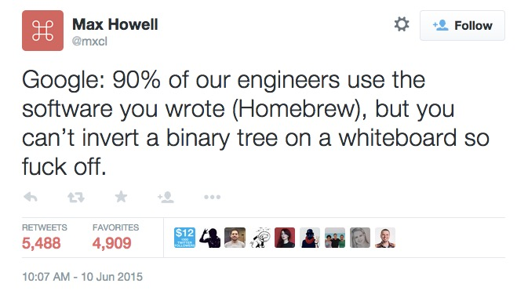
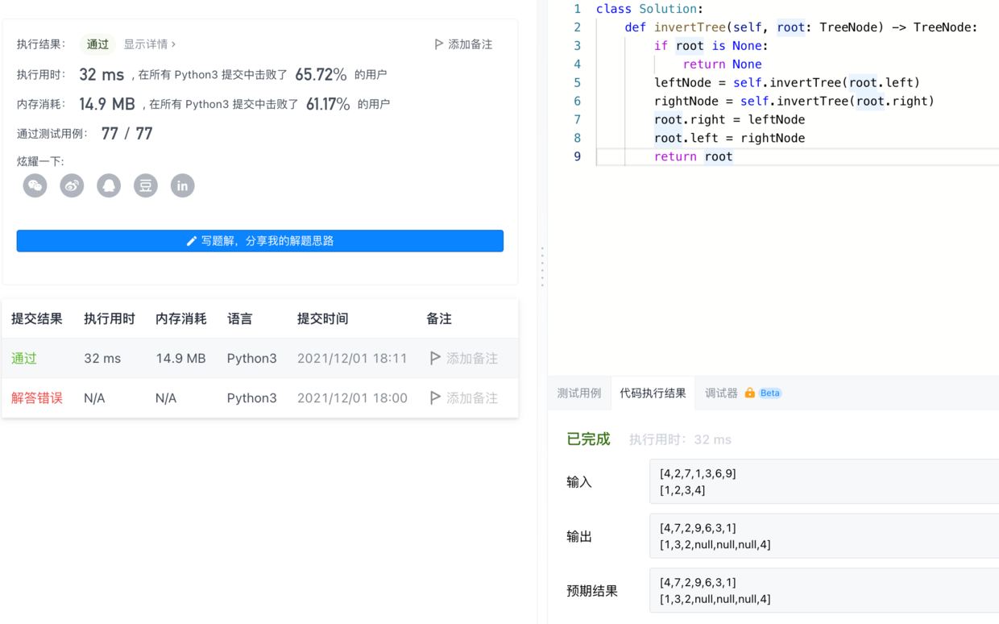

最近在找工作，所以这些算法梗又出现在了我的阅读视野里，比如经典的homebrew作者吐槽的翻转二叉树的问题。


我本以为是根和叶节点倒转过来，原来是同层里面的左右翻转。

那么就是把左边换到右边，右边换到左边呗，可以考虑递归。我一直用一个原则理解递归，就是把命令传达下去（比如上面的左右互换，就完了），而不关心细节，只有最末端的那个大头兵才是真正做业务的人，写了一下，递归加业务也就4行代码：



具体到这个问题，就是我把left和right互换就是了
然后left和right你们做好自己的子级的互换，我不管，所以核心代码就一句
`left, right = right, left`，前面是为了稳妥，通过了之后，直接用python这种左右互换的特性，那就真是一句代码了：
```python
def invertTree(self, root: TreeNode) -> TreeNode:
    if root is None:
        return None
    root.right, root.left = self.invertTree(root.left), self.invertTree(root.right)
    return root
```
